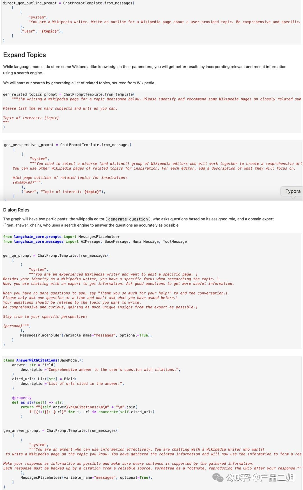

# Agent的九种设计模式

## ReACT 模式

LLM Agent 第一文，发表于2022年10月，结合工具使用让 Agent 更强。现在看起来特别简单，但当时 ChatGPT 还没有面世，能够提出让 LLM 学会使用工具，具有一定的开创性。

### ReACT 原理

ReAct 原理很简单，没有 ReAct 之前，Reasoning 和 Act 是分割开来的。

**举个例子，你让孩子帮忙去厨房里拿一个瓶胡椒粉，告诉 ta 一步步来（COT提示词策略）**：

> 1. 先看看台面上有没有；
> 2. 再拉开灶台底下抽屉里看看；
> 3. 再打开油烟机左边吊柜里看看。

**没有 React 的情况就是**：

> 不管在第几步找到胡椒粉，ta 都会把这几个地方都看看（Action）。

**有 React 的情况是**：

> - Action1：先看看台面上有没有；
> - Observation1: 台面上没有胡椒粉，执行下一步；
> - Action2：再拉开灶台底下抽屉里看看；
> - Observation2：抽屉里有胡椒粉；
> - Action3: 把胡椒粉拿出来。

是的，就是这么简单，在论文的开头作者也提到人类智能的一项能力就是 Actions with verbal reasoning，即每次执行行动后都有一个“碎碎念(Observation)”：我现在做了啥，是不是已经达到了目的。这相当于让 Agent 能够维持短期记忆。

### ReACT 实现

**本质上所有的 Agent 设计模式都是将人类的思维、管理模式以结构化 prompt 的方式告诉大模型来进行规划，并调用工具执行，且不断迭代的方法**。明白这一点非常重要。

代码：[YT_Exploring_ReAct_on_Langchain.ipynb](https://github.com/samwit/langchain-tutorials/blob/main/agents/YT_Exploring_ReAct_on_Langchain.ipynb)

代码逻辑梳理为下图:

接下来结合代码内容详细解读。

1. **生成提示词**

首先，将代码中预设好 ReAct 的提示词模板(格式为Quesion->Thought->Action->Observation)和用户的问题进行合并。得到的提示词是这样的。

如果需要针对你自己的领域定制，需要将 fewshot 里的内容更换为更合适的内容，比如你的 Action 里可能会有 "Send message to someone"， 这里的 Action “Send message” 可能就对应一个外部工具的 API 接口。

2. **调用大模型生成Thought+Action**

接下来将 few shot 提示词发给大模型。如果直接将上述提示词发给大模型，大模型生成将针对用户问题生成一堆 Thought，Action 和 Observation。但是我们现在希望展开 Action 来看看。所以，在代码里通过 Stop.Observation 来控制大模型遇到 Observation 后停止输出，于是大模型仅仅返回 Thought 和 Action，而不会把 Observation 给生成出来。

3. **调用外部工具**

拿到 Action 之后，大模型就可以调用外部工具了。首先判断这里的 Action 是不是 Finish，如果不是我们就可以利用大模型把 Action 后面的自然语言转换为外部工具能识别的 API 接口（这个转换过程就是 function calling 功能）。

4. **生成Observation**

API 接口返回后，将返回内容丢给大模型转换为自然语言的 Observation。

然后将 Observation 的内容，加上刚刚的 Thought， Action 内容输入给大模型，重复第 2，3 步，直至 Action 为 Finish 为止。

5. **完成输出**

将最后一步的 Observation 转化为自然语言输出给用户。

由此，我们可以看到 Agent 要落地一个场景，需要定制两项内容：

- Prompt 模板中 few shot 中的内容。
- function calling 中的外部工具定义。

而 Prompt 模板中 fewshot 本质上就是人类思维模式的结构化体现，通过查阅各个设计模式的 prompt 模板是很好的学习 Agent 设计模式的方法，习得这个方法，可以用同样的方法理解其他的设计模式。

## Plan and solve 模式

顾名思义这种设计模式是**先有计划再来执行**。

如果说 ReAct更适合 完成“厨房拿胡椒粉”的任务，那么 Plan & solve 更适合完成“西红柿炒鸡蛋”的任务：你需要计划，并且过程中计划可能会变化（比如你打开冰箱发现没有西红柿时，你将购买西红柿作为新的步骤加入计划）。

提示词模板方面，论文标题中说得很直白，《Plan-and-Solve Prompting: Improving Zero-Shot Chain-of-Thought Reasoning by Large Language Models》，简言之就是 Zero shot 的提升，下图是作者代码中给出的一些 PS-Plan and Solve 提示词。

架构上它的组成是这样的：

- **规划器**：负责让 LLM 生成一个多步计划来完成一个大任务。代码中有 `Planner` 和 `Replanner`，`Planner` 负责第一次生成计划；`Replanner` 是指在完成单个任务后，根据目前任务的完成情况进行 Replan，所以 `Replanner` 提示词中除了 Zeroshot，还会包含：目标，原有计划，和已完成步骤的情况。
- **执行器**：接受用户查询和规划中的步骤，并调用一个或多个工具来完成该任务。

## Reason without Observation 模式

REWOO(Reason without Observation) 这种方法是相对 ReAct 中的Observation 来说的，ReAct 提示词结构是 `Thought→ Action→ Observation`, **而 REWOO 把 Observation 去掉了。但实际上，REWOO 只是将 Observation 隐式地嵌入到下一步的执行单元中了，即由下一步骤的执行器自动去 observe 上一步执行器的输出**。

**举个例子，常见的审批流都是环环相扣的，比如我们的目标是完成 c，我们的步骤是**：

> - 我们需要从部门 A 中拿到 a 文件，
> - 然后拿着 a 文件去部门 B 办理 b 文件，
> - 然后拿着 b 文件去部门 C 办理 c 文件 - 任务完成。

这其中第 2，3 步骤中 B，C 部门对 a，b 文件的审查本身就是一类Observation。

又比如下面提示词模板中给出 one shot 内容中定义出每一步的 plan 都会依赖上一步的输入。

架构上它由三个组件组成：

- **Planner**：负责生成一个相互依赖的“链式计划”，定义每一步所依赖的上一步的输出。
- **Worker**：循环遍历每个任务，并将任务输出分配给相应的变量。当调用后续调用时，它还会用变量的结果替换变量。
- **Solver**：求解器将所有这些输出整合为最终答案。

## LLMCompiler 模式

Compiler-编译一词在计算机科学的意义就是如何进行任务编排使得计算更有效率，原论文题目是《An LLM Compiler for Parallel Function Calling》，很直白，就是通过**并行Function calling来提高效率**，比如用户提问张译和吴京差几岁，planner 搜索张译年龄和搜索吴京年龄同时进行，最后合并即可。

提示词里对 Planner 的要求是这样的，重点是希望生成一个 DAG(Direct Acyclic Graph, 有向无环图。

架构上有一个 Planner(规划器)，有一个 Jointer(合并器)。

## Basic Reflection 模式

Basic Reflection 可以类比于学生(Generator)写作业，老师(Reflector)来批改建议，学生根据批改建议来修改，如此反复。

提示词就是复刻师生之间的交互。

架构上有一个 Generator，一个 Reflector。

## Reflexion 模式

Reflexion 是 Basic reflection 的升级版，相应论文标题是《Reflexion: Language Agents with Verbal Reinforcement Learning》，本质上是强化学习的思路。和 Basic reflection 相比，引入了外部数据来评估回答是否准确，并强制生成响应中多余和缺失的方面，这使得反思的内容更具建设性。

提示词方面：会让大模型针对问题在回答前进行反思和批判性思考，反思包括有没有漏掉(missing)或者重复(Superfluous)，然后回答问题，回答之后再有针对性的修改(Revise)。

架构上，有一个 Responder：自带批判式思考的陈述 Critique；有一个 Revisor：以 Responder 中的批判式思考作为上下文参考对初始回答做修改。

## Language Agent Tree Search 模式

LATS 相应论文标题是《Language Agent Tree Search Unifies Reasoning Acting and Planning in Language Models》，很直白：是 Tree search + ReAct+Plan&solve 的融合体。在原作的图中，我们也看到 LATS 中通过树搜索的方式进行 Reward(强化学习的思路)，同时还会融入 Reflection，从而拿到最佳结果。所以：

**LATS = Tree search + ReAct+Plan&solve + Reflection + 强化学习**

提示词模板方面和之前的 reflection，plan&solve，ReAct 差别不大，只是上下文中多了对树搜索结果的评估和返回结果。

架构上，就是多轮的 Basic Reflection， 多个 Generator 和 Reflector。

## Self-Discover 模式

Self-discover 的核心是让大模型在更小粒度上 task 本身进行反思，比如前文中的 Plan&Slove 是反思 task 是不是需要补充，而 Self-discover 是对 task 本身进行反思。

提示词方面，Self-discover 列出一系列的反思方式让 agent 来选择：

结构上，Self-Discover 如下图所示：

- Selector: 从众多的反省方式中选择合适的反省方式；
- Adaptor: 使用选择的反省方式进行反省；
- Implementor: 反省后进行重新 Reasoning。

## Storm 模式

Storm 相应论文标题是《 Assisting in Writing Wikipedia-like Articles From Scratch with Large Language Models》，很直白：可以从零生成一篇像维基百科的文章。主要思路是先让 agent 利用外部工具搜索生成大纲，然后再生成大纲里的每部分内容。

提示词模板方面主要围绕如何生成大纲，如何丰富大纲内容来展开。

架构上，就是先有 topic， 然后生成大纲，根据大纲丰富内容。这里会有一个大纲生成器，一个内容生成器。

## 总结

好了，以上就是目前所总结的 Agent 九大设计模式，其实 **Agent 中没有最好的设计模式，只有最适合的设计模式，最终还是要从用户需求出发来选择**。
