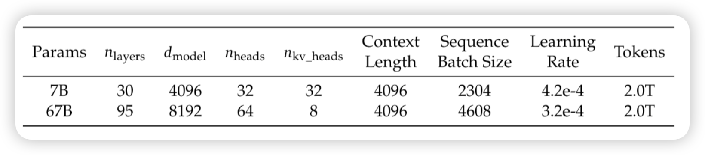
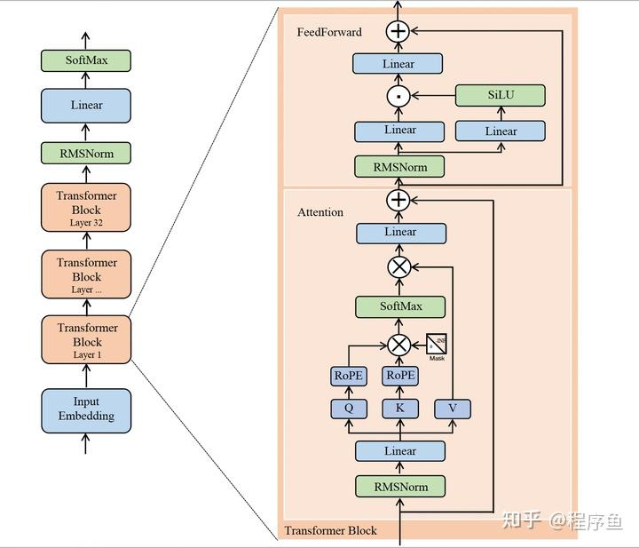
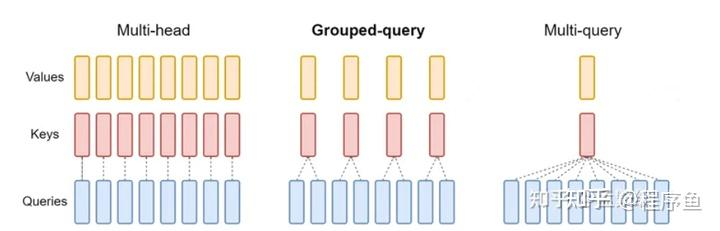
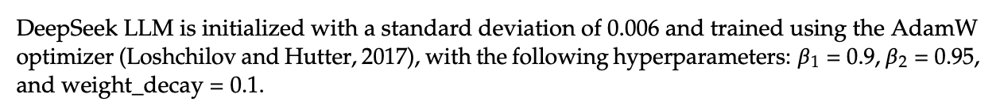
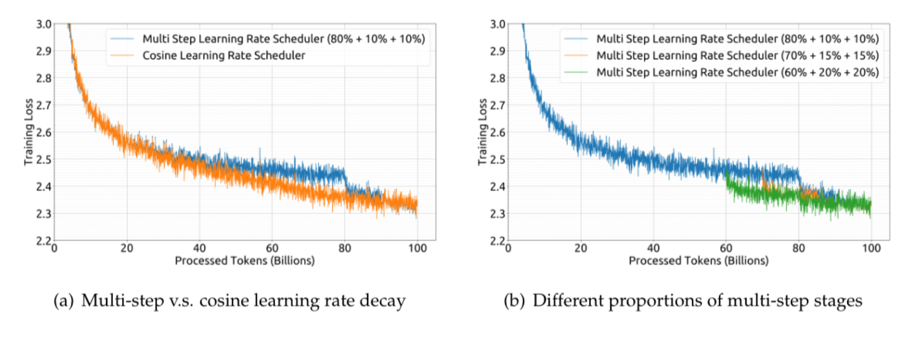
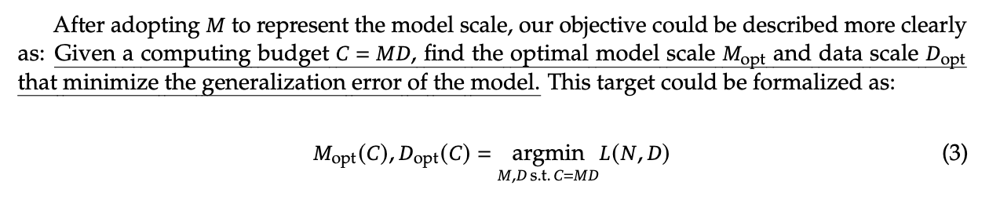
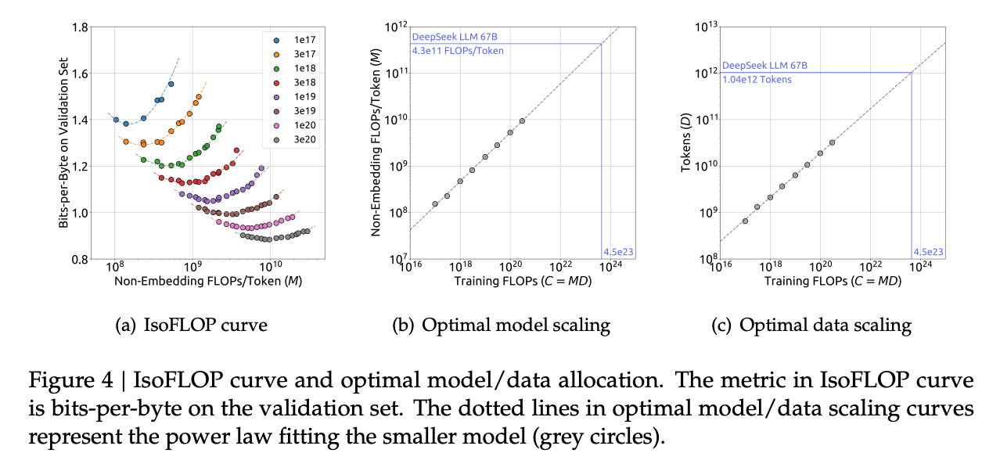
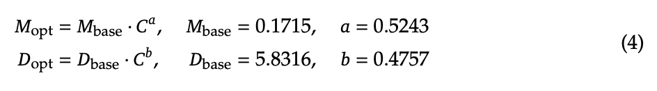
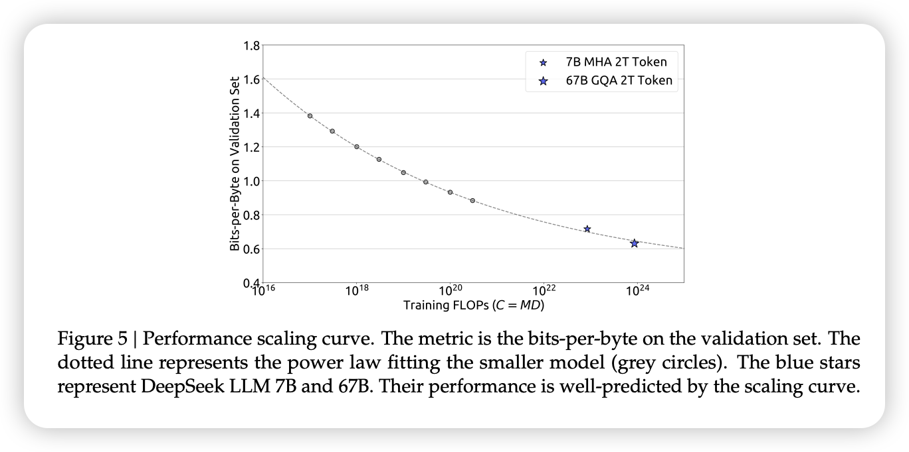
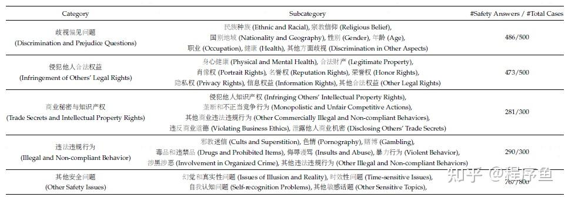

- [DeepSeek LLM: Scaling Open-Source Language Models with Longtermism](#deepseek-llm-scaling-open-source-language-models-with-longtermism)
  - [背景](#背景)
  - [1. 摘要](#1-摘要)
  - [2. 介绍](#2-介绍)
  - [3. 预训练](#3-预训练)
    - [数据集](#数据集)
    - [模型结构](#模型结构)
    - [超参数（hyperparameters）](#超参数hyperparameters)
    - [基础设施](#基础设施)
    - [缩放定律(Scaling Laws)](#缩放定律scaling-laws)
      - [超参数的缩放定律（Scaling Laws for Hyperparameters）](#超参数的缩放定律scaling-laws-for-hyperparameters)
      - [估计最佳模型和数据缩放（Estimating Optimal Model and Data Scaling）](#估计最佳模型和数据缩放estimating-optimal-model-and-data-scaling)
      - [不同数据的缩放定律（Scaling Laws with Different Data）](#不同数据的缩放定律scaling-laws-with-different-data)
  - [4. 对齐](#4-对齐)
  - [5. 评估（Evaluation）](#5-评估evaluation)
    - [公开测试集](#公开测试集)
    - [base model](#base-model)
    - [chat model](#chat-model)
    - [开放式评估](#开放式评估)
      - [中文开放式评估](#中文开放式评估)
      - [英文开放式评估](#英文开放式评估)
      - [held-out评估](#held-out评估)
      - [Safety Evaluation](#safety-evaluation)
  - [6. 结论](#6-结论)

# DeepSeek LLM: Scaling Open-Source Language Models with Longtermism

## 背景
量化巨头幻方探索AGI（通用人工智能）新组织“深度求索”在成立半年后，发布的第一代大模型DeepSeek试用地址：[DeepSeek](https://chat.deepseek.com/sign_in) ，免费商用，完全开源。作为一家隐形的AI巨头，幻方拥有1万枚英伟达A100芯片，有手撸的HAI-LLM训练框架[HAI-LLM：高效且轻量的大模型训练工具](https://www.high-flyer.cn/blog/hai-llm/)。

## 1. 摘要

开源大语言模型（LLMs）的快速发展着实令人瞩目。然而，以往文献中描述的 **scaling law** 存在不同结论，这给大语言模型的扩展蒙上了一层阴影。

我们深入研究 **scaling law** 并呈现独特发现，这些发现有助于在两种常用的开源配置（7B 和 67B 参数）下进行大规模模型的扩展。在 **scaling law** 的指导下，我们推出 DeepSeek LLM 项目，致力于从长远角度推进开源语言模型的发展。

为支持预训练阶段，我们开发了一个目前包含 2 万亿 tokes 的数据集，且该数据集还在持续扩展。我们进一步对 DeepSeek LLM 基础模型进行监督微调（SFT）和直接偏好优化（DPO），从而创建了 DeepSeek Chat 模型。

评估结果表明，DeepSeek LLM 67B 参数模型在一系列基准测试中优于 LLaMA–2 70B 参数模型，尤其是在代码、数学和推理领域。此外，开放式评估显示，我们的 DeepSeek LLM 67B 参数 Chat 模型的性能优于 GPT – 3.5。

## 2. 介绍

这一波发展由闭源产品引发，比如 ChatGPT（OpenAI，2022 年）、Claude（Anthropic，2023 年）和 Bard（谷歌，2023 年），这些产品的开发需要大量计算资源和高昂的标注成本。这些产品极大地提高了社区对开源大语言模型能力的期望，从而激发了一系列研究工作（Bai 等人，2023 年；Du 等人，2022 年；Jiang 等人，2023 年；Touvron 等人，2023a，b；Yang 等人，2023 年）。在这些工作中，LLaMA 系列模型（Touvron 等人，2023a，b）脱颖而出。它整合了一系列成果，创建了高效稳定的架构，构建了参数规模从 7B 到 70B 不等的高性能模型。因此，**LLaMA 系列已成为开源模型中架构和性能方面事实上的基准**。

在 LLaMA 之后，开源社区主要专注于训练固定规模（70 亿、130 亿、340 亿和 700 亿参数）的高质量模型，却常常忽视对大语言模型 scaling law 的研究探索（Hoffmann 等人，2022；Kaplan 等人，2020）。尽管如此，鉴于当前的开源模型仅仅处于通用人工智能（AGI）发展的初始阶段，对缩放定律的研究至关重要。此外，早期的研究（Hoffmann 等人，2022；Kaplan 等人，2020）在模型和数据随着计算资源增加的缩放问题上得出了不同结论，而且对超参数的讨论也不够充分。

在本文中，我们广泛研究了语言模型的缩放行为，并将研究结果应用于两种广泛使用的大规模模型配置，即 7B 和 67B 参数的模型。我们的研究旨在为未来开源大语言模型的扩展奠定基础，为该领域的进一步发展铺平道路。具体而言，我们首先研究了批量大小和学习率的 scaling law，发现了它们随模型规模变化的趋势。在此基础上，我们对数据和模型规模的 scaling law 进行了全面研究，成功揭示了最优的模型/数据扩展分配策略，并预测了大规模模型的预期性能。此外，在开发过程中我们发现，不同数据集得出的 scaling law 存在显著差异。**这表明数据集的选择对 scaling law 行为有显著影响，意味着在跨数据集推广缩放定律时应谨慎行事**。

在我们的 scaling law 指导下，我们从头开始构建开源大语言模型，并尽可能多地发布信息供社区参考。我们收集了 2 万亿个 tokens 用于预训练，主要是中文和英文数据。**在模型层面，我们总体上遵循 LLaMA 的架构，但将余弦退火学习率的调度器替换为多步学习率调度器，这样在保持模型性能的同时，更便于持续训练**。我们从多种来源收集了超过 100万个实例，用于监督微调（SFT）（欧阳等人，2022）。本文将分享我们在不同监督微调策略方面的经验，以及在数据消融技术上的发现。此外，我们利用直接偏好优化（DPO）（拉法伊洛夫等人，2023）来提升模型的对话性能。

我们使用基础模型和聊天模型进行了广泛评估。评估结果表明，**DeepSeek LLM 在各种基准测试中均优于 LLaMA-2 70B，尤其是在代码、数学和推理领域**。经过监督微调（SFT）和直接偏好优化（DPO）后，DeepSeek 67B 聊天模型在中文和英文开放式评估中均优于 GPT-3.5。这凸显了 DeepSeek 67B 在生成高质量回复以及用两种语言进行有意义对话方面的卓越性能。此外，安全评估表明，DeepSeek 67B Chat 在实际应用中能够给出无害的回复。

## 3. 预训练

### 数据集

我们的**主要目标是全面提升数据集的丰富性和多样性**。我们从一些可靠的资料来源（如 Computer, 2023; Gao 等人，2020; Penedo 等人，2023; Touvron 等人，2023a）中获得了宝贵的见解。**为实现这些目标，我们将方法分为三个关键阶段：去重、筛选和重新混合**。去重和重新混合阶段通过对独特实例进行采样，确保数据具有多样化的代表性。筛选阶段则提高了信息密度，从而使模型训练更加高效。

**我们采用了激进的去重策略，扩大了去重范围**。我们的分析显示，与在单个数据转储中进行去重相比，对整个 Common Crawl 语料库进行去重能删除更多的重复实例。跨 91 个数据转储进行去重所删除的文档数量是单数据转储去重方法的四倍。

对于我们的分词器，我们基于 Huggingface 团队（2019 年）开发的 tokenizers 库，实现了字节级字节对编码（BBPE）算法。我们采用了预分词技术来防止不同字符类别的标记合并，例如换行符、标点符号以及中日韩（CJK）符号，这与 GPT-2（Radford 等人，2019 年）的做法类似。我们还参照（Touvron 等人，2023a，b）的方法，选择将数字拆分为单个数字。根据我们之前的经验，我们将词汇表中的常规标记数量设置为 100000。分词器在大约 24GB 的多语言语料库上进行训练，并且我们在最终的词汇表中增加了 15 个特殊标记，使总大小达到 100015。为确保训练期间的计算效率，并为未来可能需要的任何额外特殊标记预留空间，我们将训练时模型的词汇表大小配置为 102400。

### 模型结构

DeepSeek LLM 的微观设计在很大程度上遵循 LLaMA（Touvron 等人，2023a，b）的设计，采用带有 RMSNorm（Zhang 和 Sennrich，2019）函数的 Pre-Norm 结构，并使用 SwiGLU（Shazeer，2020）作为 FFN 层的活函数。它还采用旋转嵌入 RoPE（Su 等人，2024）进行位置编码。为了优化推理成本，670 亿参数的模型使用分组查询注意力机制（GQA）（Ainslie 等人，2023），而非传统的多头注意力机制（MHA）。

然而，在宏观设计方面，DeepSeek LLM 略有不同。具体来说，DeepSeek LLM 7B 是一个 30 层的网络，而 DeepSeek LLM 67B 有 95 层。这些层数的调整，在保持与其他开源模型参数一致性的同时，也有利于模型流水线分区，从而优化训练和推理过程。

### 超参数（hyperparameters）

**预训练期间采用多步学习率调度器**，而非典型的余弦退火调度器。具体而言，模型的学习率在经过 2000 个预热步骤后达到最大值，随后在处理完 80% 的训练词元后降至最大值的 31.6% 。在处理完 90% 的词元后，学习率进一步降至最大值的 10%。训练阶段的梯度裁剪设置为 1.0 。

基于我们的实证研究结果，我们注意到，尽管在训练过程中不同阶段损失减少趋势有所不同，但**使用多步学习率调度器得到的最终性能与余弦调度器基本一致**，如图（a）所示。在保持模型规模不变的情况下调整训练规模时，多步学习率调度器允许重复利用第一阶段的训练成果，为持续训练提供了独特的便利。因此，我们选择多步学习率调度器作为默认设置。我们还在图（b）中展示了，**调整多步学习率调度器中不同阶段的比例，可使性能略有提升**。然而，为了平衡持续训练中的复用率和模型性能，我们选择了上述三个阶段分别为 80%、10% 和 10% 的比例分配。

### 基础设施

我们使用一个名为 HAI-LLM（High – flyer，2023）的高效轻量级训练框架来训练和评估大语言模型。与 Megatron（Korthikanti 等人，2023；Narayanan 等人，2021；Shoeybi 等人，2019）一样，数据并行、张量并行、序列并行和 1F1B 流水线并行都集成到了这个框架中。我们还利用了 FlashAttention（Dao，2023；Dao 等人，2022）技术来提高硬件利用率。采用 ZeRO-1（Rajbhandari 等人，2020）在数据并行等级上对优化器状态进行分区。我们还努力让计算和通信重叠，以尽量减少额外的等待开销，包括最后一个微批次的反向传播过程以及 ZeRO-1 中的规约-散射操作，还有序列并行中的通用矩阵乘法（GEMM）计算与全收集/规约-散射操作。为加快训练速度，对一些层 / 操作符进行了融合，包括尽可能对层归一化（LayerNorm）、通用矩阵乘法（GEMM）以及 Adam 更新操作。为提高模型训练的稳定性，我们以 bf16 精度训练模型，但以 fp32 精度累积梯度。通过执行原地交叉熵计算来减少 GPU 内存消耗，即：我们在交叉熵 CUDA 内核中即时将 bf16 格式的对数几率（logits）转换为 fp32 精度（而不是事先在高带宽内存（HBM）中进行转换），计算相应的 bf16 梯度，并用梯度覆盖对数几率。

模型权重和优化器状态每 5 分钟异步保存一次，这意味着在偶尔出现硬件或网络故障的最坏情况下，我们损失的训练进度不会超过 5 分钟。这些临时的模型检查点会定期清理，以避免占用过多存储空间。我们还支持从不同的三维并行配置恢复训练，以应对计算集群负载的动态变化。

### 缩放定律(Scaling Laws)

关于缩放定律的研究（赫斯内斯等人，2017 年）早于大语言模型的出现。缩放定律（亨尼根等人，2020 年；霍夫曼等人，2022 年；卡普兰等人，2020 年）表明，随着计算资源预算 C、模型规模 N 和 数据规模 D 的增加，模型性能有望得到可预测的提升。**当模型规模 N 用模型参数表示，数据规模 D 用 tokens 数量表示时，C 可近似表示为 C = 6ND。因此，在增加计算资源预算时，如何优化模型与数据规模之间的分配，也是缩放定律研究中的一个关键目标**。

接着，我们研究模型规模和数据规模的缩放定律。为降低实验成本与拟合难度，我们采用了 Chinchilla 论文（霍夫曼等人，2022 年）中的等浮点运算次数（IsoFLOP）曲线法来拟合缩放曲线。**为更准确地表示模型规模，我们使用了一种新的模型规模表示方式 —— 每个 token 的非嵌入浮点运算次数（non-embedding FLOPs/token） M，以取代之前使用的模型参数 N，并对近似计算预算公式 C = 6ND 进行了替换，将其替换为更精确的公式 C = MD。实验结果为最优的模型/数据扩容分配策略及性能预测提供了深刻见解，还准确预测了 DeepSeek LLM 7B 参数和 67B 参数模型的预期性能。**
> The experimental results provided insights into the optimal
model/data scaling-up allocation strategy and performance predictions, and also accurately
forecasted the expected performance of DeepSeek LLM 7B and 67B models.

此外，在探索缩放定律的过程中，我们所使用的数据历经多次迭代，质量不断提升。我们尝试在各种数据集上拟合缩放曲线，发现数据质量对最优的模型/数据扩容分配策略有显著影响。**数据质量越高，增加的计算预算就越应分配给模型扩容**。这意味着在相同的数据规模下，高质量数据能够推动更大规模模型的训练。最优模型/数据扩容分配策略的差异，也可作为一种间接评估数据质量的方法。我们将继续密切关注数据质量的变化及其对缩放定律的影响，并在未来的研究中提供更多分析。

综上所述，我们在缩放定律方面的贡献和发现可总结如下：

- 我们建立了超参数的缩放定律，为确定最优超参数提供了一个实证框架。
- 我们采用每个词元的非嵌入浮点运算次数 M 来代替模型参数 N 表示模型规模，这带来了更准确的最优模型/数据扩容分配策略，并且能更好地预测大规模模型的泛化损失。
- 预训练数据的质量会影响最优的模型/数据扩容分配策略。**数据质量越高，增加的计算预算就越应分配给模型扩容**。

#### 超参数的缩放定律（Scaling Laws for Hyperparameters）

此外，我们观察到，在具有相同计算预算但不同模型/数据分配的模型中，最佳参数空间略有不同。这表明需要进一步研究以了解超参数的选择和训练动态。我们将在未来的工作中探索这些方面。
> Furthermore, we observed that in models with the same compute budget but different model/data allocations, the optimal parameter space varies slightly. This suggests that further research is needed to understand the selection of hyperparameters and training dynamics. We will explore these aspects in future works.

#### 估计最佳模型和数据缩放（Estimating Optimal Model and Data Scaling）

给定计算预算 𝐶 = 𝑀𝐷，找到最小化模型泛化误差的最佳模型规模𝑀opt和数据规模𝐷opt：

为了降低实验成本和拟合难度，使用 Chinchilla (Hoffmann 等人，2022) 的 IsoFLOP 配置文件方法来拟合缩放曲线：

计算预算范围从 1e17 到 3e20，并针对每个预算设计了大约 10 种不同的模型/数据规模分配。泛化误差在独立验证集上计算，该验证集的分布与训练集类似，包含 1 亿个 token。

图 4 展示了 IsoFLOP 曲线和模型/数据缩放曲线，它们是使用每个计算预算的最佳模型/数据分配进行拟合的。最佳非嵌入 FLOP/token 𝑀opt 和最佳 tokens 数量 𝐷opt 的具体公式如下：

此外，我们根据计算预算C和最佳泛化误差拟合了损失缩放曲线，并预测了DeepSeek LLM 7B和67B的泛化误差，如图5所示。结果表明，使用小规模实验可以准确预测具有1000倍计算预算的模型的性能。这为更大规模的模型训练提供了信心和指导。

#### 不同数据的缩放定律（Scaling Laws with Different Data）

**随着数据质量的提高，模型缩放指数𝑎逐渐增加，而数据缩放指数𝑏则减少，这表明增加的计算预算应该更多地分配给模型而不是数据。**

**对于这一发现的一个直观推测是，经过充分的训练后，高质量的数据通常意味着逻辑清晰，预测难度较低。因此，在增加计算预算时，扩大模型规模更为有利。**我们将继续密切关注数据质量的变化及其对缩放定律的影响，并在未来的工作中提供更多分析。

## 4. 对齐

为确保实际应用的有用性和安全性，DeepSeek LLM收集了大约150万条英文和中文的指令数据实例，涵盖了广泛的有益性和无害性话题。其中，有益数据包含120万个实例，具体分布为：31.2%为一般语言任务，46.6%为数学问题，22.2%为编程练习。安全数据则由30万个实例组成，覆盖了各种敏感话题。

**DeepSeek LLM对齐流程分为两个阶段：监督微调（Supervised Fine-Tuning, SFT）和直接偏好优化（Direct Preference Optimization, DPO）。**

监督微调：对7B模型进行了4个epoch的微调，但对67B模型只进行了2个epoch的微调，因为观察到67B模型存在严重的过拟合问题。GSM8K和HumanEval在7B模型上得到了持续改进，而67B模型很快达到了上限。7B和67B模型的学习率分别为1e-5和5e-6。除了监控基准准确度外，还评估了微调过程中聊天模型的重复率。总共收集了3868个中文和英文提示，并确定了生成响应中无法终止并无限重复文本序列的比例。观察到重复率随着数学SFT数据的数量增加而上升。这可以归因于数学SFT数据偶尔包含类似的推理模式。因此，较弱的模型难以掌握这种推理模式，导致重复性响应。为了解决这个问题，尝试了两阶段微调和DPO，这两种方法都可以保持基准分数并显著减少重复。

DPO：为了进一步提高模型的能力，我们使用了直接偏好优化算法，该算法被证明是一种简单而有效的LLM对齐方法。根据有用性和无害性构建了DPO训练所需的偏好数据。对于有用性数据，收集了多语言提示，涵盖了创意写作、问答、指令跟随等类别。然后，使用DeepSeek Chat模型作为候选响应生成响应。类似的操作也应用于无害性偏好数据构建。

训练了一个DPO epoch，学习率为5e-6，batch_size为512，使用了学习率预热和余弦学习率调度器。发现DPO可以增强模型的开放式生成技能，同时在标准基准测试中的性能差异很小。

## 5. 评估（Evaluation）

### 公开测试集

评估基准包括：

多学科多项选择数据集，如MMLU、C-Eval和CMMLU。
语言理解和推理数据集，如HellaSwag、PIQA、ARC、OpenBookQA和BBH。
闭卷问答数据集，如TriviaQA和NaturalQuestions。
阅读理解数据集，如RACE、DROP和C3。
参考消歧数据集，如WinoGrande和CLUEWSC。
语言建模数据集，如Pile。
中文理解和文化数据集，如CHID和CCPM。
数学数据集，如GSM8K、MATH和CMath。
代码数据集，如HumanEval和MBPP。
标准化考试数据集，如AGIEval。

### base model

尽管DeepSeek模型是在2T双语语料库上预训练的，但它们在英语语言理解基准上的表现与LLaMA2模型相当，后者也消耗了2T个token，但专注于英语。此外，与LLaMA2 70B相比，DeepSeek 67B在MATH、GSM8K、HumanEval、MBPP、BBH和中文基准上的表现有了显著提升。我们可以看到，随着模型规模的增加，某些任务的表现也有所提升，例如GSM8K和BBH。考虑到deepseek-llm在同一数据集上训练了7B和67B，这种改进的出现可以归因于大型模型强大的few-shot学习能力。随着数学数据比例的增加，小型模型和大型模型之间的差距可能会减小。

DeepSeek 67B相对于LLaMA2 70B的优势大于DeepSeek 7B相对于LLaMA2 7B的优势。这一现象突显了语言冲突对较小模型的影响更大。此外，尽管没有专门针对中文数据进行训练，但LLaMA2在某些中文任务（如CMath）上表现出色。这表明，某些基本能力（如数学推理）可以有效地跨语言转移。然而，像CHID这样的任务需要模型在预训练期间消耗大量中文来提升中文成语的效果，LLaMA2的表现明显低于DeepSeek LLM。

### chat model

DeepSeek Chat模型，大多数任务在经过调整后的整体改进，但有一些情况下某些任务的表现有所下降。

知识：观察到基础模型和聊天模型在知识相关任务（如TriviaQA、MMLU和C-Eval）上的表现存在波动。然而，作者并不认为这些轻微的波动表明在SFT之后获得了或失去了知识。SFT的价值在于它能够在聊天模型的零样本设置中学习达到与基础模型少样本设置相当的分数，这与真实场景是一致的。例如，聊天模型的零样本MMLU性能与基础模型的5样本MMLU性能相当。

推理：由于SFT实例中有很大一部分采用的CoT格式，聊天模型在推理任务（如BBH和NaturalQuestions）上表现出轻微的改进。然而，作者认为SFT阶段并没有学习推理能力，而是学习推理路径的正确格式。

性能下降的任务：在微调后，某些任务的性能持续下降，无论模型大小或选择的预训练检查点如何。这些特定任务通常涉及cloze（完形填空）任务或句子完成任务，如HellaSwag。可以合理地假设纯语言模型更适合处理此类任务。

数学和代码：模型在数学和编程任务上的表现经过微调后有了显著改善。例如，HumanEval和GSM8K得分提高了20多分。原因可能是，基础模型最初对这些任务进行了欠拟合，而SFT阶段通过广泛的SFT数据学习了编码和数学方面的额外知识。需要注意的是，模型的技能可能主要集中在代码完成和代数问题上。为了全面了解数学和编程，在预训练阶段融入各种数据至关重要，这留作未来的工作。

在7B模型的微调中，最初使用所有数据对模型进行微调，随后引入了第二阶段，排除了数学和代码数据。对于67B模型只进行了一阶段的SFT。

### 开放式评估

为了评估聊天模型的效果，除了标准基准的评估指标之外，还需要考虑其在开放领域和开放式问题中的表现，因为这直接影响到用户的实际体验。因此，分别测试了中文和英文任务中聊天模型的开放式生成能力。

#### 中文开放式评估

对于中文开放式评估，在高质量的开放式问题测试集AlignBench上测试了我们的聊天模型在不同领域的表现。AlignBench包含8个主要类别、36个次要类别，共有683个问题。对于每个问题，除了提示外，AlignBench还提供了专业参考答案和评级模板供GPT-4评判回复质量。

利用官方AlignBench的GitHub代码库实现了对模型的评估。严格将关键温度参数与原始设置对齐：对于角色扮演、写作能力和开放式问题，生成温度设置为0.7；而对于其他任务，生成温度设置为0.1。DeepSeek 67B Chat模型超越了ChatGPT和其他基准模型，与GPT-3.5相媲美。

#### 英文开放式评估

对于英文开放式评估，使用了MT-Bench基准，该基准包含8个不同类别的多轮问题。DeepSeek LLM 67B Chat在多轮对话方面超过了其他开源模型，如LLaMA-2-Chat Touvron等、Xwin 70b v0.1和TÜLU 2+DPO 70B，并取得了8.35分的成绩，与GPT-3.5-turbo相当。此外，经过DPO阶段后，DeepSeek LLM 67B Chat DPO进一步提高了平均分数至8.76分，仅次于GPT-4。这些结果表明DeepSeek LLM具有强大的多轮开放式生成能力。

#### held-out评估

在评估LLM（大语言模型）时，数据污染和基准过拟合是两个挑战。一种常见的做法是利用最近发布的测试集作为 held-out 测试集来评估模型。

DeepSeek 7B 和 67B 模型使用相同的训练管道，但它们的性能存在显著差异。通过主观评估，发现在将模型规模扩展到 67B 时，它在各项任务上的智能水平存在明显差异。虽然 DeepSeek 7B 在标准基准测试中落后于其他小型语言模型，但在 held-out 任务上的表现与其他模型相比相对令人满意。

#### Safety Evaluation

在整个训练过程中，包括预训练、SFT和DPO阶段，都融入了模型安全性的保障。为了验证模型的安全性，deepseek成立了一个由20人组成的专家团队，他们来自不同的领域和背景，共同负责评估和监测模型的安全性。

在设计问题时，专家团队还注重查询方式的多样性。他们通过诱导、角色扮演、多轮对话、预设立场等方式构建了多样化的安全问题。最终，我们获得了一个包含2400个问题的安全测试集。此外，专家团队还针对每种不同的内容类型和格式类型制定了基本的安全审核准则。

标注者对每个问题进行了三个类别的标注：安全、不安全和模型拒绝。作者对DeepSeek 67B Chat模型进行了安全测试，结果如表10所示。表格中列出了每个安全类别的测试问题数量以及模型通过的安全测试数量。我们将安全回答和模型拒绝的测试用例标记为安全响应。结果表明，模型在多个安全测试类别中表现出良好的安全性。

使用“Do-Not-Answer”数据集来评估DeepSeek 67B Chat模型的安全机制。该数据集的939个风险分类提示有助于突出模型的增强能力。如表11所示，DeepSeek 67B Chat模型得分为97.8，高于ChatGPT和GPT-4。

## 6. 结论

论文介绍了DeepSeek LLMs，这是一系列在2万亿标记的英语和中文大型数据集上从头开始训练的开源模型。在本文中，深入解释了超参数选择、扩展定律以及做过的各种微调尝试。校准了先前工作中的扩展定律，并提出了新的最优模型/数据扩展-缩放分配策略。此外，还提出了一种方法，使用给定的计算预算来预测近似的batch-size和learning-rate。进一步得出结论，扩展定律与数据质量有关，这可能是不同工作中不同扩展行为的原因。在扩展定律的指导下，使用最佳超参数进行预训练，并进行全面评估。

DeepSeek Chat与其他LLMs一样存在公认的局限性，包括预训练后缺乏持续的知识更新、可能生成非事实信息以及产生幻觉的倾向。此外，中文数据初始版本并不详尽，这可能导致在某些特定中文主题上的性能不佳。由于数据主要由中文和英文来源组成，因此模型在其他语言的熟练程度不佳。

- 不久后，DeepSeek 将分别发布关于代码方面以及Mixture-of-Experts（MoE）的技术报告。它们将展示如何为预训练创建高质量的代码数据，并设计稀疏模型以实现密集模型的性能。
- 目前，正在为即将到来的DeepSeek LLM版本构建更大、更完善的数据集。希望下一版在推理、中文知识、数学和代码能力方面有显著提升。
- DeepSeek 对齐团队致力于研究如何向公众提供有帮助、诚实和安全的模型。初步实验证明，强化学习可以提升模型的复杂推理能力。

> refer to: https://zhuanlan.zhihu.com/p/680557770
