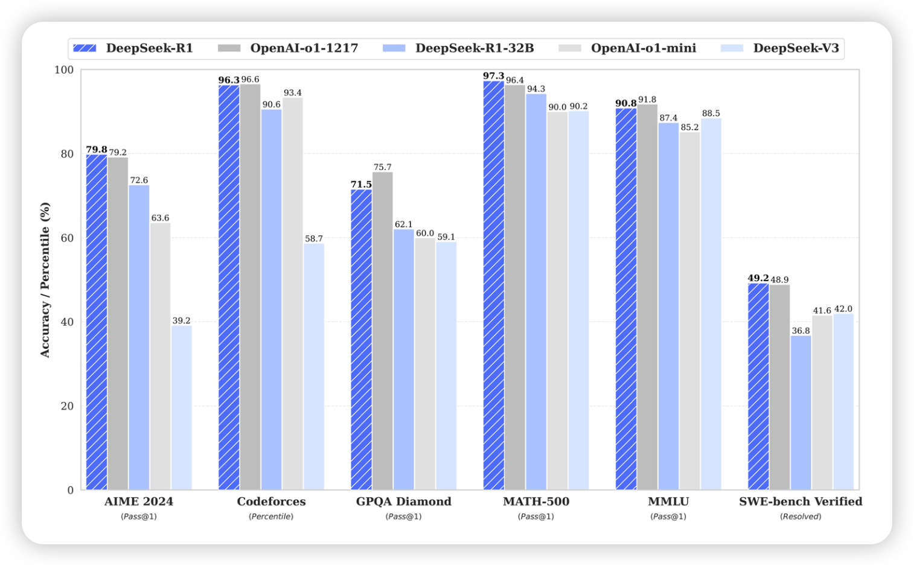

- [DeepSeek-R1：通过强化学习提升LLM推理能力](#deepseek-r1通过强化学习提升llm推理能力)
  - [主要内容](#主要内容)
    - [1. 作者和团队信息](#1-作者和团队信息)
    - [2. 背景和动机](#2-背景和动机)
    - [3. 相关研究](#3-相关研究)
    - [4. 核心思路](#4-核心思路)
    - [5. 方案与技术](#5-方案与技术)
    - [6. 实验与结论](#6-实验与结论)
    - [7. 贡献](#7-贡献)
    - [8. 不足](#8-不足)
  - [QA](#qa)
    - [Q1：为什么这篇论文要研究纯强化学习（RL）在 LLM 推理能力上的应用？](#q1为什么这篇论文要研究纯强化学习rl在-llm-推理能力上的应用)
    - [Q2：DeepSeek-R1-Zero 的「顿悟」时刻（aha moment）是怎么回事？](#q2deepseek-r1-zero-的顿悟时刻aha-moment是怎么回事)
    - [Q3：DeepSeek-R1相比DeepSeek-R1-Zero，做了哪些最主要的改进？](#q3deepseek-r1相比deepseek-r1-zero做了哪些最主要的改进)
    - [Q4：为什么 DeepSeek-R1 要使用冷启动数据？冷启动数据有什么好处？](#q4为什么-deepseek-r1-要使用冷启动数据冷启动数据有什么好处)
    - [Q5：DeepSeek-R1 的多阶段训练框架中每个阶段的侧重点是什么？](#q5deepseek-r1-的多阶段训练框架中每个阶段的侧重点是什么)
    - [Q6：论文中提到，DeepSeek-R1 在软件工程任务中提升不明显，这是为什么？](#q6论文中提到deepseek-r1-在软件工程任务中提升不明显这是为什么)
    - [Q7：为什么论文中说，基于过程的奖励模型（PRM）和蒙特卡洛树搜索（MCTS）并不适合 LLM 的推理？](#q7为什么论文中说基于过程的奖励模型prm和蒙特卡洛树搜索mcts并不适合-llm-的推理)
    - [Q8：为什么在蒸馏到小模型时，直接用RL在小模型上训练不如先做大模型再蒸馏？](#q8为什么在蒸馏到小模型时直接用rl在小模型上训练不如先做大模型再蒸馏)
    - [Q9：在没有大量带「过程标签」（step-by-step annotation）的数据支撑下，模型如何知道自己的推理过程是否正确？](#q9在没有大量带过程标签step-by-step-annotation的数据支撑下模型如何知道自己的推理过程是否正确)
    - [Q10：如果我想在工程上应用DeepSeek-R1，需要从哪些方面注意？](#q10如果我想在工程上应用deepseek-r1需要从哪些方面注意)
    - [Q11：这篇论文对我们有什么启发？](#q11这篇论文对我们有什么启发)
  - [伪代码实现](#伪代码实现)


# DeepSeek-R1：通过强化学习提升LLM推理能力

DeepSeek刚刚（2025年1月20日）放出了自己的o1-like模型，命名为DeepSeek-R1，R代表推理（Reasoning）。验证了三个思路：

- DeepSeek-R1-Zero：纯RL，展现了自我进化能力，但存在可读性问题
- DeepSeek-R1：冷启动 + 多阶段训练，在多个推理benchmark上取得了和OpenAI-o1-1217相近的水平。
- 小模型蒸馏：知识蒸馏后的小模型在推理benchmark上也表现出强大的竞争力。

## 主要内容

### 1. 作者和团队信息

- 作者团队：论文由 DeepSeek-AI 团队的研究人员完成。
- 核心贡献者：
  - Daya Guo、Dejian Yang 等为论文的核心贡献者，负责整体的研究方向、算法设计和实验验证。
- 团队背景：DeepSeek-AI 团队在 LLM 领域有深厚的技术积累，曾发布过 DeepSeek-V3 等模型。

### 2. 背景和动机

- **发表时间**：2025年1月。
- **研究问题**：如何通过强化学习（RL）有效提升大型语言模型（LLM）的推理能力？
- **问题背景**：
  - 近年来，LLM 在各个领域都取得了显著进展，但推理能力仍有提升空间。
之前的研究大多依赖于大量的监督式微调（SFT）数据，但获取高质量的 SFT 数据成本高昂。
  - OpenAI 的 o1 系列模型通过增加思维链（Chain-of-Thought, CoT）推理过程的长度来提升推理能力，但如何有效进行测试时（test-time）扩展仍是开放问题。
  - 一些研究尝试使用基于过程的奖励模型、强化学习和搜索算法来解决推理问题，但没有达到 OpenAI 的 o1 系列模型的通用推理性能水平。
- **论文动机**：探索是否可以通过纯强化学习来让 LLM 自主发展推理能力，而无需依赖监督式数据。

### 3. 相关研究

- **监督式微调 (SFT)**：之前的研究通常依赖 SFT 来增强模型性能。然而，SFT 需要大量标注数据，成本高且耗时。
- **推理时扩展**：OpenAI 的 o1 系列模型通过增加 CoT 推理长度来实现推理能力扩展，但测试时扩展的挑战仍然存在。
- **基于过程的奖励模型**：一些研究采用过程奖励模型来引导模型进行推理。然而，这些模型在实际应用中存在局限性（后面会详细分析）。
- **强化学习**：强化学习已被用于提升推理能力，但通常与 SFT 数据结合使用，难以探索纯 RL 的潜力。
- **搜索算法**：如蒙特卡洛树搜索（MCTS）等算法也被用于增强推理，但效果有限。

### 4. 核心思路

- DeepSeek-R1-Zero：纯强化学习：
  - 直接在基础模型上应用强化学习，不使用任何 SFT 数据。
  - 探索 LLM 在纯 RL 环境下的自演化过程，使其自主发展推理能力。
- DeepSeek-R1：冷启动 + 多阶段训练：
  - 使用少量高质量的 CoT 数据进行冷启动，预热模型。
  - 进行面向推理的强化学习，提升模型在推理任务上的性能。
  - 使用拒绝采样和监督微调，进一步提升模型的综合能力。
  - 再次进行强化学习，使模型在所有场景下都表现良好。
- 知识蒸馏：
  - 将 DeepSeek-R1 的推理能力蒸馏到更小的模型中，使小模型也具有强大的推理能力。

### 5. 方案与技术

- **强化学习算法**： 使用名为GRPO（Group Relative Policy Optimization）的方法，跳过传统RL中与策略模型等规模的critic网络，通过相对评分取代绝对评分来估计baseline，减少训练开销。
- **奖励设计**：
  - 准确度奖励：对答案进行自动判定（如数学题检测答案是否正确；编程题通过编译与测试用例验证）。
  - 格式奖励：要求模型输出的思考过程必须用指定标签包裹，如<think>…</think>，并将结果放在<answer>…</answer>内，以获取对模型输出结构化的奖励。
  - 语言一致性奖励：在DeepSeek-R1阶段，进一步奖励在同一种语言中保持推理过程一致性，减少文本中不同语言混杂的现象。
- **冷启动与多阶段RL**：
  - 收集少量高质量的长链推理数据（保证文本可读性），对Base模型进行SFT作为初始策略模型。
  - 大规模RL：重点在数学、逻辑、代码推理领域进行奖励优化，提高模型推理能力。
  - 再次SFT：在推理收敛后，用拒绝采样方式过滤不良答案，并结合非推理类数据（写作、角色扮演、知识问答等），微调新一轮的Base模型。
  - 最终RL：在更全面的场景中再次强化学习，兼顾推理正确率和帮助/无害性。
- **蒸馏**：
  - 将DeepSeek-R1输出的约80万条推理示例用于训练小参数量的Qwen、Llama，让小模型具备部分高阶推理能力。

### 6. 实验与结论



- 实验设计：
  - 论文在多种数学推理（AIME 2024、MATH-500）、代码题（LiveCodeBench、Codeforces）、知识问答（MMLU、GPQA Diamond、SimpleQA）和开放生成场景（AlpacaEval2.0、ArenaHard）等上进行了系统评测。
  - 对于数学与编程题目，准确度大多以pass@1或majority voting的方式衡量；对于生成类任务，则用LLM或GPT-4等来做对比打分。
- 主要结果：
  - DeepSeek-R1-Zero（纯RL）在AIME2024等难度较高的数学推理上，从初始的15.6%提升到71.0% pass@1，投票后可达86.7%，与OpenAI-o1-0912相当。
  - DeepSeek-R1（冷启动+多阶段RL）在数学、逻辑推理方面可与OpenAI-o1-1217相媲美，并在各种教育型基准测试（如MMLU-Pro等）获得大幅提升。
  - 小模型蒸馏版本也有亮眼成绩，如DeepSeek-R1-Distill-Qwen-7B在AIME2024可达55.5%，而DeepSeek-R1-Distill-Qwen-14B与32B则不断逼近乃至超越更大规模的对比模型。

### 7. 贡献

- **首次验证了纯强化学习在LLM中显著增强推理能力的可行性**（DeepSeek-R1-Zero），即无需预先的SFT数据，仅通过reward即可激励模型学会长链推理和反思等能力。
- 提出了**多阶段训练策略**（含冷启动、拒绝采样、二轮SFT和全场景RL），有效兼顾准确率与可读性，产出DeepSeek-R1，性能比肩OpenAI-o1-1217。
- 展示了**知识蒸馏在提升小模型推理能力方面的潜力**，并开源多个大小不一的蒸馏模型（1.5B~70B），为社区提供了可在低资源环境中也能获得高推理能力的模型选择。
- 从学术和产业角度均提供了可复用的RL和SFT思路，丰富了大模型后训练方法论。

### 8. 不足

- 可读性与语言混杂： DeepSeek-R1-Zero严重依赖于基础模型的语言能力，没有经过特别的「友好输出」训练，容易出现语言互相夹杂、格式不佳等问题。虽然在DeepSeek-R1中有所改善，但对于多语言场景还需进一步优化。
- 提示词敏感性： DeepSeek-R1对上下文提示较为敏感，用少量示例（few-shot）可能会损害模型的推理表现，尚不具备稳定的泛化提示策略。
- 软件开发类任务： RL在代码编写（尤其是工程级）的大规模应用还受限于评测成本高、过程长等问题，目前DeepSeek-R1在一般代码题上有改进，但在复杂工程问题上和最先进模型相比，还有提升空间。
- PRM和MCTS的尝试不理想：文章还提到，他们尝试了基于过程的奖励模型（PRM）和蒙特卡洛树搜索（MCTS）等方法，但没有取得成功。仍需探索。
  - 尝试过过程奖励模型时，遇到标注难度高、奖励作弊等情况，尚未找到易于扩展的稳定方法。
  - MCTS的挑战在于，Token 生成的搜索空间远大于棋类游戏，容易陷入局部最优。

## QA

### Q1：为什么这篇论文要研究纯强化学习（RL）在 LLM 推理能力上的应用？

之前的研究通常依赖大量的监督式微调（SFT）数据，但获取这些数据成本高昂。此外，作者也希望探索，在没有人类干预的情况下，模型如何通过和环境交互，自发进化出强大的推理能力。因此，这篇论文尝试直接在基础模型上应用 RL，观察模型在纯 RL 环境下的表现。

### Q2：DeepSeek-R1-Zero 的「顿悟」时刻（aha moment）是怎么回事？

在大规模强化学习中，模型的「思考过程」会不断与最终的正确率奖励相互作用。当模型最初得出的答案并未得到较高奖励时，它会在后续的推理中「回头反省」，尝试补充或修正先前的思路，从而获得更高的奖励。随着强化学习的迭代，这种「主动回溯、推翻先前想法并重新推理」的行为逐渐巩固，便在输出中表现为所谓的「aha moment」。本质上，这是RL为模型「留出了」足够的思考和试错空间，当模型自行发现更优思路时，就会出现类似人类「恍然大悟」的瞬间。

这也展示了 RL 的强大潜力，它可以让模型在没有明确指导的情况下，自主学习并改进。

### Q3：DeepSeek-R1相比DeepSeek-R1-Zero，做了哪些最主要的改进？

- 引入冷启动数据：使用了数千条带详细推理过程（长CoT）的数据先做一次SFT，让模型初始时就具备一定可读性与写作风格。
- 分阶段RL：在推理收敛后，通过拒绝采样等手段获得更多优质监督样本，再进行SFT，再全场景RL，不断修正模型的正确性与通用能力。
- 语言一致性奖励：避免模型出现大量的拼写或中英文混杂，从而保证可读性。

### Q4：为什么 DeepSeek-R1 要使用冷启动数据？冷启动数据有什么好处？

DeepSeek-R1 使用冷启动数据的主要目的是为了解决 DeepSeek-R1-Zero 在训练早期出现的训练不稳定问题。相比于直接在基础模型上进行 RL，使用少量的 SFT 数据进行冷启动，可以让模型更快地进入稳定训练阶段：

- 可读性：冷启动数据使用更易于理解的格式，输出内容更适合人类阅读，避免了 DeepSeek-R1-Zero 输出的语言混合、格式混乱等问题。
- 潜在性能：通过精心设计冷启动数据的模式，可以引导模型产生更好的推理能力。
- 稳定训练：使用 SFT 数据作为起始点，可以避免 RL 训练早期阶段的不稳定问题。

### Q5：DeepSeek-R1 的多阶段训练框架中每个阶段的侧重点是什么？

- 冷启动（Cold Start）：使用少量高质量的 CoT 数据对基础模型进行微调，作为 RL 训练的初始起点。侧重点是让模型掌握基本的 CoT 推理能力，并使模型的输出更具可读性。
- 推理导向的强化学习（Reasoning-oriented RL）：在冷启动模型的基础上进行 RL 训练，侧重点是提升模型在推理任务上的性能。在这个阶段，会引入语言一致性奖励，以减少推理过程中的语言混合问题。
- 拒绝采样和监督微调（Rejection Sampling and SFT）：使用上一阶段的 RL 模型进行拒绝采样，生成高质量的推理和非推理数据，并用这些数据对模型进行微调。侧重点是提升模型的综合能力，使其在写作、事实问答等多种任务上表现良好。
- 所有场景下的强化学习（RL for all scenarios）：在上一阶段 SFT 模型的基础上进行 RL 训练，侧重点是使模型在所有场景下都能表现良好，包括推理任务和非推理任务，并且保证模型的安全性和无害性。

### Q6：论文中提到，DeepSeek-R1 在软件工程任务中提升不明显，这是为什么？

- 评估时间过长：软件工程任务的评估时间较长，这会影响 RL 过程的效率，使得在软件工程任务上无法进行大规模的 RL 训练。
- 数据有限：目前可用于软件工程任务的 RL 训练数据仍然有限，因此模型在这些任务上的性能提升相对较小。
- 未来改进方向： 论文也提到，未来会使用拒绝采样或异步评估来提升在软件工程任务上的性能。

### Q7：为什么论文中说，基于过程的奖励模型（PRM）和蒙特卡洛树搜索（MCTS）并不适合 LLM 的推理？

- PRM 的挑战：
  - 难以定义通用的、细粒度的推理步骤。
  - 难以准确判断中间步骤的正确性，且自动标注方法效果不佳，人工标注又难以扩展。
  - 模型化的 PRM 容易导致奖励黑客行为，并且会增加额外的训练成本。
- MCTS 的挑战：
  - LLM 的 token 生成搜索空间巨大，远远超出棋类游戏，容易陷入局部最优解。
  - 价值模型的训练非常困难，导致难以迭代提升。

这两个方法在某些领域是有效的，但对于 LLM 这种复杂场景，直接套用可能无法达到理想的效果。

### Q8：为什么在蒸馏到小模型时，直接用RL在小模型上训练不如先做大模型再蒸馏？

- 大模型在RL阶段可能出现许多高阶推理模式。而小模型因为容量和表示能力有限，很难在无监督或纯RL情境下学到相似水平的推理模式。
- 蒸馏可将「大模型的推理轨迹」直接转移给小模型，小模型只需要模仿大模型相对完备的推理流程，可以在较小训练/推理开销下取得远胜于自身独立强化学习的效果。

### Q9：在没有大量带「过程标签」（step-by-step annotation）的数据支撑下，模型如何知道自己的推理过程是否正确？

- 这里主要通过「结果判定」的方式：对于数学题、编程题等有客观正确答案的任务，可以把最终答案与标准结果对比给出奖励。虽没有逐步的过程标注，但最终答案正确与否足以在RL中当作回报（Reward）来引导模型学会更好的推理。
- 部分中间也会酌情使用格式奖励，用来约束模型输出思考过程，这是一种「作弊少、易维护」的思路。

### Q10：如果我想在工程上应用DeepSeek-R1，需要从哪些方面注意？

- 提示词要简洁：少用Few-shot示例，因论文提到DeepSeek-R1对少量示例可能会过度拟合，影响推理性能。
- 非数学/编程场景：由于模型强化学习数据以推理为主，如需更强的对话、多轮交互等能力，或许需要额外的微调数据或结合其他指令微调。
- 资源规划：模型推理时的思考链很长，注意在生产环境中如何限制最大token数和计算开销。

### Q11：这篇论文对我们有什么启发？

- 纯 RL 的潜力：这篇论文首次验证了，纯 RL 可以有效地提升 LLM 的推理能力，为未来的研究提供了新的方向。
- 冷启动的重要性：冷启动策略可以有效地稳定 RL 训练，加速模型性能的提升。
- 多阶段训练的优势：多阶段训练框架可以更好地结合 SFT 和 RL 的优势，提升模型的综合能力。
- 知识蒸馏的价值：知识蒸馏可以有效地将大模型的知识和能力迁移到小模型中，降低使用成本。
- 对失败的思考：失败的尝试也提供了宝贵的经验，让我们认识到 PRM 和 MCTS 等方法在 LLM 推理任务中的局限性。
- 对未来研究方向的展望：这篇论文也指出了未来研究的方向，例如如何解决语言混合问题、如何提升模型在软件工程任务上的性能、如何构建更全面、更具挑战性的推理基准测试等。

## 伪代码实现

下面给出一个demo级别的代码，用以演示核心思路：

```python
"""
本示例演示论文中DeepSeek-R1的主要流程，包括：
1. 冷启动数据微调（SFT）
2. 面向推理的强化学习（Reasoning-oriented RL）
3. 拒绝采样并再次微调（Rejection Sampling + SFT）
4. 面向全场景的RL
5. 蒸馏到小模型

注：以下代码仅为演示性质，省略了数据加载、超参数配置、训练细节和大规模并行等实际工程实现。
"""

import torch
import random
import numpy as np
from transformers import AutoModelForCausalLM, AutoTokenizer, TrainingArguments, Trainer
# (可选) 下面演示使用一个公开的RL库示例，如TRL等
# from trl import PPOTrainer, PPOConfig

#####################################################################################
#                                数据加载与预处理
#####################################################################################

def load_data_cold_start():
    """
    加载冷启动数据（包含一小批带详细推理过程的示例）。
    返回值为一个简单的列表或DataSet格式，每条数据含(prompt, answer_with_CoT)。
    """
    # 这里仅示例返回一个空列表或简单模拟
    return [
        {
            "prompt": "给定一个整数n，判断它是否是质数，并解释推理过程。",
            "answer": "<reasoning_process>...长链推理示例...</reasoning_process><summary>是质数/不是质数</summary>"
        },
        # ... 这里应该有更多实际冷启动数据
    ]

def load_data_reasoning_rl():
    """
    加载主要用来做推理强化学习的大规模任务数据（如数学、代码、逻辑推理题）。
    返回值通常包含可以自动判分的题目，以便实现基于结果的reward。
    """
    return [
        {"prompt": "请解方程: x^2 - 4x + 3 = 0 ，并给出详细推理。", "reference_answer": "x=1或x=3"},
        # ... 省略更多示例
    ]

def load_data_sft_non_reasoning():
    """
    加载非推理场景的数据，例如写作任务、多轮对话、知识问答等，用于SFT微调后提升通用性。
    """
    return [
        {"prompt": "你好，可以帮我写一段自我介绍吗？", "answer": "好的，这里是一段简单示例......"},
        # ...
    ]

def load_data_for_rejection_sampling():
    """
    用于做拒绝采样时的题目或场景数据，之后会调用强化后的模型生成答案，再根据规则或模型判定是否保留。
    """
    return [
        {"prompt": "证明勾股定理，并写出详细过程。", "reference_answer": "符合题意的正确推理和结论"},
        # ...
    ]

#####################################################################################
#                       冷启动微调 (Stage 1: Cold-Start SFT)
#####################################################################################

def train_sft_cold_start(base_model_name: str, train_data, output_dir: str):
    """
    使用冷启动数据进行SFT（监督微调）。
    :param base_model_name: HuggingFace模型名称或本地路径
    :param train_data: 冷启动数据，需包含prompt和详细的答案（带CoT）
    :param output_dir: 模型输出目录
    :return: 微调后的模型
    """
    tokenizer = AutoTokenizer.from_pretrained(base_model_name)
    model = AutoModelForCausalLM.from_pretrained(base_model_name)

    # 这里为了简单，用huggingface的Trainer做一个监督训练示例
    # 实际中需根据任务自定义collator并拼接 <prompt><separator><answer> 格式输入
    train_texts = []
    for d in train_data:
        prompt = d["prompt"]
        answer = d["answer"]
        # 假设answer里已经含有<reasoning_process>,<summary>等标记
        combined_text = f"{prompt}\n{answer}"
        train_texts.append(combined_text)

    # 简单的train_dataset示例
    encodings = tokenizer(train_texts, truncation=True, padding=True, max_length=512)
    # 为了演示，可把inputs当targets
    dataset = SimpleDataset(encodings)

    training_args = TrainingArguments(
        output_dir=output_dir,
        num_train_epochs=1,  # 示例中只训练一个epoch
        per_device_train_batch_size=2,
        save_steps=10,
        logging_steps=10
    )

    trainer = Trainer(
        model=model,
        args=training_args,
        train_dataset=dataset
    )
    trainer.train()

    return model, tokenizer


#####################################################################################
#         面向推理的强化学习 (Stage 2: Reasoning-Oriented RL，如DeepSeek-R1-Zero)
#####################################################################################

def compute_reward_for_reasoning(output_str: str, reference_answer: str) -> float:
    """
    根据模型输出和参考答案来计算奖励值。
    这里以简单匹配or外部判定为例：正确则+1，不正确则0。
    在实际中可使用更多规则/正则表达式/编译器测试，乃至语言一致性奖励等。
    """
    # 简单示例：如果预期结果在输出字符串里，就给正奖励，否则0
    if reference_answer in output_str:
        return 1.0
    else:
        return 0.0


def train_rl_reasoning(base_model, tokenizer, rl_data, rl_steps=1000):
    """
    针对推理任务进行大规模强化学习训练，示例化演示。
    :param base_model: 已经初始化或SFT过的模型(如DeepSeek-V3-Base或SFT后的模型)
    :param tokenizer: 分词器
    :param rl_data: 大规模推理数据，每条含可自动判定正误的题目
    :param rl_steps: RL训练步数
    :return: 强化学习后的模型
    """
    # 注意：在真实实现中，需要RL库(如trl, accelerate等)来进行策略梯度/PPO等操作
    # 这里仅做概念示例
    
    # pseudo-code:
    model = base_model
    optimizer = torch.optim.AdamW(model.parameters(), lr=1e-5)
    
    # 模拟若干个训练步，每步从数据集中采样(SGD)
    for step in range(rl_steps):
        data_sample = random.choice(rl_data)
        prompt = data_sample["prompt"]
        ref_ans = data_sample["reference_answer"]

        # 1. 用当前策略（model）生成文本
        inputs = tokenizer(prompt, return_tensors="pt")
        outputs = model.generate(**inputs, max_new_tokens=128)
        output_text = tokenizer.decode(outputs[0], skip_special_tokens=True)

        # 2. 计算奖励
        reward = compute_reward_for_reasoning(output_text, ref_ans)

        # 3. 计算policy gradient的loss(仅示例，不是实际可运行代码)
        #    在真实环境，需要保留log_probs，并使用类似PPO的loss函数
        #    这里假装reward就是loss的负数
        loss = -1.0 * reward  # 纯粹演示，不可用

        # 4. 反向传播并更新模型
        loss.backward()
        optimizer.step()
        optimizer.zero_grad()

        if step % 100 == 0:
            print(f"RL training step {step}, current reward={reward}, output_text={output_text[:50]}...")

    return model


#####################################################################################
#                 拒绝采样并再次SFT (Stage 3: Rejection Sampling + New SFT)
#####################################################################################

def collect_data_with_rejection_sampling(model, tokenizer, data_for_reject_sampling):
    """
    用已强化学习后的模型生成若干答案，进行拒绝采样。
    - 对于每个prompt，采样N次（例如N=4或更多），并将其中正确或可读性好的回答保留下来。
    - 可以组合人工过滤或简单的GPT判定、判分器等。
    """
    recollected = []
    for d in data_for_reject_sampling:
        prompt = d["prompt"]
        ref_ans = d["reference_answer"]
        # 全部候选
        candidates = []
        for _ in range(4):
            inputs = tokenizer(prompt, return_tensors="pt")
            outputs = model.generate(**inputs, max_new_tokens=128)
            output_text = tokenizer.decode(outputs[0], skip_special_tokens=True)
            # 计算正确性
            score = compute_reward_for_reasoning(output_text, ref_ans)
            candidates.append((output_text, score))
        # 选择score最高/可读性最好的
        best_candidate = max(candidates, key=lambda x: x[1])
        # 如果符合一定阈值，则保留
        if best_candidate[1] > 0.5:
            recollected.append((prompt, best_candidate[0]))
    return recollected

def train_sft_second(model_name_or_path, new_sft_data, output_dir):
    """
    对带有更多(拒绝采样后)的推理数据+非推理数据，再次SFT
    """
    tokenizer = AutoTokenizer.from_pretrained(model_name_or_path)
    model = AutoModelForCausalLM.from_pretrained(model_name_or_path)

    # 同理，这里只是示例化
    train_texts = []
    for item in new_sft_data:
        prompt, ans = item
        combined = f"{prompt}\n{ans}"
        train_texts.append(combined)

    encodings = tokenizer(train_texts, truncation=True, padding=True, max_length=512)
    dataset = SimpleDataset(encodings)

    training_args = TrainingArguments(
        output_dir=output_dir,
        num_train_epochs=1,
        per_device_train_batch_size=2,
        save_steps=10,
        logging_steps=10
    )
    trainer = Trainer(
        model=model,
        args=training_args,
        train_dataset=dataset
    )
    trainer.train()

    return model, tokenizer


#####################################################################################
#                 全场景RL (Stage 4: RL for All Scenarios)
#####################################################################################

def train_rl_full_scenarios(model, tokenizer, data_mixed, steps=1000):
    """
    在所有场景（包含推理数据和广泛任务数据）上再次进行RL，
    以同时兼顾有害性检测、帮助度评估等多种reward。
    """
    # 仅示例：引入更多reward维度，如helpfulness_reward, harmless_reward等
    optimizer = torch.optim.AdamW(model.parameters(), lr=1e-5)

    for step in range(steps):
        sample_data = random.choice(data_mixed)
        prompt = sample_data["prompt"]
        ref_answer = sample_data["reference_answer"]
        # 可能还有helpfulness参考或harmlessness判断

        inputs = tokenizer(prompt, return_tensors="pt")
        outputs = model.generate(**inputs, max_new_tokens=128)
        output_text = tokenizer.decode(outputs[0], skip_special_tokens=True)

        # 假设用多重reward简单加和
        correctness_reward = compute_reward_for_reasoning(output_text, ref_answer)
        helpfulness_reward = 0.5  # 仅示例: 可能需要另一个模型打分
        total_reward = correctness_reward + helpfulness_reward
        loss = -1.0 * total_reward

        loss.backward()
        optimizer.step()
        optimizer.zero_grad()

        if step % 100 == 0:
            print(f"[Full RL] Step {step}, total reward={total_reward}, sample output={output_text[:50]}...")

    return model


#####################################################################################
#                 蒸馏到小模型 (Stage 5: Distillation to Smaller Models)
#####################################################################################

def distill_model_to_small(teacher_model, teacher_tokenizer, small_model_name, distilled_data, output_dir):
    """
    将teacher模型（DeepSeek-R1）生成的推理数据，拿来对小模型做微调，达到蒸馏效果。
    :param teacher_model: 已经训练好的教师模型
    :param teacher_tokenizer: 教师模型分词器
    :param small_model_name: 用来加载小模型的名称或路径
    :param distilled_data: 教师模型产出的数据，如<prompt, answer>对
    :param output_dir: 小模型输出路径
    """
    # 1. 小模型初始化
    small_model = AutoModelForCausalLM.from_pretrained(small_model_name)
    small_tokenizer = AutoTokenizer.from_pretrained(small_model_name)

    # 2. 构造"教师强推理数据" → "学生小模型微调"
    #    在实际中，可由teacher_model对大量复杂题目生成正确解答，然后把 (prompt, answer) 存入distilled_data
    #    这里仅做简单示例
    train_texts = []
    for item in distilled_data:
        # item为(prompt, correct_answer)对
        prompt, ans = item
        combined_text = f"{prompt}\n{ans}"
        train_texts.append(combined_text)

    encodings = small_tokenizer(train_texts, truncation=True, padding=True, max_length=512)
    dataset = SimpleDataset(encodings)

    training_args = TrainingArguments(
        output_dir=output_dir,
        num_train_epochs=1,
        per_device_train_batch_size=2,
        save_steps=10,
        logging_steps=10
    )

    trainer = Trainer(
        model=small_model,
        args=training_args,
        train_dataset=dataset
    )
    trainer.train()

    return small_model, small_tokenizer


#####################################################################################
#                                   工具函数
#####################################################################################

class SimpleDataset(torch.utils.data.Dataset):
    """
    简易数据集封装，将tokenizer输出的encodings包装为torch Dataset
    """
    def __init__(self, encodings):
        self.encodings = encodings

    def __getitem__(self, i):
        return {key: torch.tensor(val[i]) for key, val in self.encodings.items()}

    def __len__(self):
        return len(self.encodings["input_ids"])


#####################################################################################
#                                   主流程示例
#####################################################################################

def main():
    # 1. 加载基础模型名称或路径
    base_model_name = "EleutherAI/gpt-neo-1.3B"  # 仅示例，可换成任意支持的LLM
    
    # --------------------- Stage 1: 冷启动SFT ---------------------
    cold_data = load_data_cold_start()
    model_cold, tokenizer_cold = train_sft_cold_start(
        base_model_name,
        cold_data,
        output_dir="model_sft_cold"
    )
    # 这里假设得到一个在冷启动数据上具备一定可读性的模型
    
    # --------------------- Stage 2: 推理强化学习 (Reasoning RL) ---------------------
    rl_data = load_data_reasoning_rl()
    model_reasoning = train_rl_reasoning(model_cold, tokenizer_cold, rl_data, rl_steps=100)
    # 此时得到类似DeepSeek-R1-Zero或DeepSeek-R1初步版本

    # --------------------- Stage 3: 拒绝采样并再次SFT ---------------------
    data_for_reject = load_data_for_rejection_sampling()
    recollected_data = collect_data_with_rejection_sampling(model_reasoning, tokenizer_cold, data_for_reject)
    # 也可合并非推理SFT数据
    non_reasoning_data = load_data_sft_non_reasoning()
    # 将两部分融合
    new_sft_data = []
    for item in recollected_data:
        new_sft_data.append(item)
    for nr in non_reasoning_data:
        prompt = nr["prompt"]
        ans = nr["answer"]
        new_sft_data.append((prompt, ans))

    model_sft2, tokenizer_sft2 = train_sft_second(
        base_model_name,
        new_sft_data,
        output_dir="model_sft_stage2"
    )

    # --------------------- Stage 4: 全场景RL ---------------------
    # 我们可以将更多多样化数据放在一起，让模型既保留强推理能力，也能兼顾安全、形式合规等
    data_mixed = rl_data  # 这里直接重复用推理数据做示例
    model_full = train_rl_full_scenarios(model_sft2, tokenizer_sft2, data_mixed, steps=50)

    # --------------------- Stage 5: 蒸馏到小模型 ---------------------
    # 假设我们先用训练好的model_full生成了大量的 (prompt, answer) 对，存储在distilled_data里
    # 这里为演示，仅以recollected_data为例
    distilled_data = recollected_data
    teacher_model = model_full
    teacher_tokenizer = tokenizer_sft2
    small_model_name = "gpt2"  # 示例小模型
    small_model, small_tokenizer = distill_model_to_small(
        teacher_model, teacher_tokenizer,
        small_model_name,
        distilled_data,
        output_dir="model_distilled_small"
    )

    print("DeepSeek-R1示例流程结束，最终小模型已完成蒸馏。")


if __name__ == "__main__":
    main()


```

说明：

- 「冷启动SFT」：使用少量高质量、能示范推理过程的训练样本进行监督微调。
- 「推理导向的强化学习」：使用可自动判定（或半自动判定）正确性的海量推理数据来不断提高模型的推理能力。
- 「拒绝采样+再次SFT」：在强化学习模型基础上，对多次候选输出进行筛选，把正确且可读性好的数据重新用作监督数据来微调。
- 「全场景RL」：进一步优化模型的helpfulness（帮助度）、harmlessness（安全性）等更多维度。
- 「蒸馏」：将最终得到的强推理模型用作教师模型，为更小的基模型提供大规模( prompt, answer )对，让小模型也获得较好的推理能力。


> refer to: https://zhuanlan.zhihu.com/p/19551355661
