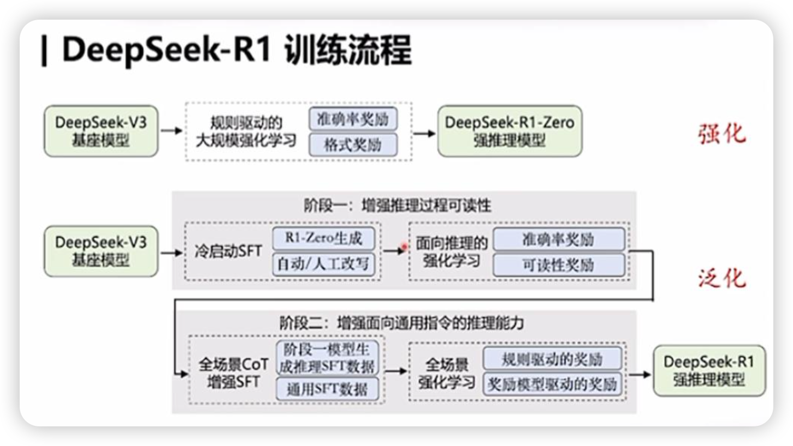

- [DeepSeek-R1 解读](#deepseek-r1-解读)
  - [一、技术突破：从零开始的推理能力进化](#一技术突破从零开始的推理能力进化)
    - [1. DeepSeek-R1-Zero：纯RL训练的“自我觉醒”](#1-deepseek-r1-zero纯rl训练的自我觉醒)
    - [2. DeepSeek-R1：冷启动与多阶段训练的平衡之道](#2-deepseek-r1冷启动与多阶段训练的平衡之道)
  - [二、实验验证：推理能力的全方位跃升](#二实验验证推理能力的全方位跃升)
    - [1. 基准测试：超越顶尖闭源模型](#1-基准测试超越顶尖闭源模型)
    - [2. 蒸馏技术：小模型的逆袭](#2-蒸馏技术小模型的逆袭)
  - [三、行业启示：AGI之路的新范式](#三行业启示agi之路的新范式)
    - [1. 纯RL训练的价值与挑战](#1-纯rl训练的价值与挑战)
    - [2. 蒸馏技术的普惠意义](#2-蒸馏技术的普惠意义)
    - [3. 开源生态的推动力](#3-开源生态的推动力)
  - [四、未来展望：从推理到通用智能](#四未来展望从推理到通用智能)
  - [五、结语](#五结语)

# DeepSeek-R1 解读

近年来，大型语言模型（LLMs）在自然语言处理领域取得了显著进展，但其核心推理能力仍面临挑战。传统方法多依赖监督微调（SFT）和复杂的提示工程，而DeepSeek-AI团队的最新研究《DeepSeek-R1: Incentivizing Reasoning Capability in LLMs via Reinforcement Learning》提出了一种革命性路径：通过纯强化学习（RL）自主激发模型的推理能力，并结合蒸馏技术实现高效迁移。本文将从技术突破、实验成果与行业影响三个维度，深度解析这一研究的核心价值。

## 一、技术突破：从零开始的推理能力进化

### 1. DeepSeek-R1-Zero：纯RL训练的“自我觉醒”

传统LLM的推理能力通常需要大量人工标注的监督数据，但DeepSeek-R1-Zero首次验证了无需任何SFT数据，仅通过强化学习即可实现推理能力的自主进化。其核心创新在于：

- 算法框架：采用Group Relative Policy Optimization（GRPO），通过组内奖励对比优化策略，避免传统RL中复杂价值模型的依赖。
- 自我进化现象：模型在训练中自发涌现出“反思”（Re-evaluation）、“多步验证”（Multi-step Verification）等复杂推理行为。例如，在解决数学方程时，模型会主动纠正早期错误步骤（如表3的“Aha Moment”）。
- 性能飞跃：在AIME 2024数学竞赛任务中，模型Pass@1准确率从初始的15.6%提升至71.0%，多数投票（Majority Voting）后更达86.7%，与OpenAI的o1-0912模型持平。

然而，纯RL训练的代价是可读性差与多语言混杂。模型生成的推理过程常包含中英文混合、格式混乱等问题，限制了实际应用。

### 2. DeepSeek-R1：冷启动与多阶段训练的平衡之道

为解决上述问题，团队提出**“冷启动+多阶段RL”策略**：

- 冷启动阶段：引入数千条高质量长推理链数据对基础模型微调，强制规范输出格式（如<think>推理过程</think>标签），提升可读性。
- 两阶段强化学习：
  - 推理导向RL：结合规则奖励（答案准确性、语言一致性），优化数学、编程等结构化任务表现。
  - 通用对齐RL：融入人类偏好奖励模型（Helpfulness & Harmlessness），确保模型在开放域任务中的安全性与实用性。

性能对标：DeepSeek-R1在MATH-500（97.3% Pass@1）、Codeforces（超越96.3%人类选手）等任务上达到与OpenAI-o1-1217相当的水平，同时在MMLU（90.8%）、GPQA Diamond（71.5%）等知识密集型任务中显著超越前代模型。

## 二、实验验证：推理能力的全方位跃升

### 1. 基准测试：超越顶尖闭源模型

论文在20余项基准任务中对比了DeepSeek-R1与Claude-3.5、GPT-4o、OpenAI-o1系列等模型（表4），关键结论包括：

- 数学与编程：AIME 2024（79.8%）、MATH-500（97.3%）、LiveCodeBench（65.9%）等任务表现全面领先，Codeforces评分（2029）接近人类顶尖选手。
- 知识密集型任务：MMLU（90.8%）、GPQA Diamond（71.5%）等得分显著高于DeepSeek-V3，逼近OpenAI-o1-1217。
- 通用能力：AlpacaEval 2.0（87.6%胜率）、长上下文理解（如FRAMES任务82.5%）表现突出，证明RL训练可泛化至非推理场景。

### 2. 蒸馏技术：小模型的逆袭

通过将DeepSeek-R1生成的80万条数据用于微调开源模型（Qwen、Llama系列），团队实现了推理能力的高效迁移：

- 小模型性能飞跃：7B参数模型在AIME 2024上达55.5%，超越32B规模的QwQ-Preview；70B蒸馏模型在MATH-500（94.5%）等任务接近o1-mini。
- 开源贡献：发布1.5B至70B的蒸馏模型，为社区提供低成本、高性能的推理解决方案。

## 三、行业启示：AGI之路的新范式

### 1. 纯RL训练的价值与挑战

DeepSeek-R1-Zero的成功证明，无需人工标注的RL训练可自主挖掘模型的推理潜力。这一发现挑战了传统LLM依赖监督数据的范式，为AGI研究提供了新思路。然而，其局限性（如可读性差）也表明，完全自主进化仍需与人类先验知识结合。

### 2. 蒸馏技术的普惠意义

通过蒸馏实现推理能力迁移，不仅降低了计算成本，更使小模型在特定任务中媲美大模型。例如，7B模型在数学任务上超越GPT-4o，这为边缘计算、实时应用场景提供了可行方案。

### 3. 开源生态的推动力

DeepSeek团队开源了R1-Zero、R1及多个蒸馏模型，涵盖Qwen和Llama架构。这一举措不仅加速了学术研究，更助力企业低成本部署高性能推理模型，推动AI技术的民主化。

## 四、未来展望：从推理到通用智能

尽管DeepSeek-R1取得了突破，其局限仍指向未来方向：

多语言与工程任务：当前模型优化以中英文为主，其他语言支持有限；软件工程任务因评估效率问题提升缓慢。
长推理链的扩展：探索CoT在函数调用、多轮对话等复杂场景的应用。
安全与可控性：RL训练中奖励模型的设计需进一步平衡性能与伦理约束。

## 五、结语
DeepSeek-R1的研究标志着LLM推理能力进化的一次重要跨越。通过纯强化学习与蒸馏技术，团队不仅验证了模型自主进化的可能性，更构建了从理论研究到产业落地的完整链条。这一工作为AGI的发展提供了新范式：在减少对人类先验依赖的同时，通过算法创新与开源协作，推动智能技术的普惠与深化。未来，随着更多类似研究的涌现，我们或许正站在通用人工智能的真正起点。

> refer to: https://zhuanlan.zhihu.com/p/20097827932
> deepseek-r1 技术报告：https://github.com/deepseek-ai/DeepSeek-R1/blob/main/DeepSeek_R1.pdf
