- [deepseek-v2技术详解](#deepseek-v2技术详解)
  - [背景补充](#背景补充)
    - [KV Cache](#kv-cache)
    - [MOE架构](#moe架构)
  - [DeepSeek-V2](#deepseek-v2)
    - [Multiple Latent Attention](#multiple-latent-attention)
    - [DeepSeek MOE](#deepseek-moe)
  - [点评](#点评)

# deepseek-v2技术详解

作为国内顶级量化私募幻方旗下的大模型公司，Deepseek-V2并不是他们发布的第一个大模型。之前就已经发布过国内首个基于MOE架构的Deepseek-Moe。

而且这两次发布的大模型，Deepseek没有沿用传统的大模型架构，而是都做出了一定程度的创新，单凭敢于创新这一点就让人肃然起敬。

本篇文章将基于他们发布的技术报告中，对DeepSeek-V2的架构进行分析。

## 背景补充

这一节主要将回顾一下一些基础知识，因为DeepSeek-V2的主要创新点在：

- MLA，即Multi Latent Attention，对传统多头注意力（Multi Head Attention）的改进，降低KV Cache开销。
- DeepseekMOE，改进了传统MOE结构。

所以，这一节将回顾KV Cache和传统MOE结构的基本原理。

### KV Cache

KV Cache是大模型标配的推理加速功能，也是推理过程中，显存资源巨大开销的元凶之一。在模型推理时，KV Cache在显存占用量可达30%以上。

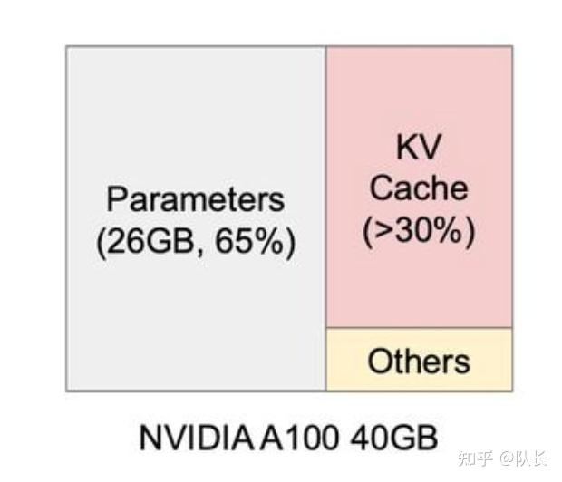

目前大部分针对KV Cache的优化工作，主要集中在工程上。比如著名的VLLM，基于paged Attention，最大限度地利用碎片化显存空间，从而提升了空间利用率。

但是这些方案并没有从根本上改变KV Cache占用空间巨大的问题。

我们先来看看KV Cache的基本原理，然后在文章后面详细介绍DeepSeek MLA机制时，再来看DeepSeek-V2是怎么解决这个问题的。

**KV Cache基本原理**

我们先回到Transformer计算Attention的公式，

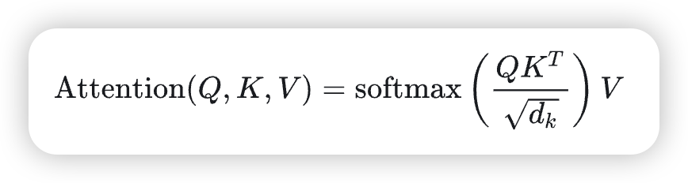

大模型的推理是一个自回归的过程，即一个从头到尾逐步生成的过程。下一步的输出，取决于上一步。

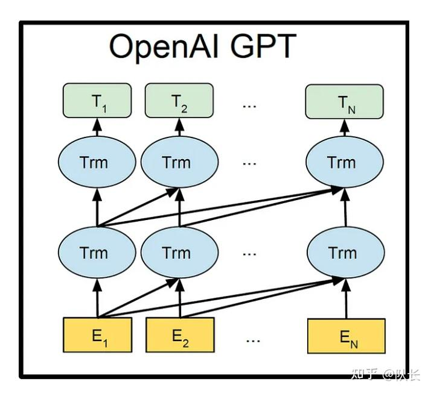

假如我们需要输出Robot must obey orders这四个字。

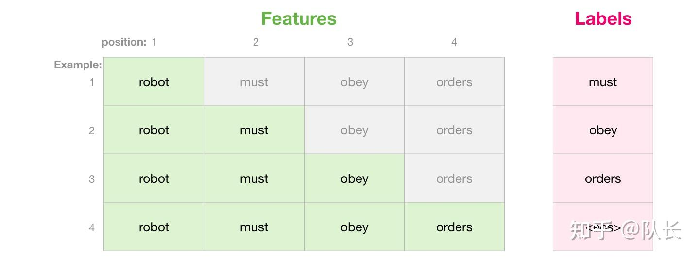

模型生成第一步Robot时，会接收一个特殊字符\<s>，作为第一步的输入，然后输出Robot。接着将“\<s> Robot”作为第二步的输入，生成must，以此类推，直到模型输出遇到最大长度限制，或者输出了停止字符，则停止输出过程。

我们来模拟一个输出过程中每一步全局的Masked Attention的计算过程。这里公式中忽略了上述公式的分子以便展示。

每一行代表一个查询向量与所有键向量的点积，但由于掩码的存在，每个查询只能访问它自己和之前的键（因果关系）。毕竟在生成的过程中，是不能看到后续的值的。

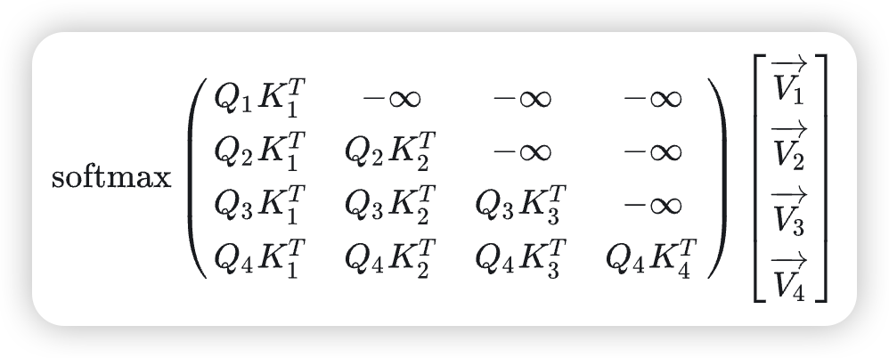

最后输出的softmax结果大概如下：

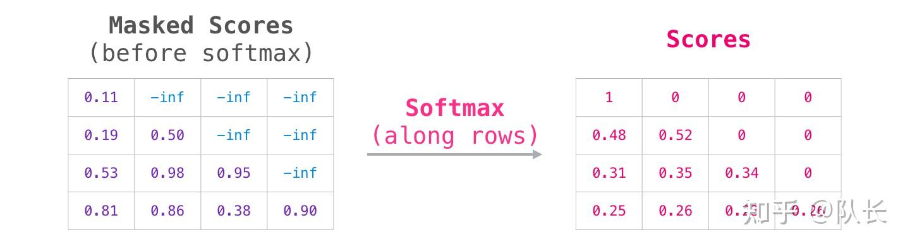

然后再将这个softmax结果，和对应的V值进行计算。在这个过程中，上面的矩阵计算，四行的Attention拆解下来如下

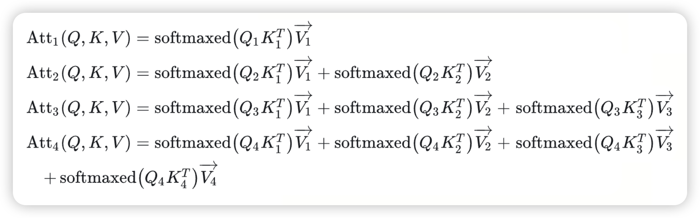

我们可以发现这么一些规律：

- 每一个 Attn 的计算，只取决于当前步的 Qn，不需要以前的 Q。
- 之前的K和V，在后面会被重复利用。

那么这里就很清楚了，随着生成序列的增加，计算Attention的增多，前面步骤的K和V都需要参与后续的计算。

所以我们如果将之前的K和V都存储下来，就不用在当前这一步，再重新生成计算一次以前生成过的K和V。这就是KV Cache。一种空间换时间的做法。

所以可以看出，随着序列增长，需要存储的K和V逐渐增多，因此推理中产生的开销也会越大。

### MOE架构

MOE层替代的是传统Transformer架构中FFN这一层。就是图中框红圈的Feed Forward层。

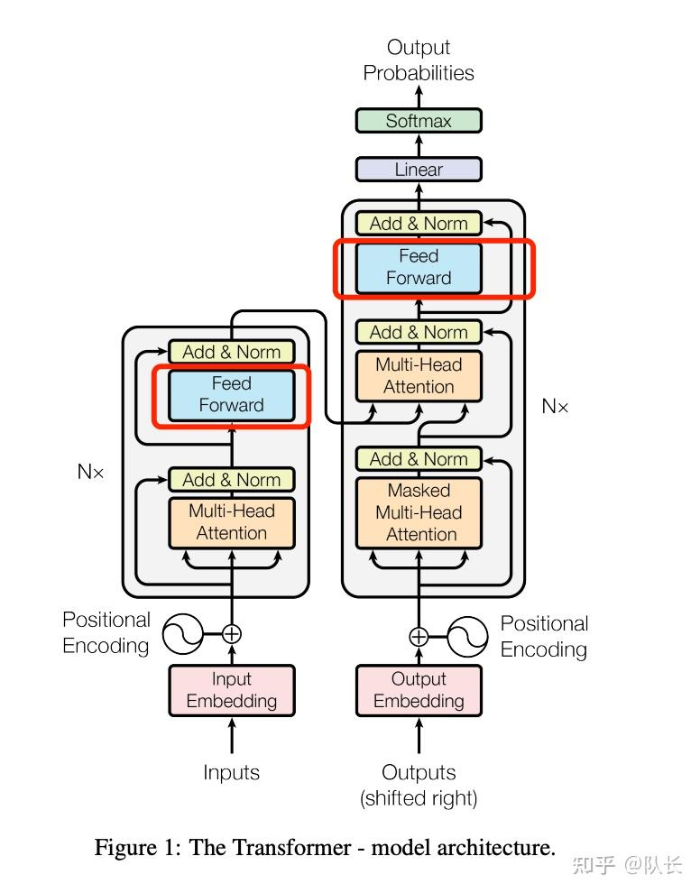

FFN层的几个问题，

第一，是FFN层参数量巨大，大概占了整个模型参数量的三分之二左右。

第二，FFN层的激活存在较大的稀疏性，也就是针对某些问题的输入，FFN层只有部分的参数是有用的。

MOE架构主要针对第二个问题进行了较大的改进。简而言之就是将一个完整的FFN，替换成由多个“专家网络”组成的神经网络，这个神经网络可以是简单的FFN，或者其它结构。从而在推理或者训练时，能够针对不同的数据进行解耦，增加效率。

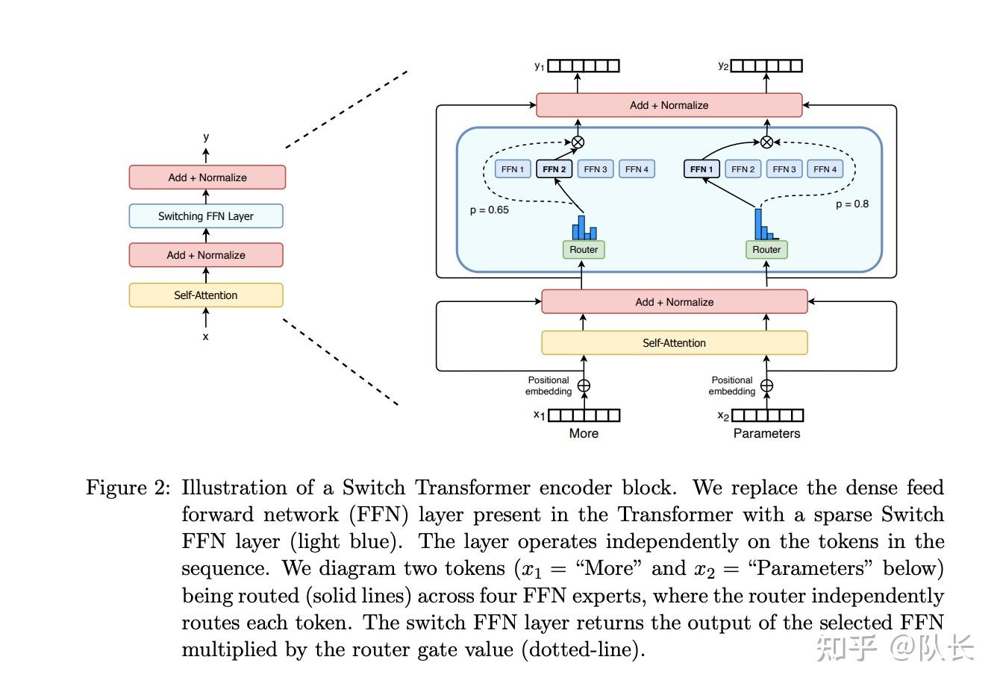

从上图的结构可以看出，MOE架构包含两个部分：

- 多个专家网络组成的稀疏MOE层。
- 另一个是门控网络，决定了模型的输入，需要由哪个专家网络进行处理。

这么做的好处在推理中体现如下：

首先，提升了模型的拓展性，MoE的每个专家都负责处理一部分数据。这意味着整个模型可以包含大量的专家（和相应的参数），而每次只有少部分专家被激活处理特定的数据。这样，我们可以扩展模型的能力而不必担心处理速度变慢。

只有被门控机制选中的专家才会参与到当前输入的处理中。这不仅使模型在处理单个任务时更为高效，而且大大减少了不必要的计算，每个专家只计算与其专长相关的数据。

不过，也有随之而来的问题，最主要的问题是，需要设计一个高效和公平的门控机制，即负载均衡问题。它需要确保正确的专家被激活，同时避免某些专家被过度使用而其他专家则几乎闲置。

此外，还得确保每个专家都能得到足够的训练，以避免过拟合或欠拟合的问题，否则输出的稳定性会受到极大影响。

## DeepSeek-V2

说完了背景知识，KV Cache和MOE，以及它们存在的一些问题。

我们可以来看看DeepSeek-V2对上述两个核心部分到底做了哪些改进。

### Multiple Latent Attention

MLA是对传统多头注意力做的改进，其目的有两个：

- 降低推理过程中的KV Cache资源开销。
- 缓解MQA、MGA对性能的损耗。

首先来说第一点，之前介绍KV Cache中，提到每一步都需要将K和V缓存下来。假设单个Attention Block块中的多头注意力，有n个头，每个k和v的维度为d，则每一步需要缓存的参数量为 2ndl，l为block的块数。

因此，MLA立足于在推理中，降低 nd。对Key和Value进行了一个低秩联合压缩。

简单理解就是，假设有个矩阵的维度是 n\*n，那么可以将其分解为两个 n*d 的矩阵相乘，而 d << n。这样就降低了存储量。

具体来看看DeepSeek中的具体实现公式：

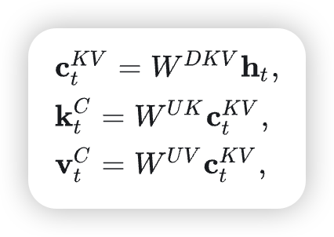

- c 是对Key和Value压缩后的隐向量，通过一个降维映射矩阵和模型输入h得到：

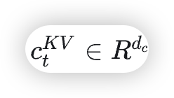

- 得到这个 c 后，具体的key和value，由两个对应的升维矩阵还原
- 在推理的过程中，只需要缓存每一步的 c，然后再计算还原回原始的K和V即可。由于 c 的维度远小于K、V。因此每一步token的推理产生的缓存由之前的 2n(h)d(h)l 变成了 d(c)l。

另外，之前提到KV Cache中，Q的作用只发生在当下，但是在模型训练的过程中，每个输入的token会通过多头注意力机制生成对应的query、key和value。这些中间数据的维度往往非常高，因此占用的内存量也相应很大。所以论文中也提到，为了降低训练过程中的激活内存activation memory，DeepSeek-V2还对queries进行低秩压缩，即便这并不能降低KV Cache。

对Q的压缩方式和K、V一致。

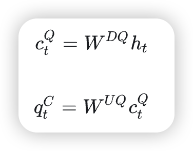

**位置编码解耦**

从架构图中发现，DeepSeek-V2的q和k各自都有2个部分。1个部分是刚刚解释过的压缩部分，而另外的1个部分，加上了RoPE位置编码。做了一个位置编码的解耦。

### DeepSeek MOE

DeepSeekMoE引入了两个主要策略：

- **细粒度专家分割（Fine-Grained Expert Segmentation）**：通过将每个FFN专家进一步细分，这允许模型在保持参数总数不变的情况下，激活更多的、更细粒度的专家。这种策略使得各个专家能够专注于更细致的知识领域，提高了专家的专业化程度。
- **共享专家隔离（Shared Expert Isolation）**：设置一部分专家作为“共享专家”，这些专家总是被激活，用于捕捉和整合常见的跨上下文知识。这样可以减少路由专家之间的知识冗余，每个路由专家可以更专注于独特的知识领域。

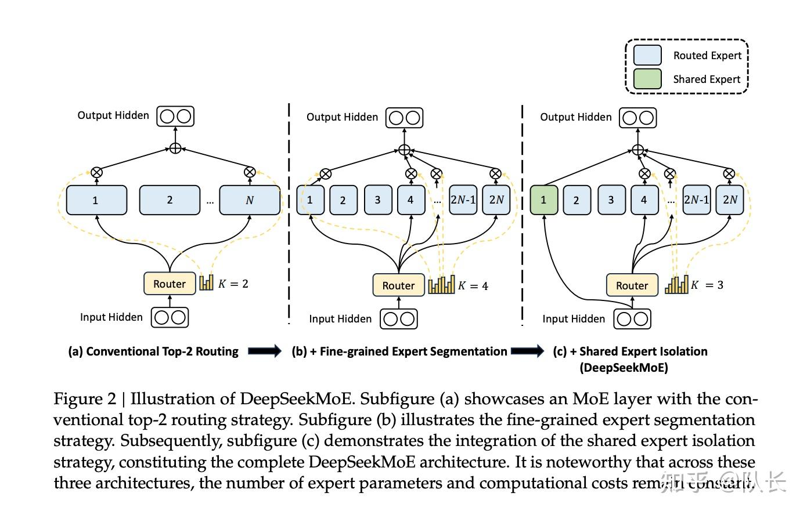

上图摘取自DeepSeek MOE的技术报告，从左到右分别是传统的MOE，细粒度专家分割，细粒度专家分割+共享专家隔离。

这两个策略是对缓解传统MoE的缺陷进行的改进，

- **知识杂糅（Knowledge Hybridity）**：传统的MoE模型中，每个专家往往需要处理多种类型的知识，这使得专家难以形成专门化的知识结构。
- **知识冗余（Knowledge Redundancy）**：不同的专家在处理不同的输入时可能需要相同的知识，导致多个专家中存在重复的知识，浪费了模型参数。

## 点评

首先是为什么能做到那么便宜。有以下两个推测：

- 如果简单把模型推理过程中，占用的显存资源归纳为weight_size + cache_size * batch_size。由于模型极大降低了cache size，因此可以大大提升batch_size，也就是同时推理的数量。那么推理服务能支持的容量就提升了不少，摊薄了使用成本。
- 从模型设计上看，尽管KV Cache的空间降低，但是计算量稍有增多。因为每次都需要对Q、K、V进行一个升维操作。但是我们知道，目前大模型推理的瓶颈，其实并不在计算上，而是在内存墙上。不了解这点的可以去看看Flash Attention的优化思路。但是由于现在KV Cache极大降低，将推理计算重新变成了一个计算密集型任务，对于计算卡而言，这样其实是提升了计算效率，规避了重复访问显存HBM的性能开销。

第二，关于MLA后续还能发挥多少影响力，我认为得看生态建设。这个工作做了不少创新，并且从放出的模型真实效果以及评测性能上看，也证明了这一创新的可行性，并不是纸上谈兵。这也说明模型架构上的创新，仍然能够有很多可改进的地方。

> refer to: https://zhuanlan.zhihu.com/p/697524307

