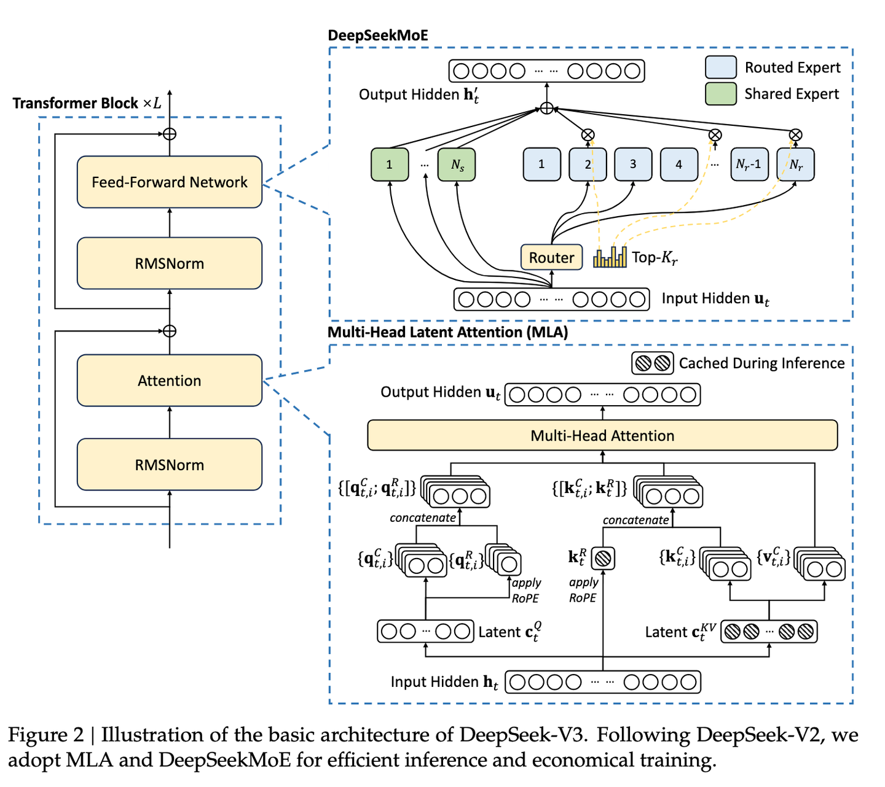
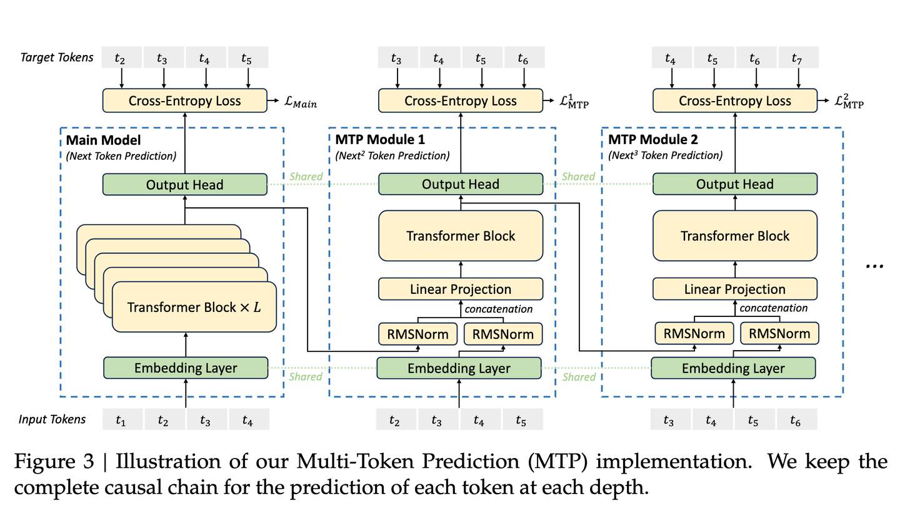
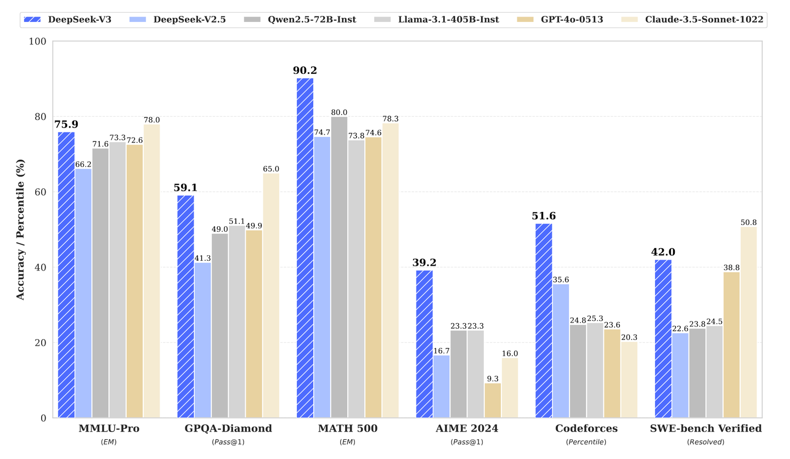

- [TL;DR](#tldr)
- [主要内容](#主要内容)
  - [1. 作者和团队信息](#1-作者和团队信息)
  - [2. 背景和动机](#2-背景和动机)
  - [3. 相关研究](#3-相关研究)
  - [4. 核心思路](#4-核心思路)
  - [5. 方案与技术](#5-方案与技术)
  - [6. 实验与结论](#6-实验与结论)
  - [7. 贡献](#7-贡献)
  - [8. 不足](#8-不足)
- [QA](#qa)
  - [Q1：什么是 MoE 模型？为什么 DeepSeek-V3 要使用 MoE 架构？](#q1什么是-moe-模型为什么-deepseek-v3-要使用-moe-架构)
  - [Q2：什么是 Multi-Head Latent Attention (MLA)？它如何减少键值缓存的大小？](#q2什么是-multi-head-latent-attention-mla它如何减少键值缓存的大小)
  - [Q3：为什么需要负载均衡？ DeepSeek-V3 的无辅助损失负载均衡策略是什么？](#q3为什么需要负载均衡-deepseek-v3-的无辅助损失负载均衡策略是什么)
  - [Q4：什么是 Multi-Token Prediction (MTP)？它为什么能提高模型性能？](#q4什么是-multi-token-prediction-mtp它为什么能提高模型性能)
  - [Q5：什么是 FP8 混合精度训练？为什么 DeepSeek-V3 要使用 FP8 训练？](#q5什么是-fp8-混合精度训练为什么-deepseek-v3-要使用-fp8-训练)
  - [Q6：DeepSeek-V3 的 DualPipe 算法是如何工作的？它如何解决通信瓶颈？](#q6deepseek-v3-的-dualpipe-算法是如何工作的它如何解决通信瓶颈)
  - [Q7：DeepSeek-V3 是如何进行知识蒸馏的？它和传统的知识蒸馏有什么不同？](#q7deepseek-v3-是如何进行知识蒸馏的它和传统的知识蒸馏有什么不同)
  - [Q8：论文中提到的 tile-wise 和 block-wise 量化是什么意思？](#q8论文中提到的-tile-wise-和-block-wise-量化是什么意思)
  - [Q9：DeepSeek-V3 与其他大型语言模型相比，有什么优势？](#q9deepseek-v3-与其他大型语言模型相比有什么优势)
  - [Q10：在推理阶段，如何保证专家负载均衡和高效推理？](#q10在推理阶段如何保证专家负载均衡和高效推理)
  - [Q11：DeepSeek-V3 的训练过程为什么稳定，没有出现不可恢复的损失尖峰？](#q11deepseek-v3-的训练过程为什么稳定没有出现不可恢复的损失尖峰)

# TL;DR

**主要思路**
- **降低训练成本**：通过FP8低精度训练、DualPipe双向流水线等
- **降低推理成本**：优化MoE负载均衡、多头潜在注意力机制（MLA）等
- **优化训练数据**：使用 14.8T 高质量、多样化的 token，增加了数学和编程样本的比例，扩大了多语言覆盖范围
- **进一步提升效果**：多 Token 预测（MTP）、从 DeepSeek-R1 中蒸馏推理能力等

**效果**
- 在 MMLU、MMLU-Pro、GPQA 等知识性基准测试中，性能与 GPT-4o、Claude-3.5-Sonnet 等领先闭源模型相当。
- 在 代码和数学 基准测试中，取得了最先进的性能，甚至超越了 GPT-4o。
- 在 AlpacaEval 2.0 和 Arena-Hard 的开放式评估中表现出色。

**训练成本**
- 总成本 ：278.8 万 H800 GPU 小时，约 557.6 万美元。
- 预训练效率 ：每训练 1 万亿个 token 仅需 18 万 H800 GPU 小时，训练过程稳定，无需回滚。

# 主要内容

## 1. 作者和团队信息

- 作者/团队： DeepSeek-AI 团队一直走在开源模型发展的前列，此前发布的 DeepSeek 系列模型一直在Math即Coding能力上为人称道。

## 2. 背景和动机

- **发表时间**： 2024年12月末。
- **研究问题**： 如何在保证模型性能的同时，降低训练成本，并进一步提高开源语言模型的能力？
- **问题背景**： 近年来，大型语言模型（LLMs）发展迅速，但训练和部署成本仍然很高。同时，开源模型在性能上与闭源模型还存在一定的差距。为了解决这些问题，DeepSeek-AI 团队提出了 DeepSeek-V3，旨在实现高性能、低成本的开源 LLM。
- **补充说明**
  - **MoE (Mixture-of-Experts)**: 混合专家模型，是一种利用多个小型专家模型共同完成任务的架构。每个专家模型只处理部分输入，从而提高模型的效率和扩展性。

## 3. 相关研究

- **已有的开源模型**：DeepSeek 团队提到了 DeepSeek 系列、LLaMA 系列、Qwen 系列和 Mistral 系列等开源模型，这些模型都在努力追赶闭源模型。
- **已有的 MoE 模型**： GShard 是一个传统的 MoE 模型，而 DeepSeekMoE 使用了更细粒度的专家，并隔离了一些专家作为共享专家。
- **已有的低精度训练方法**： 论文提到了 FP8 混合精度训练，这是一种利用低精度数据格式进行训练的方法，可以加速训练并减少内存使用。
- **现有方法的不足**
  - **MoE 的负载均衡问题**： 传统的 MoE 模型通常依赖于辅助损失函数来平衡专家负载，但过大的辅助损失会损害模型性能。
  - **低精度训练的挑战**： 低精度训练容易受到异常值的影响，而且在大型语言模型的预训练中应用仍然存在挑战。

## 4. 核心思路

- **整体思路**： 在 DeepSeek-V2 的基础上，通过引入新的架构和训练策略，进一步提升模型的性能，同时降低训练成本。
- **核心创新点**
  - **无辅助损失的负载均衡策略**： 通过引入偏置项动态调整专家负载，避免了传统辅助损失带来的性能损失。
  - **多 Token 预测（MTP）**： 在每个位置预测多个未来的 token，增加训练信号，提高模型的数据效率。
  - **FP8 混合精度训练框架**： 首次验证了 FP8 训练在超大规模模型上的可行性和有效性。
  - **高效的训练框架**： 通过 DualPipe 算法和优化的通信内核，实现了近乎零开销的跨节点通信。
  - **从 DeepSeek-R1 中提炼推理能力**： 将 DeepSeek-R1 的推理模式融入 DeepSeek-V3，提高了模型的推理性能。
- **灵感来源**
  - **无辅助损失负载均衡**: 该策略受到了 Wang et al.(2024a) 的研究启发，旨在最小化负载均衡对模型性能的负面影响。
  - **多Token预测**: 该策略受到了 Gloeckle et al.(2024) 的启发，旨在通过更密集的训练信号提高模型性能。
  - **FP8 混合精度训练**: 该策略受到了 Dettmers et al.(2022) 等一系列低精度训练研究的启发，旨在加速训练并降低内存占用。

## 5. 方案与技术

混合专家模型（MoEs）通过路由机制动态并稀疏地激活模型参数，使得能高效地增大模型参数规模。基于 TopK 机制的稀疏激活会在训练中会遇到专家激活不均衡的问题：少数被频繁选择的专家会被优化得更多，进一步使得这些专家被更频繁地选择，最终导致只选择少数专家，造成剩余专家的冗余。因此，MoE 在训练中需要引入额外辅助的负载均衡损失（load balance loss，LBL）来鼓励专家的选择趋于均衡。

1. **提高模型的泛化能力**：通过负载均衡，可以使每个专家模型都有机会被训练，从而提高模型的泛化能力。如果不使用负载均衡，可能会导致某些专家模型被频繁选择，而其他专家模型很少或者从来不被选择，这会导致模型的泛化能力下降。
2. **减少训练的变化**：通过负载均衡，可以使每个专家模型在训练过程中接受到的梯度的方向和大小更加平衡，从而减少训练的变化。如果不使用负载均衡，可能会导致某些专家模型接受到的梯度过大或过小，导致训练不稳定。
3. **提高计算效率**：通过负载均衡，可以使每个专家模型在训练过程中接受到的样本数量更加平衡，从而提高计算效率。如果不使用负载均衡，可能会导致某些专家模型接受到的样本数量过多或过少，导致计算资源的浪费。

- **基础架构**
  - **MLA (Multi-Head Latent Attention)**： 多头潜在注意力机制，通过低秩压缩减少 KV 缓存，提高推理效率。
  - **DeepSeekMoE**： 一种高效的混合专家模型架构，使用更细粒度的专家，并隔离部分专家作为共享专家。

- **负载均衡**
  - **无辅助损失负载均衡**： 为每个专家引入一个偏置项，在路由时使用，但计算门控值时仍然使用原始的亲和性得分。训练过程中，动态调整偏置项，使得专家负载均衡。
  - **序列级辅助损失（补充）**： 为了防止在单个序列中出现极端的失衡，使用一个非常小的辅助损失来确保序列内的负载均衡。
- **多 Token 预测 (MTP)**
  - **MTP 模块**： 使用 D 个串行模块，每个模块包含一个共享的嵌入层、一个共享的输出头、一个 Transformer 块和一个投影矩阵。
  - **MTP 目标**： 计算每个预测深度的交叉熵损失，并乘以一个权重因子，作为额外的训练目标。

- **训练框架**
  - **DualPipe 算法**： 一种高效的流水线并行算法，通过重叠前向和后向计算与通信来减少流水线气泡。
  - **高效的跨节点通信内核**： 利用 IB 和 NVLink 带宽，减少通信开销。
- **FP8 训练**
  - **混合精度框架**： 大部分计算操作在 FP8 精度下进行，而一些关键操作保持原始精度（BF16 或 FP32）。
  - **细粒度量化**： 对激活值和权重进行分组缩放，以适应异常值，提高量化精度。
  - **增加累积精度**： 使用 CUDA 核心进行高精度累积，以解决 FP8 GEMM 中的下溢问题。
  - **在线量化**: 在线计算最大绝对值用于缩放，并直接将激活或权重量化为 FP8 格式。
  - **低精度存储和通信**： 使用低精度格式（FP8 或 BF16）来存储和传递激活值、梯度等，以降低内存和通信开销。
- **长文本扩展**
  - **YaRN**: 使用 YaRN 技术对模型的上下文长度进行扩展，逐步从 4K 扩展到 32K，再到 128K。
- **推理和部署**
  - **预填充阶段**： 使用 4 路张量并行、序列并行和 8 路数据并行，并使用冗余专家来平衡负载。
  - **解码阶段**： 使用 4 路张量并行、序列并行和 80 路数据并行，并通过点对点 IB 传输进行通信。

## 6. 实验与结论

- **预训练**
  - **数据**： 使用 14.8T 高质量和多样化的 token 进行预训练，数据中数学和编程样本的比例更高，并扩大了多语言覆盖范围。
  - **稳定性**： 预训练过程非常稳定，没有出现不可恢复的损失峰值或回滚。
  - **Context Length Extension**: 使用两阶段上下文长度扩展，先扩展到 32K，再扩展到 128K。
- **后训练**
  - **有监督微调（SFT）**： 使用 150 万个跨多个领域的指令微调数据集进行微调。
  - **强化学习（RL）**： 使用基于规则的奖励模型和基于模型的奖励模型，结合 GRPO 算法进行强化学习，并从 DeepSeek-R1 中提炼推理能力。
- **评估**
  - **标准评测**： DeepSeek-V3 在 MMLU、MMLU-Pro、GPQA 等知识性基准测试中表现出色，与 GPT-4o 和 Claude-3.5-Sonnet 等领先的闭源模型相当。在代码和数学基准测试中，DeepSeek-V3 也取得了最先进的性能。
  - **开放式评估**： 在 AlpacaEval 2.0 和 Arena-Hard 的开放式评估中，DeepSeek-V3 也展示了优异的表现。
  - **多 token 预测的加速效果**： 通过 MTP 技术，DeepSeek-V3 的解码速度提高了 1.8 倍。
- **训练成本**
  - **总成本**： DeepSeek-V3 的完整训练（包括预训练、上下文扩展和后训练）仅需 278.8 万 H800 GPU 小时，总成本约 557.6 万美元。
预训练成本： 预训练阶段每训练 1 万亿个 token 仅需 18 万 H800 GPU 小时。
  - **训练稳定性**: 整个训练过程中没有发生任何不可恢复的损失峰值或回滚。
- **核心结论**： DeepSeek-V3 是一款高性能、低成本的开源模型，其性能与领先的闭源模型相当，并在多个基准测试中取得了最先进的结果，尤其是在代码和数学方面。

## 7. 贡献

- **架构创新**
  - 提出了无辅助损失的负载均衡策略，避免了因追求负载均衡而导致的性能下降。
  - 验证了多 token 预测目标对模型性能的提升效果，并可用于推理解码加速。
- **预训练**
  - 设计了 FP8 混合精度训练框架，首次验证了 FP8 训练在超大规模模型上的有效性。
  - 通过算法、框架和硬件的协同设计，解决了跨节点 MoE 训练中的通信瓶颈，实现了近乎完全的计算-通信重叠。
  - 以较低的成本（266.4 万 H800 GPU 小时）完成了 DeepSeek-V3 的预训练，产生了目前最强的开源基础模型。
- **后训练**
  - 提出了一种创新的方法，从 DeepSeek-R1 系列模型中提炼推理能力，并将其应用于 DeepSeek-V3。
- **核心评估结果**
  - 知识： 在 MMLU、MMLU-Pro 和 GPQA 等基准测试中，DeepSeek-V3 超过了所有其他开源模型。
  - 代码、数学和推理： DeepSeek-V3 在数学相关基准测试中达到了最先进的性能，甚至在某些基准测试中超过了 GPT-4o。在代码相关任务中，DeepSeek-V3 是编码竞赛基准测试中表现最佳的模型。
- **对后续研究的启发和影响**
  - 开源社区: DeepSeek-V3 作为一款高性能的开源模型，将推动开源社区的发展，为研究人员和开发者提供有力的工具。
  - 低成本训练: 论文展示的 FP8 训练和高效训练框架，为后续研究如何降低大型模型训练成本提供了参考。
  - MoE架构: 论文对 MoE 架构的优化，为如何提高 MoE 模型的性能和效率提供了新的思路。
  - 推理加速: MTP 和推测解码等技术，为如何提升 LLM 推理速度提供了可行方案。

## 8. 不足

- **部署方面的挑战**
  - DeepSeek-V3 的推理对硬件要求高，需要较大的部署单元（4 个节点，32 个 GPU），这对于小型团队来说可能是一个负担。
虽然 DeepSeek-V3 的推理速度比 DeepSeek-V2 快了两倍以上，但仍有提升空间。
  - 部分任务仍有差距： 虽然 DeepSeek-V3 在多个方面表现出色，但在一些任务上，比如英语事实知识方面，仍然落后于 GPT-4o 和 Claude-3.5-Sonnet。
- **可能的未来方向**
  - 更高效的模型架构： 研究更高效的模型架构，进一步提高训练和推理效率。
  - 更丰富的训练数据： 探索更多的数据来源，提高训练数据的质量和多样性。
  - 更强的推理能力： 扩展推理长度和深度，增强模型的推理能力。
  - 更多维度的模型评估： 开发更全面的模型评估方法，避免过度优化固定基准测试。

# QA

## Q1：什么是 MoE 模型？为什么 DeepSeek-V3 要使用 MoE 架构？

MoE (Mixture-of-Experts) 模型，即混合专家模型，是一种将多个小型专家模型组合起来，共同完成任务的架构。每个专家模型只处理部分输入，从而提高模型的效率和扩展性。

DeepSeek-V3 使用 MoE 架构的原因主要有以下几点：

- **提高模型容量**： MoE 可以显著增加模型的参数数量，而无需像稠密模型那样增加计算量。这使得模型可以学习更复杂的模式和关系，提高模型的性能。
- **降低训练成本**： 虽然 MoE 模型的总参数量很大，但每次激活的参数量却很小，从而减少了训练所需的计算资源。
- **提高推理效率**： 在推理时，只有部分专家被激活，从而降低了推理的计算成本。

## Q2：什么是 Multi-Head Latent Attention (MLA)？它如何减少键值缓存的大小？

Multi-Head Latent Attention (MLA)，即多头潜在注意力机制，旨在减少推理阶段的内存占用。MLA 和传统的 MHA 的主要区别在于：

- **KV 缓存**： 在传统的 MHA 中，每个 token 的 Key 和 Value 向量都需要缓存起来，这在长文本生成中会占用大量的显存。而 MLA 通过低秩压缩技术，将 Key 和 Value 向量压缩成低维度的潜在向量，只需缓存压缩后的表示，从而显著减少 KV 缓存的内存占用。
- **通俗类比**：想象你在听一场演讲，传统的注意力机制需要记住每个时间点的所有细节（就像记录每一秒的录音）。而 MLA 则只提取关键信息（就像只记录每个重点句子），这样需要记忆的信息就大大减少了。

## Q3：为什么需要负载均衡？ DeepSeek-V3 的无辅助损失负载均衡策略是什么？

在 MoE 模型中，如果专家负载不均衡，会导致以下问题：

- **路由崩溃**： 某些专家可能会被过度使用，而其他专家则被闲置。
- **计算效率降低**： 过度使用的专家会成为性能瓶颈，而闲置的专家则浪费了计算资源。

传统 MoE 模型为了实现专家间的负载均衡，通常引入辅助损失。但辅助损失会对模型的主要优化目标产生干扰，可能导致性能下降。为了解决这个问题，DeepSeek-V3 提出了无辅助损失的负载均衡策略。该策略的核心思想是：

- **引入偏置项**： 为每个专家引入一个偏置项，并将这个偏置项添加到亲和度得分中，从而影响路由决策。
- **动态调整偏置项**： 在训练过程中，如果一个专家被过度使用，则减小其偏置项；如果一个专家被闲置，则增大其偏置项。这样，可以动态调整专家负载，使其达到均衡。
- **不使用辅助损失**： 偏置项只用于路由，而不影响最终的门控值计算，从而避免了传统辅助损失对模型性能的损害。

**类比**： 想象一下你在一个餐厅里，有多个厨师。如果顾客都点同样的菜，那么只有一个厨师会很忙，而其他厨师则没事做。为了解决这个问题，你可以告诉顾客：「今天点这道菜可以打折」，或者「点其他菜可以更快上菜」。这样，就可以引导顾客点不同的菜，让所有厨师都忙起来。DeepSeek-V3 的无辅助损失负载均衡策略就类似于这个引导顾客点不同菜的策略。

## Q4：什么是 Multi-Token Prediction (MTP)？它为什么能提高模型性能？

在传统的语言模型训练中，模型通常只预测下一个标记。MTP 则是在每个位置上，让模型预测多个未来的标记。

**实现方法**：

- 引入了多个预测模块，每个模块负责预测不同深度（未来第几个）的标记。
- 在训练过程中，对每个深度的预测计算损失，然后将这些损失平均，作为整体的 MTP 损失。

**好处**：

- 增加训练信号： 通过预测多个 token，模型可以获得更密集的训练信号，提高数据效率。
- 增强预规划能力： MTP 可以帮助模型更好地预先规划未来 token 的表示，使其更好地捕捉长距离依赖关系，从而提高模型的性能。

## Q5：什么是 FP8 混合精度训练？为什么 DeepSeek-V3 要使用 FP8 训练？

在深度学习训练中，使用低精度浮点数（如 FP16、FP8）可以降低计算和存储需求，提高训练速度。但低精度可能导致数值不稳定和模型性能下降。

**解决方案**：

- **精细量化策略**
  - **细粒度量化**：对张量进行小块划分（如 1×128 或 128×128），对每个小块单独计算缩放因子，进行量化，减少了量化误差带来的影响。
- **提高积累精度**
  - **增加乘加运算的精度**：在进行矩阵乘法累加时，将部分结果提升到更高精度（如 FP32）进行积累，减少了因低精度引入的误差。
- **混合精度训练框架**
  - **保留关键操作的高精度**：对于敏感的操作，如嵌入层、归一化层等，仍然使用高精度计算，确保训练的稳定性。

DeepSeek-V3 使用 FP8 训练的主要原因是：

- **加速训练**： FP8 格式可以加速 GEMM (General Matrix Multiplication) 等核心计算操作，从而提高训练速度。
- **减少内存使用**： FP8 格式可以显著减少内存占用，使得在有限的显存中训练更大的模型成为可能。
- **突破硬件限制**: 目前 NVIDIA H100 及以上的 GPU 已经对 FP8 有了较好的支持，而 DeepSeek-V3 使用了 FP8 混合精度训练，使其可以更好地利用硬件性能。

## Q6：DeepSeek-V3 的 DualPipe 算法是如何工作的？它如何解决通信瓶颈？

DualPipe 算法是 DeepSeek-V3 中用于解决通信瓶颈的一种高效流水线并行算法。它的核心思想是通过重叠前向和后向计算与通信，从而减少流水线气泡，提高训练效率。

具体来说，DualPipe 算法：

- **双向流水线**： 同时从流水线的两端输入 micro-batch，实现双向并行计算。
- **计算-通信重叠**： 将每个 chunk 分成多个部分，并调整 GPU SM 用于通信和计算的比例，使得计算和通信可以相互重叠。
- **减少流水线气泡**： 通过双向流水线和计算-通信重叠，减少了流水线中的等待时间，从而提高了训练效率。

**类比**： 你可以将 DualPipe 算法想象成一个生产线。传统的流水线是按顺序一个一个地处理产品，而 DualPipe 算法是同时从两个方向处理产品，并让不同环节同时进行，从而提高了生产效率。

## Q7：DeepSeek-V3 是如何进行知识蒸馏的？它和传统的知识蒸馏有什么不同？

DeepSeek-V3 使用了一种特殊的知识蒸馏方法，从 DeepSeek-R1 模型中提炼推理能力。与传统的知识蒸馏不同，DeepSeek-V3 的知识蒸馏：

- **重点在于推理模式**： 不是简单地模仿 R1 的输出，而是将 R1 的反思和验证模式融入到 DeepSeek-V3 中。
- **生成多样化的 SFT 数据**： 通过让 R1 生成带有反思和验证的响应，为 DeepSeek-V3 提供更高质量的 SFT 数据。
- **在强化学习中运用**： 在 RL 阶段，通过高温度采样生成融合了 R1 和原始数据的响应，使模型学习 R1 的推理模式。

## Q8：论文中提到的 tile-wise 和 block-wise 量化是什么意思？

tile-wise 和 block-wise 量化是用于提高 FP8 量化精度的两种细粒度量化方法：

- **tile-wise 量化**： 对于激活值（activations），将 1xNe 的元素分组成一个 tile，然后在 tile 内进行缩放（scaling）。这里的 Ne 通常是 128，所以就是一个 1x128 的 tile。这意味着，对于每一个 token，每 128 个通道（channel）会被分成一组。
- **block-wise 量化**： 对于权重（weights），将 Ne x Ne 的元素分组成一个 block，然后在 block 内进行缩放。这里的 Ne 也通常是 128，所以就是一个 128x128 的 block。这意味着，每 128 个输入通道和 128 个输出通道会被分组成一个 block。

这种细粒度的量化方法可以更好地适应激活值和权重中的异常值，提高量化的精度，从而使模型能够更有效地利用低精度的 FP8 格式进行训练。

**类比**： 你可以将 tile-wise 和 block-wise 量化想象成在打包货物时，不是把所有货物都放在一个大箱子里，而是将它们根据形状、大小等进行分类，然后分别打包。这样可以更好地利用空间，减少货物之间的挤压和碰撞。

## Q9：DeepSeek-V3 与其他大型语言模型相比，有什么优势？

- **高效的训练和推理**：采用了 MLA 和 DeepSeekMoE 架构，减少了内存占用和计算需求，实现了高效的训练和推理。
- **优异的性能**：在多个基准测试上，DeepSeek-V3 超越了其他开源模型，在数学、代码生成、知识问答等任务上表现出色，接近甚至超过了一些闭源模型。
- **低训练成本**：由于采用了 FP8 训练和优化的训练框架，DeepSeek-V3 的训练成本显著降低，总共只花费了 278.8 万 H800 GPU 小时。
- **开源**：DeepSeek-V3 是目前性能最强的开源模型之一，为研究者和开发者提供了宝贵的资源，促进了人工智能社区的共同进步。

## Q10：在推理阶段，如何保证专家负载均衡和高效推理？

**挑战**：在推理阶段，专家负载可能不均衡，导致一些专家过载，影响推理效率和吞吐量。

**解决方案**：

- **冗余专家部署**
  - **检测高负载专家**：通过在线统计，识别负载较高的专家。
  - **冗余部署**：对高负载的专家进行冗余部署，增加其副本，均摊负载。
- **动态调整**
  - **定期调整冗余专家集**：根据实时负载情况，动态调整哪些专家需要冗余部署。
  - **专家重新排列**：在节点内部，根据专家的负载情况，重新排列专家的部署，提高 GPU 的利用率。
- **优化的通信策略**
  - **跨节点通信优化**：通过高效的 All-to-All 通信内核，降低通信开销。
  - **计算与通信重叠**：利用 DualPipe 算法，将计算和通信阶段重叠，隐藏通信延迟。

## Q11：DeepSeek-V3 的训练过程为什么稳定，没有出现不可恢复的损失尖峰？

- **架构优化**：采用了改进的 DeepSeekMoE 架构和无辅助损失的负载均衡策略，避免了路由崩溃等问题，保证了训练的稳定性。
- **精细的训练策略**
  - **学习率调度**：合理的学习率增长和衰减策略，避免了训练过程中的不稳定性。
  - **梯度裁剪**：设置梯度裁剪阈值，防止梯度爆炸。
- **混合精度训练**：通过 FP8 混合精度训练，既提高了训练效率，又避免了数值不稳定。
- **优化的训练框架**：DualPipe 等算法减少了流水线中的气泡，保持了训练过程的连续性。

> refer to: https://zhuanlan.zhihu.com/p/14988009150
