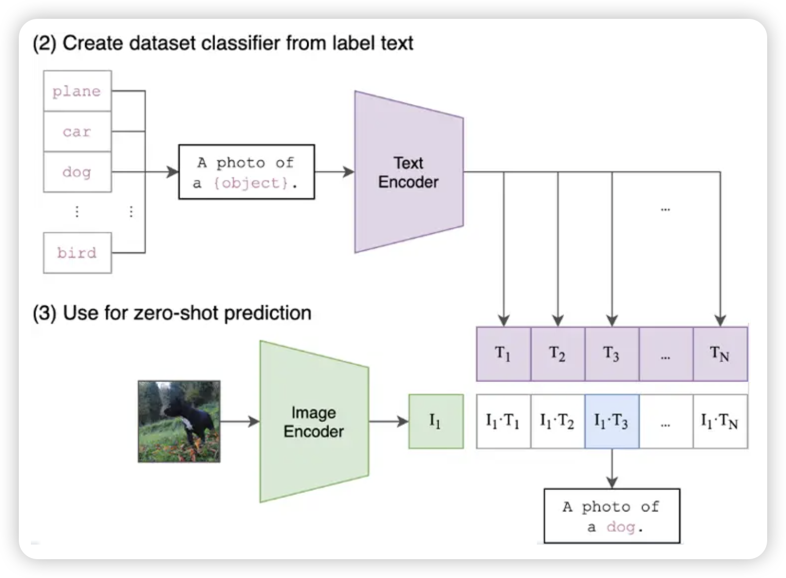
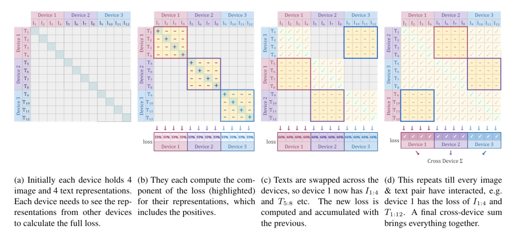

- [DeepSeek-VL：Towards Real-World Vision-Language Understanding](#deepseek-vltowards-real-world-vision-language-understanding)
  - [视觉大模型介绍](#视觉大模型介绍)
    - [ViT 介绍](#vit-介绍)
    - [CLIP 介绍](#clip-介绍)
      - [CLIP 模型概述](#clip-模型概述)
      - [CLIP 模型训练和使用](#clip-模型训练和使用)
        - [模型训练](#模型训练)
        - [模型推理](#模型推理)
    - [SigLIP 介绍](#siglip-介绍)
    - [SAM 介绍](#sam-介绍)
      - [SAM模型概览](#sam模型概览)
      - [掩码质量](#掩码质量)
      - [数据引擎](#数据引擎)
  - [数据构建环节](#数据构建环节)
    - [视觉-语言预训练数据介绍](#视觉-语言预训练数据介绍)
    - [监督微调数据介绍](#监督微调数据介绍)
  - [实现路径](#实现路径)
    - [系统架构概述](#系统架构概述)
      - [混合视觉编码器](#混合视觉编码器)
      - [视觉-语言适配器](#视觉-语言适配器)
      - [语言模型](#语言模型)
    - [训练策略详解](#训练策略详解)
      - [阶段1：视觉-语言适配器训练](#阶段1视觉-语言适配器训练)
      - [阶段2：视觉-语言联合预训练探索](#阶段2视觉-语言联合预训练探索)
      - [阶段3：监督微调](#阶段3监督微调)
    - [超参数与基础架构设置](#超参数与基础架构设置)
  - [结论](#结论)

# DeepSeek-VL：Towards Real-World Vision-Language Understanding

## 视觉大模型介绍

### ViT 介绍

ViT的原理非常简单，就是将一张P*P大小的图像，切分为(P/p)*(P/p)个大小为p*p的patch，然后用d个卷积核为p*p大小的CNN将每个小patch转换为d维token embedding，并铺平成序列、加入位置编码后，就能输入到常规的Transformer Block里边了。

### CLIP 介绍

CLIP(Contrastive Language-Image Pre-Training) 模型是 OpenAI 在 2021 年初发布的用于匹配图像和文本的预训练神经网络模型，是近年来多模态研究领域的经典之作。

#### CLIP 模型概述

在目前图像分类领域中，训练的模型通常会遇到以下问题：

- 模型需要用到大量的格式化标注数据，这些标注数据获取通常成本高昂
- 模型在当前数据集的效果比较好，但是可能模型的泛化能力较差，同时迁移到新的训练任务也比较困难
- 传统的图像分类模型无法进行类别拓展，想要保证准确率只能从头开始训练，费时费力

CLIP模型就可以用来解决这种问题，预训练后的模型就可以直接进行zero-shot。17年类似方法在ImageNet上的效果只有17%，openAI认为不是方法不行，而是资源不到位，大力才能出奇迹。

互联网已经存在了大量的图像文本对（网页图片通常有标题），这些海量素材可以作为已经标注好的数据集，并且容易获取。同时，互联网上的数据量比较大和数据本身差异较大，更容易训练泛化能力较强的模型。OpenAI 收集到的4 亿对图像文本，分别将文本和图像进行编码，之后使用 metric learning 进行训练，将图像与文本的相似性提高。在预测阶段，通过一系列生成的文本对和目标图像，计算余弦相似度从而获取预测值。

CLIP的效果：在完全不使用ImageNet中所有训练数据的前提下，直接Zero-shot得到的结果与ResNet在128W ImageNet数据训练效果一致。

#### CLIP 模型训练和使用

##### 模型训练

- 输入图片->图像编码器（vision transformer）->图片特征向量
- 输入文字->文本编码器（text ）->文本特征向量
- 对两个特征进行线性投射，得到相同维度的特征，并进行L2归一化
- 计算两个特征向量的相似度（夹角余弦）
- 对n个类别进行softmax，确定个正样本和个负样本，并最大化正样本的权重

##### 模型推理

- 给出一些文本提示词条目，这些提示词条目要保证正确
- 根据提示词和图片，计算每一个文本提示词和图片特征的相似度
- 相似度最高的即为正确答案

合理的提示词对预测效果非常重要：

- 首先是需要一句话或者几个词来提示
- 最好要加上预测的场景，要具有情景的相关性
- 提示要全面，这样预测准确率也会提高

### SigLIP 介绍

SigLIP 是一种与 CLIP 类似的图像嵌入模型。主要区别在于训练损失，SigLIP采用成对Sigmoid 损失，这允许模型独立地对每个图像-文本对进行操作，而无需对批次中的所有对进行全局查看，同时对 logits应用sigmoid激活函数，而不是softmax。

换句大白话的说，sigLIP的损失函数是在文字Tokens和图像Tokens的两个序列的基础上计算出来。它指导着模型训练朝着这相同样本对（图，文）的点积值越大，而不同图文对的点积值越小的目标迈进。即矩阵对角线的越大，其余的各自越小。

上图为SigLIP的预训练过程，它在三个设备进行训练。每设备持有4幅图和文字，在单设备上各自运算。紧接着不同的设备交换文本计算损失，如此循环直到全部计算完毕。

SigLIP 的视觉编码器在高层次上将图像分割成一系列不重叠的图像块，并将它们投影到低维线性嵌入空间中，从而产生一系列块嵌入。然后，这些块嵌入经过视觉编码器，该编码器应用自注意力来捕获长距离依赖关系并提取更高级的视觉特征。

### SAM 介绍

SAM是Meta 提出的分割一切模型（Segment Anything Model，SAM）突破了分割界限，极大地促进了计算机视觉基础模型的发展。

SAM是一个提示型模型，其在1100万张图像上训练了超过10亿个掩码，实现了强大的零样本泛化。许多研究人员认为「这是 CV 的 GPT-3 时刻，因为 SAM 已经学会了物体是什么的一般概念，甚至是未知的物体、不熟悉的场景（如水下、细胞显微镜）和模糊的情况」，并展示了作为 CV 基本模型的巨大潜力。

#### SAM模型概览

2023年4月6号，Meta AI公开了Segment Anything Model（SAM），使用了有史以来最大的分割数据集Segment Anything 1-Billion mask dataset（SA-1B），其内包含了1100万张图像，总计超过10亿张掩码图，**模型在训练时被设计为交互性的可提示模型**，因此可以通过零样本学习转移到新的图像分布和任务中。在其中**他们提出一个用于图像分割的基础模型，名为SAM**。该模型被发现在NLP和CV领域中表现出较强的性能，研究人员试图建立一个类似的模型来统一整个图像分割任务。

**SAM 架构主要包含三个部分：图像编码器；提示编码器；以及掩码解码器。**

在这项工作中，**SAM的目标是建立一个图像分割的基础模型（Foundation Models）。其目标是在给定任何分割提示下返回一个有效的分割掩码，并在一个大规模且支持强大泛化能力的数据集上对其进行预训练，然后用提示工程解决一系列新的数据分布上的下游分割问题**。

为此，**研究者设计了Segment Anything Model（SAM），模型整体上包含三个大模块，image encoder，prompt encoder和mask decoder。在使用时，只需要对图像提取一次图像嵌入，可以在不同的提示下重复使用。给定一个图像嵌入，提示编码器和掩码解码器可以在浏览器中在~50毫秒内根据提示预测掩码**。

1. **image encoder**：基于可扩展和强大的预训练方法，研究者使用MAE预训练的ViT（Vision Transformer），最小限度地适用于处理高分辨率输入。图像编码器对每张图像运行一次，在提示模型之前进行应用。
2. **prompt encoder**：prompt 提示不仅要支持文字还要支持空间的信息，空间的信息可以串联多种稀疏（sparse）型态的提示，如点、框，以及密集（dense）型态的提示，如掩码（mask）。
  - 针对密集(Dense)型态的提示，是先将Mask结合卷积进行下采样后，成为Mask embedding，直接与Image embedding相加。
  - 针对稀疏(Sparse)型态的提示，会基于空间上的座标进行转换后变成Positional embedding，再加上各型态所学出的embedding(Box embedding, Point embedding 等)，直接与Image embedding相加。
3. **mask decoder**：从功能上说有两个，一是整合image encoder和prompt encoder分别输出的两个embedding，然后从这个embedding的feature map解码出最终的分割mask。

#### 掩码质量

为了评估掩码质量，研究者随机抽取了500张图像（大约5万个掩码），要求专业标注员使用像素精确的“画笔”和“橡皮擦”在模型预测掩码的基础上对其进行专业矫正。这一过程，产生成对的模型预测掩码以及人工专业矫正后的掩码。通过计算每对之间的IoU，来评估掩码质量。实现结果发现，94%的对具有大于90%的IoU。

#### 数据引擎

为了对庞大数据的图像进行掩码标注，作者开发了数据引擎。如图所示，它是一个模型、数据的闭环系统。

该数据引擎有三个阶段：模型辅助手动标注、半自动标注阶段和全自动阶段。

- **模型辅助手动标注阶段**：简单来说就是用可以获取到的开源分割数据训练一个初始的SAM模型V0版本，再用V0在没有分割标注的数据上生成预标注，人工check模型的结果并作修改和确认。得到新的数据后，再将新的数据加入到训练集重新训练SAM得到V1版本,再循环标注数据和迭代模型。总共进行6次训练。开始的时候数据集比较少，使用的ViT-B模型，最终会使用ViT-H模型。 这里面还有一些效率提升的数据，例如随着模型的迭代，每个mask的标注耗时从34s到14s。SAM模型在每张图片上生成的mask从20到44个。在该阶段数据集最终有12万张图片，430万个mask；
- **半自动化标注**: 通过第一阶段后，已经有一个不错的SAM模型能生成分割结果。半自动化标注的目的是增加mask的多样性。具体做法是训练一个检测模型，用于检测SAM生成的mask结果是否可信，只保留可信的mask结果，然后将图片给人工标注。人工标注会在可信的mask基础上标注出其他的分割框。经过5次的迭代后，数据集新增了18万张图片，590万mask。
- **自动标注**: 经过前面两个阶段后，SAM有了较好的结果，能分割出图片中的目标，并且对于混淆的prompt也有了较好的输出。这个模型可以自动的对一些图片做标注。自动标注的时候需要有一些筛选策略，模型输出的结果可能还是会出现一些错误。
  - SAM模型有一个IOU prediction的模块能输出mask的confidence
  - stable mask的判断，具体的方法是在得到分割结果前对logit加正向和负向的扰动，如果两次扰动生成的分割结果IOU大于0.95，则认为生成的mask是可靠的
  - NMS过滤掉重复的mask

## 数据构建环节

一个多元化且规模庞大的数据集对于视觉语言模型的训练至关重要。DeepSeek团队（后面简称“团队”）的数据集主要包括两部分内容：“**用于预训练的视觉-语言数据**”和“**用于监督微调的视觉-语言数据**”。预训练数据集汇集了众多来源的视觉和文本信息，这些信息的目的是为了提升模型在跨模态（即视觉与语言之间）理解上的基础能力。相比之下，监督微调的数据集则规模更小，专注于引导模型学会执行特定的应用任务。

设计上，分三个阶段：
- 团队在训练的第一阶段使用预训练数据集对模型进行基础设定和预热，以适应视觉和语言之间的交互；
- 第二阶段则通过联合预训练的方式进一步训练视觉-语言模型；
- 最后，在第三阶段利用监督式微调数据集对模型进行最终的训练，专门针对具体的视觉-语言任务进行优化。

### 视觉-语言预训练数据介绍

研究所利用的预训练数据集包含了广泛的公开资源和精选的专有数据。在联合视觉语言预训练阶段，团队依据上图全面介绍了使用的数据来源。这类数据集有助于 LLM 更好地理解图像中呈现的实体，整个数据集主要包括以下几种类型：

- **交错图文数据**：通过使用三个公开数据集——MMC4、Wiki以及Wikihow，这类数据提高了模型在多模态输入上下文中的学习能力。
- **图像描述数据**：来源于三个高质量图文配对数据集Capsfusion、TaiSu和Detailed Caption，旨在提升模型对图像内容的描述能力。
- **表格与图表数据**：包括多种公共数据源如Chart2text、Geo170K等，使模型能够理解通用表格和图表图像。
- **Web代码数据**：通过使用Websight进行UI逆向渲染等方法，从图形界面或视觉图表中重构代码，涉及处理大量Jupyter笔记本数据，并从中提取图像与对应代码段。
- **文档光学字符识别（OCR）数据**：我们还构建了一个英中文档OCR数据集，包括来自arXiv的文章和大量英文及中文电子书与教育材料，旨在识别真实世界场景中文档级别的字符。
- **场景文本OCR数据**：包含多个公共数据集，增强模型从环境中融合文本的图像识别和提取能力。
- **仅文本语料库**：用于保持模型在语言中心任务上的熟练度，本研究使用了与DeepSeek-LLM 相同的文本语料库。

通过综合利用这些多样化的数据类型，团队的目标是训练出能够深入理解和处理视觉语言交互的高效模型。

### 监督微调数据介绍

研究选用的监督微调数据集涵盖了丰富的多模态与语言数据源，其中不乏知名的开源共享GPT4V数据集，例如ShareGPT4V、LAION-GPTV、LVIS-Instruct4V、textOCR-GPT4V、LLaVA1.6-GPT4V以及IconQA。团队还特别从预训练数据集（比如Ureader、ScreenQA、Geo170K和ScienceQA）中提取了一部分表格和图表数据，并融合了来自Screen-to-code任务的UI代码数据集。为了进一步提升多模态监督微调数据的品质，团队精心整理了一系列高品质的内部多模态SFT数据，部分数据支持中文。

团队特别为内部使用设计了一套指令调整数据集，旨在真实反映现实世界的使用场景并包含广泛的任务类型。首先团队从各种网络平台搜集了GPT-4V和Gemini的多种真实测试案例，通过细致的分析和组织，建立了一个包含多个类别（如识别、转换、分析、推理、评价和安全等）的全面分类系统，详见表:

## 实现路径

### 系统架构概述

DeepSeek-VL系统由**三个核心模块组成：混合视觉编码器、视觉适配器和语言模型**。下面详细介绍每个模块。

#### 混合视觉编码器

DeepSeek-VL采用SigLIP作为主要的视觉编码器，用以从视觉输入中提取具有高语义水平的特征表示。但单一的SigLIP编码器难以全面应对真实世界的各种问题，原因在于虽然SigLIP等CLIP系列编码器专为语义视觉表征设计，但它们在处理含糊不清的编码时会遇到挑战，这会导致视觉上明显不同的图像被编码为相似，这种现象称为“CLIP-盲对”。此外，CLIP系列模型处理的图像分辨率相对较低，这限制了它们在处理需要细致的低级特征任务的能力，如密集OCR和视觉定位任务。

为克服这些局限，在保留使用对低分辨率（384 x 384）图像输入的SigLIP-L视觉编码器的同时，团队还引入了一种基于SAM-B的仅视觉编码器，它能够处理高分辨率（1024 x 1024）的图像输入。因此，DeepSeek-VL的混合视觉编码器结合了SAM-B和SigLIP-L两种编码器，能够高效编码高分辨率图像，同时保留语义细节和低级信息。

具体来说，高分辨率的SAM-B视觉编码器首先将图像调整至1024 x 1024分辨率，生成一个64 x 64 x 256的特征图。随后，这一特征图被调整至96 x 96 x 256，通过两个步长为2的卷积层处理后，得到一个24 x 24 x 1024的特征图，并最终调整为576 x 1024的格式。低分辨率的SigLIP-L视觉编码器采用相似的处理流程，最终也产生一个576 x 1024的特征图。

对于SAM-B生成的高分辨率特征图，视觉适配器首先将其调整至96 x 96 x 256的尺寸，再通过卷积层处理，最终产生一个576 x 1024的特征图。这时，SigLIP-L产生的低分辨率特征图与高分辨率特征图合并，形成维度为2048的576个视觉token。这些视觉token极大地增强了模型在高级语义视觉识别和低级视觉定位任务上的能力。接着，这些token通过GeLU激活层，并通过向量层与语言模型建立连接，为模型提供了丰富的视觉信息。

#### 视觉-语言适配器

DeepSeek-VL采用了一个结合了两个层次的多层感知器(MLP)，用于实现视觉编码器与LLM之间的有效衔接。在起步阶段，独立地利用单层MLP处理高分辨率和低分辨率的视觉特征。之后，这些特征通过维度上的连接合并，再通过另一个MLP层转化为LLM可处理的输入格式。

#### 语言模型

DeepSeek-VL的语言模型建立在DeepSeek LLM的基础上，该模型的微观设计主要参考了LLaMA的设计原则，包括采用预归一化(Pre-Norm)结构、RMSNorm函数以及SwiGLU作为前馈网络(FFN)的激活函数，其中间层的维度设定为 `(8/3)*Dmodel`。模型还整合了旋转向量(RoPE)技术进行位置编码，并采用了与DeepSeek-LLM相同的tokenizer。

具体地，DeepSeek-VL-1B模型是基于DeekSeek-LLM-1B模型构建的，后者通过处理大约500B text token进行了训练。而DeepSeek-VL-7B模型则是基于DeepSeek-LLM-7B模型开发的，该模型通过训练大约2T text token获得。

### 训练策略详解

DeepSeek-VL训练流程分为三个连续阶段，如图3所展示的：视觉-语言适配器的预热、联合视觉-语言预训练、以及监督式微调阶段。目前，我们专注于增强模型的视觉理解能力，并且仅针对语言部分计算下一个词预测的损失值。

#### 阶段1：视觉-语言适配器训练

本阶段的核心目标是**在向量空间中构建视觉与语言元素之间的概念连接，以便让大型语言模型（LLM）能够更深入地理解图像中展现的实体**。**团队遵循了与LLaVA和Instruct-BLIP相似的研究方法，在这一阶段冻结了视觉编码器和LLM，仅允许视觉-语言适配器中的参数进行学习**。训练适配器时使用了一个数据集，该数据集包括来自ShareGPT4V的125万个图像-文本配对的字幕，以及250万组文档OCR渲染对。

#### 阶段2：视觉-语言联合预训练探索

本阶段会探讨一些有效的预训练策略，**旨在通过一个新增的阶段让 LLM 能够处理和理解多模态输入。在这个过程中保持视觉编码器的状态不变，同时对 LLM 和视觉-语言适配器进行优化**。

一开始团队尝试使用多模态数据直接对LLM进行训练。但很快就发现虽然多模态性能的指标逐步提升，语言性能的指标却急剧下降，这一现象突显了直接在LLM基础上进行多模态预训练的内在挑战，并揭示了提高多模态能力与保持语言能力之间的关键权衡问题。

团队认为这种现象主要由两个因素引起：**首先，大多数多模态语料库相对简单，与语言数据的复杂性和分布存在显著的偏差；其次，多模态和语言模态之间似乎存在竞争关系，导致了在LLM中对语言能力的灾难性遗忘**。

语言-多模态联合训练 为了应对这一挑战，团队采用了一个简单而有效的语言-多模态联合训练策略，在训练过程中不仅针对多模态数据进行训练，同时还大量引入了语言数据。这一做法旨在平衡训练重点，以减轻所观察到的负面影响。

分析结果揭示了几个关键性的发现：

- 引入语言数据显著缓解了语言能力的下降，大幅提升了模型在语言性能上的表现。
- 引入语言数据并未对多模态性能造成显著损失，表明模型保留了其处理多模态输入的能力。
- 不同模态的性能与它们在训练集中的比例密切相关，进一步证实了两种模态之间的竞争关系。

**最终团队选择了大约7:3的多模态与语言数据的训练比例作为最终模型的设置**。这一比例既保留了模型的语言能力，又有效地实现了对多模态数据更优的预训练，从而有效平衡了语言和多模态能力的发展。

#### 阶段3：监督微调

本阶段团队通过指令驱动的方式对DeepSeek-VL模型进行微调，目的是增强模型按照指令执行和参与对话的能力，最终开发出能够进行交互的DeepSeek-VL-Chat模型。**团队利用视觉-语言监督微调数据对语言模型、视觉-语言适配器以及混合视觉编码器（SigLIP）进行了优化**。**由于GPU内存的限制，微调过程中保持了SAM-B编码器的状态不变**，专注于对答案和特定token进行监督学习，并对系统prompt和用户prompt进行遮蔽处理。为确保模型在对话方面的全面能力，团队采用了一种结合了多模态数据和DeepSeek-LLM中使用的纯文本对话数据的策略。这种混合使用数据的方法，确保了模型能够灵活应对各种对话情境，提升了其在不同场景下的通用性和应用能力。

### 超参数与基础架构设置

详细的超参数设置如下表所示，DeepSeek团队利用幻方团队自研的 HAI-LLM 来训练和评估我们的DeepSeek-VL模型，这是一个轻量级且高效的分布式训练框架。通过使用视觉编码器将图像转化为向量，并将图像向量与文本向量以统一方式处理，我们能够将管道并行性策略灵活应用于视觉-语言（VL）模型的训练。

## 结论

- 率先考虑“视觉和语言 (VL) 联合预训练”阶段，DeepSeek-VL 超越了传统模型，确保多模态数据的集成不会损害大型语言模型 (LLM) 的语言能力。这是通过战略性的预热数据比率混合视觉编码器的引入实现的，它们共同实现了高分辨率图像的高效处理，同时又不失语义丰富性。混合视觉编码器的加入，能够在有限的 token budget 内处理 1024 x 1024 图像。
- DeepSeek-VL 成为了一个开创性的模型，它不仅达到而且超越了同类通用模型设定的标准。它在广泛的以视觉为中心的基准测试中表现出色，同时在以语言为中心的评估中保持了强大的能力。
- 展望未来，我们很高兴地宣布将 DeepSeek-VL 扩展到更大尺寸的计划，并结合专家混合 (MoE) 技术。此次即将推出的扩展有望进一步提高模型的效率和有效性，为人工智能领域的研究和应用开辟新的视野。

> refer to: https://zhuanlan.zhihu.com/p/686653671
