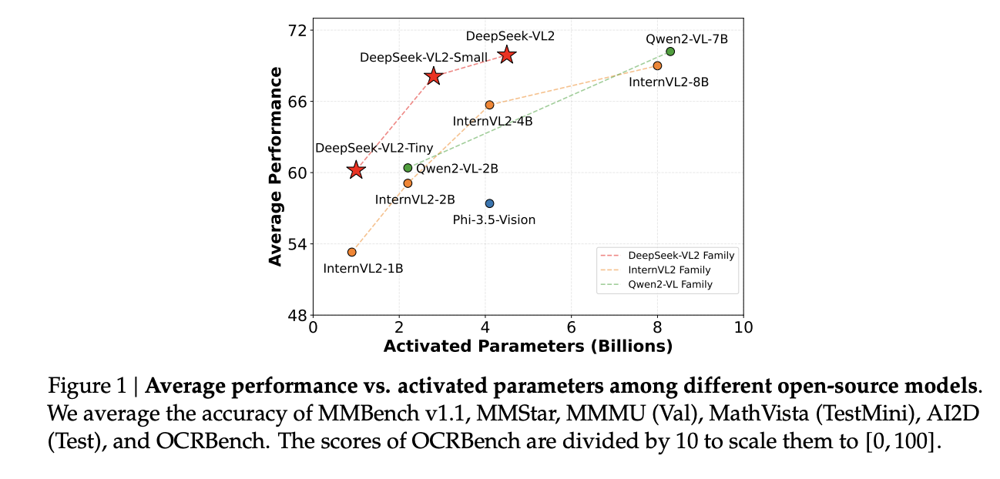
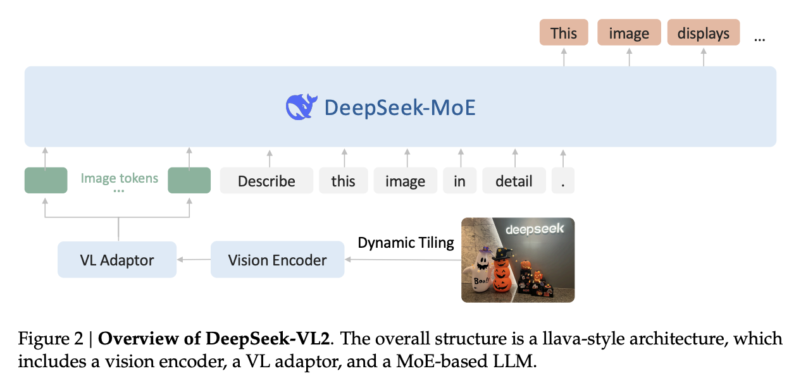
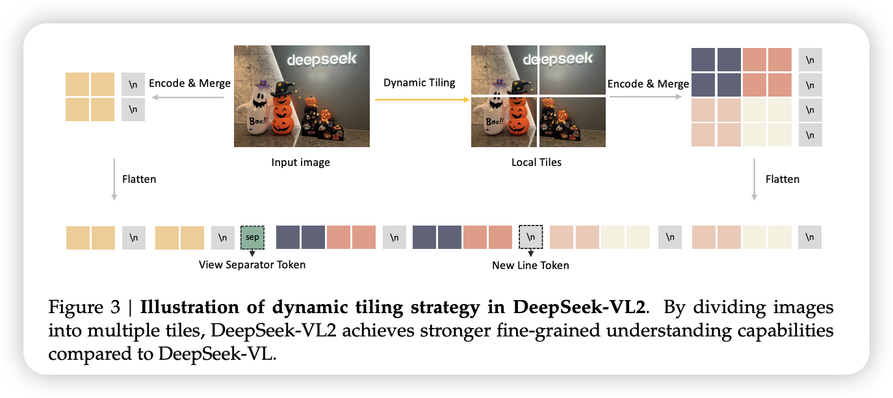
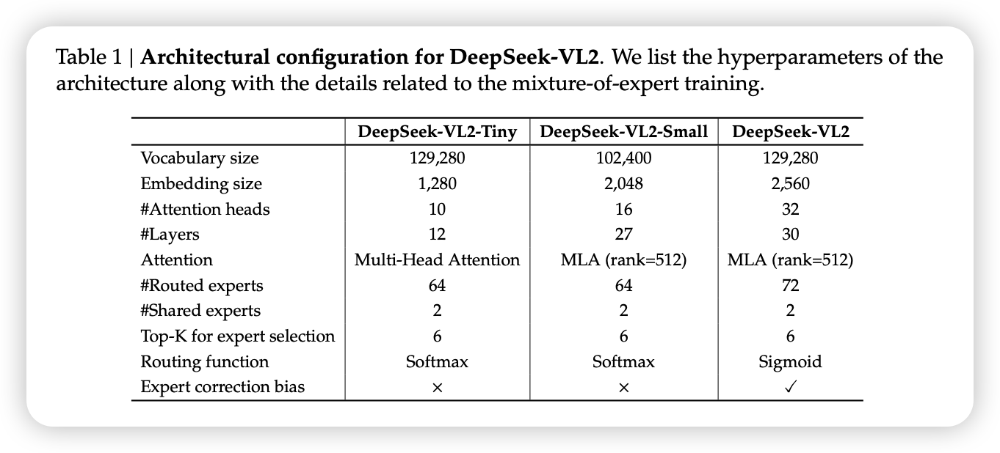

- [DeepSeek-VL2：混合专家视觉语言模型的新突破](#deepseek-vl2混合专家视觉语言模型的新突破)
  - [模型架构](#模型架构)
    - [动态分块策略（Dynamic Tiling Strategy）](#动态分块策略dynamic-tiling-strategy)
    - [视觉语言适配器（Vision-Language Adaptor）](#视觉语言适配器vision-language-adaptor)
    - [DeepSeekMoE语言模型（DeepSeekMoE LLM）](#deepseekmoe语言模型deepseekmoe-llm)
  - [数据构建](#数据构建)
    - [训练方法](#训练方法)
  - [评估](#评估)
  - [结论](#结论)

# DeepSeek-VL2：混合专家视觉语言模型的新突破

DeepSeek-VL2是一系列基于混合专家（MoE）架构的开源视觉语言模型，旨在通过三大关键升级显著提升其前身DeepSeek-VL的性能和效率。首先，DeepSeek-VL2引入了动态分块视觉编码策略，能够高效处理不同长宽比的高分辨率图像。其次，语言模型采用了多头潜在注意力机制（MLA），通过将键值缓存压缩为潜在向量，显著提高了推理效率和吞吐量。最后，通过改进的视觉语言数据集，DeepSeek-VL2在视觉问答、光学字符识别、文档/表格/图表理解以及视觉定位等任务中展现了卓越的能力。

## 模型架构

DeepSeek-VL2由三个核心模块组成：视觉编码器、视觉语言适配器和混合专家语言模型。整体基于其前身DeepSeek-VL模型架构，DeepSeek-VL2引入了两大创新：动态分块策略和DeepSeekMoE语言模型。

### 动态分块策略（Dynamic Tiling Strategy）

- DeepSeek-VL采用了SigLIP和SAM-B的混合视觉编码器，分别用于粗粒度和细粒度特征提取。然而，这种固定分辨率的编码器在处理高分辨率和极端长宽比图像时存在局限性。
- DeepSeek-VL2通过将高分辨率图像分割成多个局部块，利用共享的视觉变换器处理每个块，从而实现了对不同高分辨率图像的高效处理。

### 视觉语言适配器（Vision-Language Adaptor）

在处理视觉块后，DeepSeek-VL2通过2×2像素洗牌操作将每个块的视觉标记从27×27压缩到14×14。此外，还引入了三个特殊标记来处理全局缩略图块和局部块，最终将视觉序列投影到语言模型的嵌入空间中。

### DeepSeekMoE语言模型（DeepSeekMoE LLM）

DeepSeek-VL2的语言模型基于DeepSeekMoE，采用了多头潜在注意力机制（MLA），通过压缩键值缓存为潜在向量，显著提高了推理效率。模型还引入了MoE架构，通过稀疏计算实现高效推理。

DeepSeek-VL2 有三种大语言模型版本，模型大小如下：1.0B、2.8B 和 4.5B。完整的架构规格可在表 1 中找到：

## 数据构建

DeepSeek-VL2的训练数据构建分为三个阶段：视觉语言对齐、视觉语言预训练和监督微调。

- **视觉语言对齐数据**：在视觉语言对齐阶段，主要目标是建立视觉特征和语言特征之间的稳固连接。该阶段主要训练MLP连接器，以桥接预训练的视觉编码器和语言模型。使用了ShareGPT4V数据集，包含约120万条标题和对话样本。
- **视觉语言预训练数据**：预训练数据结合了视觉语言数据和纯文本数据，保持了视觉语言能力和纯文本性能的平衡。数据包括交错图像文本数据、图像描述数据、光学字符识别数据、视觉问答数据和视觉定位数据。对于 DeepSeekVL2，我们保持约 70% 的 VL 数据与 30% 的纯文本数据的比例，后者直接来源于我们的基础 LLM 预训练语料库。
- **监督微调数据**：微调数据结合了开源数据集和高质量的内部问答对，涵盖了通用视觉问答、OCR和文档理解、表格和图表理解、推理逻辑和数学、教科书和学术问题、网页到代码和绘图到Python生成、视觉定位和基于文本的对话数据。

### 训练方法

DeepSeek-VL2的训练分为三个阶段：视觉语言对齐、视觉语言预训练和监督微调。

- **视觉语言对齐**：在预训练语言模型的基础上，优化视觉编码器和视觉语言适配器，同时保持语言模型固定。
- **视觉语言预训练**：在视觉语言对齐后，进行视觉语言预训练，优化所有参数，包括视觉编码器、视觉语言适配器和DeepSeekMoE语言模型。
- **监督微调**：在预训练模型的基础上，通过监督微调增强模型的指令遵循和对话能力，优化所有参数，同时仅监督答案和特殊标记。

## 评估

测试结果表明，DeepSeek-VL2 在包括文档理解、图表解释和现实问题解决等众多任务中表现出色。这得益于其创新的模型架构，例如动态拼接策略和多头潜在注意力机制，以及高质量的训练数据和高效的训练策略。

此外，DeepSeek-VL2 还展现出优异的视觉定位能力，能够准确地识别和定位图像中的特定对象。 这进一步证明了其在多模态理解领域取得的显著进步，使其能够更好地应用于需要精细视觉理解的实际场景。

## 结论

DeepSeek-VL2作为基于混合专家架构的视觉语言模型的增强版，通过动态分块视觉编码策略和优化的语言模型，显著提升了模型的性能和效率。通过开源预训练模型，DeepSeek-VL2旨在推动视觉和语言交叉领域的进一步发展和应用。

局限性和未来工作：尽管DeepSeek-VL2在多个任务中展现了强大的能力，但仍有一些改进空间。例如，当前模型的上下文窗口仅允许每个会话处理少量图像，未来计划扩展上下文窗口以实现更丰富的多图像交互。此外，模型在处理模糊图像或未见过的对象时仍面临挑战，未来将进一步提升模型的鲁棒性。最后，DeepSeek-VL2在视觉感知和识别任务中表现出色，未来将加强其推理能力。

DeepSeek-VL2的推出无疑将推动视觉语言模型领域的发展，为未来的研究和应用提供强大的支持。

> refer to:
> 1. https://zhuanlan.zhihu.com/p/15709613532
> 2. https://zhuanlan.zhihu.com/p/13168690395
