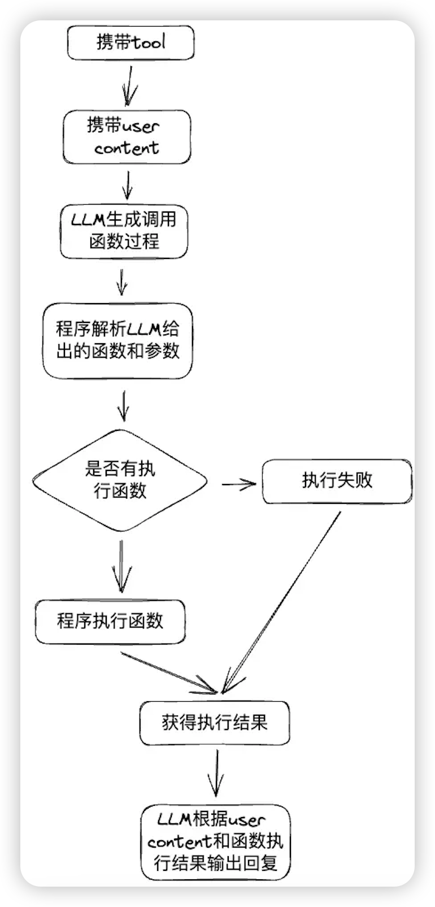

- [在任意LLM模型中实现function calling](#在任意llm模型中实现function-calling)
  - [OpenAI的Function calling](#openai的function-calling)
  - [实现通用的Function calling](#实现通用的function-calling)
    - [Function calling原理](#function-calling原理)
    - [神奇的赛博咒语](#神奇的赛博咒语)
  - [ollama demo](#ollama-demo)
- [references](#references)


# 在任意LLM模型中实现function calling

## OpenAI的Function calling

[OpenAI之前给自己的新模型提供了function calling的能力](./fc.md)，暨在给LLM提供tools工具的情况下，他能根据与你的对话内容自主选择函数。

```python
tools=[
    {
      "type": "function",
      "function": {
        "name": "get_current_temperature",
        "description": "Get the current temperature for a specific location",
        "parameters": {
          "type": "object",
          "properties": {
            "location": {
              "type": "string",
              "description": "The city and state, e.g., San Francisco, CA"
            },
            "unit": {
              "type": "string",
              "enum": ["Celsius", "Fahrenheit"],
              "description": "The temperature unit to use. Infer this from the user's location."
            }
          },
          "required": ["location", "unit"]
        }
      }
    }
  ]
```

OpenAI的接口中出现了一个新的参数tools，将可以让LLM调用的的函数注册到这个参数中。

```json
{
  "id": "run_qJL1kI9xxWlfE0z1yfL0fGg9",
  ...
  "status": "requires_action",
  "required_action": {
    "submit_tool_outputs": {
      "tool_calls": [
        {
          "id": "call_FthC9qRpsL5kBpwwyw6c7j4k",
          "function": {
            "arguments": "{"location": "San Francisco, CA"}",
            "name": "get_rain_probability"
          },
          "type": "function"
        }
    ...
    "type": "submit_tool_outputs"
  }
}
```

**如果入参携带了tools参数，那么就一定会返回如上调用结构，而不是正常的Chat模式，再根据返回的数据调用函数获得函数结果后再喂给LLM，LLM再结合函数结果和用户content回复用户。**

整个过程的流程图如下：



**因为 openai 是闭源的大模型的，它的 function call 怎么实现的不清楚，但是大概跟我们下面谈到的通用 function call 实现方式差不多。因为跟大模型的通信都是基于 prompt 进行的。**

## 实现通用的Function calling

本次的目标就是期望能够在不需要OpenAI API的情况下,任意的LLM后端，如LLama.cpp、Ollama或者其他的后端都能实现Function calling功能，只需要Text Generate就能使用这个功能。

### Function calling原理

在刚开始看到function calling的时候确实是以为又出现了什么新的模型，但这个功能确实用处很大，在比起单纯的文本生成或者后面新出的RAG来说信息的准确性和其他系统的交能力肯定有质的提升。

于是某一天在搜索Ollama有没有function call的时候在langchain中发现了一点思路：[ollama_functions.ts](https://github.com/langchain-ai/langchainjs/blob/main/libs/langchain-community/src/experimental/chat_models/ollama_functions.ts)

### 神奇的赛博咒语

Ollama官方并没有function calling的功能，但是 langchain 确实现了，原理就是使用了一段prompt：
> Ollama 是一款开源跨平台大模型工具，主要用于在本地便捷部署和运行大型语言模型（LLM），核心目标是降低用户使用大模型的门槛，同时保障数据隐私。

```python
You have access to the following tools:
{tools}
You must always select one of the above tools and respond with only a JSON object matching the following schema:
{{
  "tool": <name of the selected tool>,
  "tool_input": <parameters for the selected tool, matching the tool's JSON schema>
}}
```

为了兼容OpenAI function，结构也是一样的:

```python
protected defaultResponseFunction = {
    name: "__conversational_response",
    description:
      "Respond conversationally if no other tools should be called for a given query.",
    parameters: {
      type: "object",
      properties: {
        response: {
          type: "string",
          description: "Conversational response to the user.",
        },
      },
      required: ["response"],
    },
};
```

**看到这醍醐灌顶，这解决方法真是简单粗暴，不需要新的模型，也不需要fine tune，只需要设置这段system prompt只要LLM的逻辑能力够强就能直接让他根据你提供的内容输出指定的json格式，然后解析json并处理函数就可以了。**

**灵活性甚至比OpenAI的还要高，因为OpenAI一旦启用function calling功能就只能输出submit_tool_outputs无法正常回答问题，需要将运行结果和content再次输入模型获得新的结果，也就是说即使用户提问与任何tool都无关，还是需要执行整套流程，如上面流程图所画。**

**只要小小的修改一下prompt，就能在用户的内容与tools无关的情况下直接返回信息，而不需要再次请求大模型**。这样就能既节省时间又省钱。

```python
You have access to the following tools:
{tools}
You can select one of the above tools or just response user's content and respond with only a JSON object matching the following schema:
{{
  "tool": <name of the selected tool>,
  "tool_input": <parameters for the selected tool, matching the tool's JSON schema>,
  "message": <direct response users content>
}}
```

这样的prompt就能在用户提问与tools都不相关的情况直接回答用户问题。

如果LLM逻辑能力够强是能直接返回json数据，我们只需要解析json并执行函数就可以了。

```python
{
    "tool":"tool",
    "tool_input":{
        "arg1":"arg1",
        "arg2":false
    },
    "message":"LLM message"
}
```

执行函数也不用详细说了，只需要类似如下的函数表来执行函数，动态语言的话是很容易做到的。

```python
def getWeather(arg):
    pass
def getTemperature(arg):
    pass
functions = {
    "getWeather":getWeather,
    "getTemperature":getTemperature
}
```

## ollama demo

> https://github.com/tusik/any-function-calling/blob/fb8e357b6b6e03befb4570e943ee436cd68f9990/ollama_demo.py

```python
'''
Author: Image image@by.cx
Date: 2024-05-22 10:12:44
LastEditors: Image image@by.cx
LastEditTime: 2024-06-13 11:43:07
filePathColon: /
Description: 

Copyright (c) 2024 by Image, All Rights Reserved. 
'''

import requests
import json
# 描述工具的json格式
tools = [
    {
        "name": "get_current_weather",
        "description": "Get the current weather in a given location",
        "parameters": {
            "type": "object",
            "properties": {
                "location": {
                    "type": "string",
                    "description": "The city and state e.g. San Francisco, CA"
                },
                "unit": {
                    "type": "string",
                    "enum": [
                        "celsius",
                        "fahrenheit"
                    ]
                }
            },
            "required": [
                "location"
            ]
        }
    },
    {
        "name": "light_switch",
        "description": "控制设备内部照明的开关",
        "parameters": {
            "type": "object",
            "properties": {
                "on": {
                    "type": "bool",
                    "description": "true打开,false关闭"
                }
            },
            "required": [
                "on"
            ]
        }
    }
]
# 工具函数
def get_current_weather(obj):
    print("get_current_weather",obj)

def light_switch(obj):
    print("light_switch",obj)
    
# 工具函数映射
functions = {
    "get_current_weather":get_current_weather,
    "light_switch":light_switch,
}

# 中文系统提示
system_zh = f"""你能在系统上调用以下工具:
{json.dumps(tools)}
可以选择以上工具的其中一个来操作系统, 或者不使用工具直接回应用户, 且只能使用以下json格式回应用户:
{{
    "tool": <工具名，未选择工具可以留空>,  
    "tool_input": <工具输入参数，根据工具提供的json格式输入，未选择工具可以留空>, 
    "message":<其他回复用户的内容>
}}
"""
# 英文系统提示
system_en = f"""You have access to the following tools:
{json.dumps(tools)}
You can select one of the above tools or just response user's content and respond with only a JSON object matching the following schema:
{{
  "tool": <name of the selected tool>,
  "tool_input": <parameters for the selected tool, matching the tool's JSON schema>,
  "message": <direct response users content>
}}"""

# 默认message格式
messages = [
    {
        "role":"system",
        "content":system_en
    }
]

def extract_json(s):
    if '{' not in s or '}' not in s:
        return None
    i = s.index('{')
    count = 1 #当前所在嵌套深度，即还没闭合的'{'个数
    for j,c in enumerate(s[i+1:], start=i+1):
        if c == '}':
            count -= 1
        elif c == '{':
            count += 1
        if count == 0:
            break
    assert(count == 0) #检查是否找到最后一个'}'
    return s[i:j+1]

# 解析LLM返回的结果，如果有json则去解析json
def process_result(res):
    
    json_str = extract_json(res["message"]["content"])
    if json_str is not None:
        obj = json.loads(json_str)
        if "tool" in obj:
            if obj["tool"] in functions:
                fun = functions[obj["tool"]]
                fun(obj["tool_input"])
        return obj["message"]
    
def main():
        
    url = "http://127.0.0.1:11434/v1/chat/completions" 
    model = "qwen2:7b"
    while True:
        
        user_input = input('Enter a string: ')
        messages.append({
            "role":"user",
            "content":user_input
        })
        payload = {
            "model": model,
            "messages":messages,
        }
        payload = json.dumps(payload)
        headers = {
            'Content-Type': 'application/json'
        }
        
        response = requests.request("POST", url, headers=headers, data=payload)
        
        print(response.text)
        resp = json.loads(response.text)
        
        ai_msg = process_result(resp["choices"][0])
        messages.append({
            "role":"assistant",
            "content":json.dumps(resp["choices"][0])
        })
        print("ai_msg",ai_msg)

if __name__ == '__main__':
    main()
```

# references

- [https://by.cx/posts/programming/function-calling-sdks](https://by.cx/posts/programming/function-calling-sdks)
- [https://by.cx/posts/programming/llm-function-calling](https://by.cx/posts/programming/llm-function-calling)
- [https://by.cx/posts/programming/function-calling-in-any-llm](https://by.cx/posts/programming/function-calling-in-any-llm)
