- [大模型推理加速技术 kv cache](#大模型推理加速技术-kv-cache)
  - [self attention](#self-attention)
  - [kv cache](#kv-cache)
  - [kv cache 大小计算](#kv-cache-大小计算)
  - [| 64 | 4096 | 1208 | 3.45 |](#-64--4096--1208--345-)
  - [|  TGI | llama2 70B | 128/512 | A800，32c | 1122 | 43 | cpu25%，gpu95% |](#--tgi--llama2-70b--128512--a80032c--1122--43--cpu25gpu95-)
  - [总结](#总结)
  - [References](#references)


# 大模型推理加速技术 kv cache

KV Cache 是一种为大模型量身定制的推理加速技术。transformer官方use_cache这个参数默认是True，但是它**只能用于Decoder架构的模型**，这是**因为Decoder有Causal Mask**，在推理的时候前面已经生成的字符不需要与后面的字符产生attention，从而使得前面已经计算的K和V可以缓存起来。

对于仅编码器Transformer架构的模型的推理，我们给一个输入文本，模型会输出一个回答（长度为 N），其实该过程中执行了 N 次推理过程。即类 GPT 的仅编码器模型一次推理只输出一个token，输出的 token 会与输入 tokens 拼接在一起，然后作为下一次推理的输入，这样不断反复直到遇到终止符。

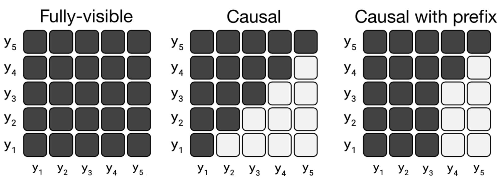

## self attention

假设输入序列为:

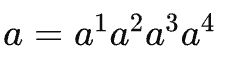

那么 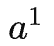 对于整个输入序列 a 的注意力表示为 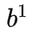，它的计算过程如下图所示：

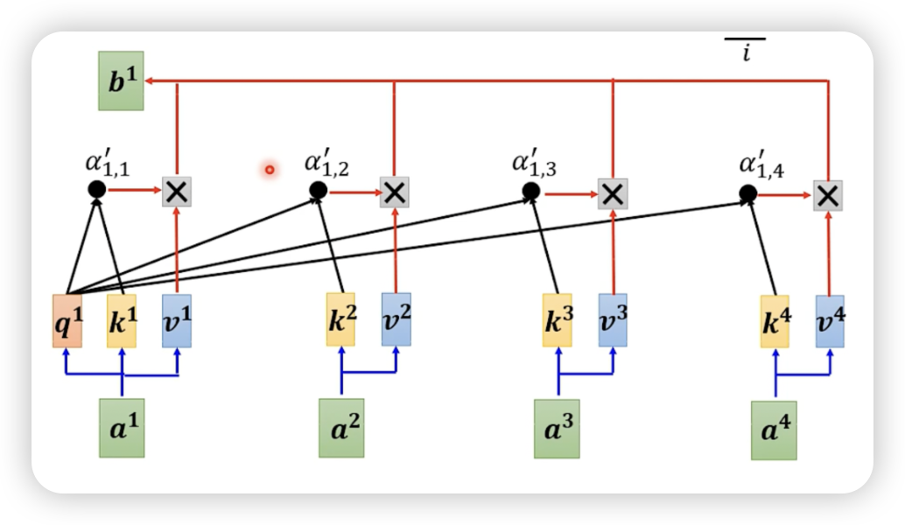

公式为：

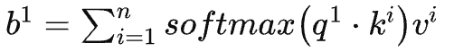

继续观察 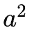 对于整个输入序列 a 的注意力表示为 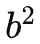，它的计算过程如下图所示：

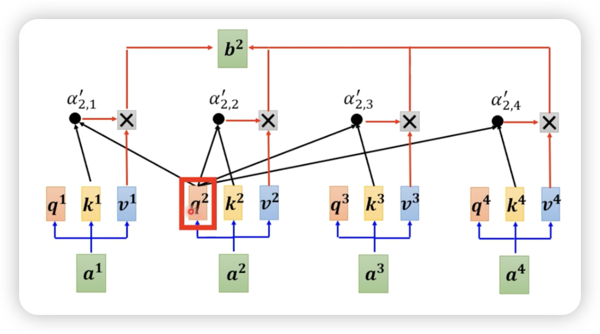

公式为：

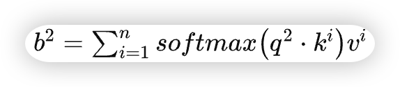

依此类推，在推理阶段，当我们需要预测第 n 个 token 时，我们需要计算 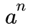 的注意力 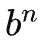，不使用 kv cache 的情况下，我们的模型需要并行计算 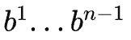，这部分会产生大量的冗余计算：

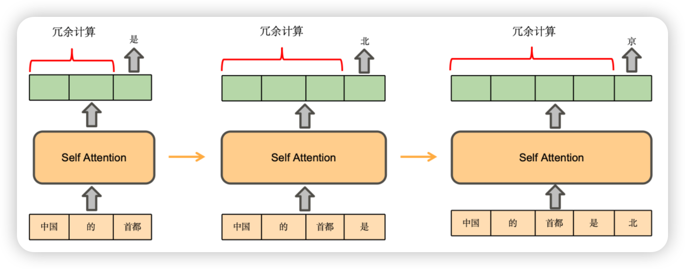

而实际上  可直接通过公式：


即  的计算**只与 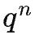 、所有 k 和 v 有关。**

## kv cache

**KV Cache 的本质是以空间换时间，它将历史输入的token的 k 和 v 缓存下来，避免每步生成都重新计算历史token的 k 和 v 以及注意力表示 。** 根据上述公式，实际上，得到  只需要计算 、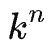、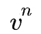，复用 KV Cache 中之前的 k 和 v，然后就可以预测下一个 token 了。

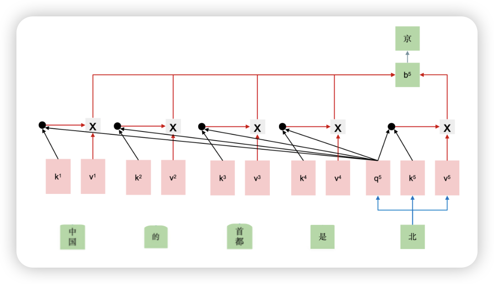


```python
# 拆分 Q、K、V
query, key, value = self.c_attn(hidden_states).split(self.split_size, dim=2)
...
# [batch, sequence_len, embeded_dim] -> [batch, heads, sequence_len, head_dim]
query = self._split_heads(query, self.num_heads, self.head_dim)  # 当前token对应的query
key = self._split_heads(key, self.num_heads, self.head_dim)  # 当前token对应的key
value = self._split_heads(value, self.num_heads, self.head_dim)  # 当前token对应的value

##################################
# KV Cache 核心代码逻辑
if layer_past is not None:
    past_key, past_value = layer_past  # 从 KV Cache 读数据
    key = torch.cat((past_key, key), dim=-2) # 将当前token的key与历史的K拼接
    value = torch.cat((past_value, value), dim=-2) # 将当前token的value与历史的V拼接

if use_cache is True:
    present = (key, value) # 将数据存到 KV Cache
else:
    present = None
##################################

...

# 使用当前token的query与K和V计算注意力表示
if self.reorder_and_upcast_attn:
    attn_output, attn_weights = self._upcast_and_reordered_attn(query, key, value, attention_mask, head_mask)
else:
    attn_output, attn_weights = self._attn(query, key, value, attention_mask, head_mask)
```

## kv cache 大小计算

kv cache 的峰值显存占用大小计算公式：

`2 * batch_size * Length * kv向量维度 * Layers * k-bits`

由此我们可以看出影响KV cache的具体因素：

- **2**：代表 Key/Value 两个向量
- **batch_size**：KV Cache 与 batchsize 度呈线性关系，随着 batch size 的增大，KV cache 占用的显存开销快速增大，甚至会超过模型本身
- **Length**：输入序列长度+输出序列长度（循环队列管理窗口KV，减少长度kv）
- **kv向量维度**：d * n_kv_heads，（MQA/GQA通过减少KV的头数减少显存占用）
- **Layers**：模型层数
- **k-bytes**：数据类型，如果是 FP16，因为 FP16 占 2个bytes，所以 k-bytes 取值 2

以 GPT3 (175B) 为例，对比 KV cache 与模型参数占用显存的大小。GPT3 模型weight占用显存大小为350GB (FP16)，层数 l为96，维度h为12888。

-----
|  batch_size | Length | KV cache(GB) | KV cache/weight |
| :----: | :----: | :----: | :----: |
| 4 | 4096 | 75.5 | 0.22 |
| 16 | 4096 | 302 | 0.86 |
| 64 | 4096 | 1208 | 3.45 |
-----

随着 batch size 和 长度的增大，KV cache 占用的显存开销快速增大，甚至会超过模型本身。从LLM的趋势上而讲，主要有三个方面来说明kv cache优化的必要性：

- **总体趋势上LLM 的窗口长度在不断增大，因此就出现一组主要矛盾，即：对不断增长的 LLM 的窗口长度的需要与有限的 GPU 显存之间的矛盾。因此优化 KV cache 非常必要。**OpenAI API场景，API最烧钱的是输入而非输出，输入包括prefill prompt 和conversation，长度动辄数十K token。虽说每输入token比每输出token便宜，但能够降低kv重新计算的开销，无论是硬件资源门槛，还是模型推理降本，都有着极为积极的作用。
- **对于消费级显卡这种性价比较高的显卡而言，显存容量相对较小，KV cache从一定程度上降低了模型的batch size，因而KV cache优化在工程落地中更显重要。**
  
-----
| 框架 | 模型 | input/output | 机器配置 | tokens/s | 最佳batch_size | gpu/cpu负载 |
| :----: | :----: | :----: | :----: | :----: | :----: | :----: |
| TGI | llama2 70B | 128/512 | 4090*8，32c | 291 | 13 | cpu25%，gpu95% |
|  TGI | llama2 70B | 128/512 | A800，32c | 1122 | 43 | cpu25%，gpu95% |
-----

从上表能够看出，类似4090等消费级显卡，其主要的瓶颈时batch_size，而影响batch_size的主要因素就是显存容量，而KV cache在推理过程中占用大量的显存。如果能通过KV cache降低显存占用，从一定程度上就能提升消费级显卡的性价比，带来非常高的商业收益。

由此可见，KV cache会成为视频生成领域的一个重要瓶颈，但不排除有替代kv cache的加速方案。

## 总结

1. 预测下一个token的时候，我们只需要当前token计算出来的 `q、k、v` 和 kv cache 中（之前tokens计算的时候缓存下来）的 `k、v`。
2. 正是由于 kv cache 缓存了之前的 `k、v`，我们读出来可以直接使用而不是重新计算，就能加速推理过程。kv cache 的重要性不言而喻。
3. KV Cache 是以空间换时间，当输入序列非常长的时候，需要缓存非常多k和v，显存占用非常大。为了缓解该问题，可以使用MQA、GQA、Page Attention、MLA等技术。

## References

- [https://zhuanlan.zhihu.com/p/662498827](https://zhuanlan.zhihu.com/p/662498827)
- [https://mp.weixin.qq.com/s?__biz=MzkwOTc5MDAzNA==&mid=2247483657&idx=1&sn=1bba3f0eedb51fb99c59f3f175d7fd98&chksm=c1341f34f6439622363bb3aef00b7e0942044a75293cfac53fe4907dadd0af8ccf25a568644b&scene=21#wechat_redirect](https://mp.weixin.qq.com/s?__biz=MzkwOTc5MDAzNA==&mid=2247483657&idx=1&sn=1bba3f0eedb51fb99c59f3f175d7fd98&chksm=c1341f34f6439622363bb3aef00b7e0942044a75293cfac53fe4907dadd0af8ccf25a568644b&scene=21#wechat_redirect)
- [https://zhuanlan.zhihu.com/p/685853516](https://zhuanlan.zhihu.com/p/685853516)
