- [Mooncake：基于KVCache的解耦式LLM服务架构](#mooncake基于kvcache的解耦式llm服务架构)
  - [简介](#简介)
    - [开发Mooncake的动机](#开发mooncake的动机)
    - [Mooncake的设计与实验结果](#mooncake的设计与实验结果)
      - [动态预填充优化](#动态预填充优化)
      - [KVCache感知调度](#kvcache感知调度)
      - [过载场景下的调度策略](#过载场景下的调度策略)
      - [总结与开放数据](#总结与开放数据)
  - [初步背景与问题定义](#初步背景与问题定义)
  - [Mooncake的分解式架构概述](#mooncake的分解式架构概述)
  - [采样的真实世界请求追踪数据](#采样的真实世界请求追踪数据)
    - [数据详情](#数据详情)
    - [统计特征分析](#统计特征分析)
  - [预填充池的实现](#预填充池的实现)
    - [多节点预填充的设计](#多节点预填充的设计)
    - [逐层预填充的设计与优化](#逐层预填充的设计与优化)
  - [以KVCache为中心的调度](#以kvcache为中心的调度)
    - [预填充全局调度的优化设计](#预填充全局调度的优化设计)
    - [缓存负载均衡](#缓存负载均衡)
  - [面向过载的调度](#面向过载的调度)
    - [过载场景下的调度](#过载场景下的调度)
    - [提前拒绝策略](#提前拒绝策略)
    - [提前拒绝引发的负载波动](#提前拒绝引发的负载波动)
    - [基于预测的提前拒绝](#基于预测的提前拒绝)
  - [相关工作](#相关工作)
  - [结论](#结论)


# Mooncake：基于KVCache的解耦式LLM服务架构

> paper：[Mooncake: A KVCache-centric Disaggregated Architecture for LLM Serving](https://arxiv.org/abs/2407.00079)

2024年11月28日，月之暗面宣布开始开源今年6月和清华大学 MADSys 实验室联合发布了 Kimi 底层的 Mooncake 推理系统设计方案。

为啥说开始开源？因为本次开源会采用分阶段的方式，逐步开源高性能 KVCache 多级缓存 Mooncake Store 的实现，同时针对各类推理引擎和底层存储 / 传输资源进行兼容。其中传输引擎 Transfer Engine 部分现在已经在 GitHub 全球开源。其最终目标是为大模型时代打造一种新型高性能内存语义存储的标准接口，并提供参考实现方案。

## 简介

### 开发Mooncake的动机

随着LLM在多种场景中的广泛应用，LLM服务的工作负载呈现出显著的多样性。这些工作负载不仅在输入/输出的长度、到达频率及分布上存在差异，更重要的是对服务水平目标（SLO）的要求也各不相同。作为一家“模型即服务”（MaaS）提供商，Kimi面临的核心任务是解决一个多约束条件下的优化问题。该任务的目标在于最大化整体有效吞吐量，这是影响收入的关键因素，而约束条件则源于不同层次的SLO需求，这些需求主要集中在延迟相关指标上，如首个token生成时间（TTFT）和token间隔时间（TBT）。

要实现这一目标，需优先充分利用GPU集群中的各种资源。尽管当前的GPU服务器通常以高度集成的节点（如DGX/HGX超级计算机）形式提供，拆解这些节点并重构为多个独立但协作的资源池显得尤为必要。每个资源池针对特定的优化目标进行调整。例如，有研究指出，应将预填充服务器和解码服务器分离，因为这两个阶段的计算特性迥异。在请求从预填充服务器转移至解码服务器的过程中，KVCache的分配和调度尤为重要。

在优化LLM服务的吞吐量时，通常采用两种策略：一是尽可能重用KVCache以减少计算开销；二是通过增加批处理中的token数量提升模型的**浮点运算利用率（MFU）**。然而，这两种策略各有权衡，例如远程重用KVCache会延长TTFT，而增大批处理规模则可能延长TBT。因此，同时优化吞吐量和延迟需求需要更加精细的设计。

基于此，本文提出了一种围绕KVCache优化的分解式设计，命名为Mooncake。


其核心流程为：

**全局调度器（Conductor）**为每个请求选择适合的预填充和解码实例，并执行以下操作：

- 将可重用的KVCache传输至预填充节点；
- 以分块或分层的方式完成预填充，并将结果流式传输至解码节点；
- 加载KVCache并在解码节点中进行批处理以生成最终输出。

尽管这一流程看似简单，但实际调度中需要应对多种复杂约束。例如，在预填充阶段，应尽量避免重复计算以提高KVCache利用率，但等待低速存储上的KVCache可能违反TTFT要求。为此，调度器需预测KVCache的未来使用情况，并通过复制或替换来管理缓存的分布。热门缓存块应被复制到多个节点以缓解访问拥堵，而冷门缓存块则需及时替换以节约资源。此外，预填充节点中的DRAM资源有限，需合理分配以满足KVCache池的需求。

相比之下，解码阶段的目标是提升MFU，通过在单个批次中聚合更多token来实现。然而，这需要在满足TBT要求的同时，确保聚合KVCache的总量不会超出VRAM容量。

### Mooncake的设计与实验结果

#### 动态预填充优化

第5节中提出了一种独立的预填充节点池设计，用于灵活应对上下文长度的动态变化。为减少长上下文输入的首个token生成延迟（TTFT），Mooncake引入了分块流水线并行（CPP）机制，使单个请求的处理能够跨多个节点扩展。与传统的序列并行（SP）方法相比，CPP在降低网络开销的同时，避免了对频繁弹性扩展的过度依赖。此外，分层预填充技术进一步优化了处理效率，通过流式传输KVCache，实现延迟的有效掩盖。

#### KVCache感知调度

第6节重点介绍了Mooncake的KVCache感知调度算法，通过TTFT和TBT等延迟指标优化用户体验，同时平衡实例负载。该算法采用启发式热点迁移策略，无需对KVCache的未来使用进行精确预测，通过热点KVCache块的自动复制，有效降低访问延迟。实验结果表明，Mooncake在长上下文场景中表现显著优于基准方法，其吞吐量最高可提高525%。在真实工作负载下，Mooncake帮助Kimi的请求处理能力提升了75%。

#### 过载场景下的调度策略

Mooncake需要应对Kimi因用户请求量快速增长导致的过载挑战。与传统假设所有请求均可处理的LLM服务不同，Mooncake通过早期拒绝策略优化资源分配，在高负载场景中显著减少了计算资源浪费。此外，研究表明，简单的拒绝策略可能引发负载波动，因此Mooncake结合负载预测方法，提高了系统稳定性与调度效率。

#### 总结与开放数据

目前，Mooncake已成为Kimi的核心服务平台，有效应对了大规模高负载场景，并验证了其扩展能力。尽管如此，仍有许多值得探索的方向将在未来进一步研究。为促进学术交流，本文所有实验基于真实工作负载的追踪数据重放，使用了与LLaMA2-70B一致架构的虚拟模型。该追踪数据将在完成内部程序后，开源于 [https://github.com/kvcache-ai/Mooncake](https://github.com/kvcache-ai/Mooncake)。

## 初步背景与问题定义

现代LLM基于Transformer架构，使用注意力机制与多层感知器（MLP）来处理输入数据。主流的Transformer模型（如GPT和LLaMA）通常采用decoder-only架构。在推理过程中，每个请求可以分为两个主要阶段：预填充阶段和解码阶段。

**预填充阶段**：在预填充阶段，所有输入token均可并行处理。该阶段的任务是生成第一个输出token，并存储已计算的键值中间结果（KVCache）。在这一阶段，由于注意力机制的计算复杂度随输入长度二次增长，而MLP的复杂度为线性增长，预填充阶段的计算时间随输入长度呈超线性增长（如图2左所示）。虽然短请求的计算需求较低，但对于较长的输入序列，此阶段通常计算密集。

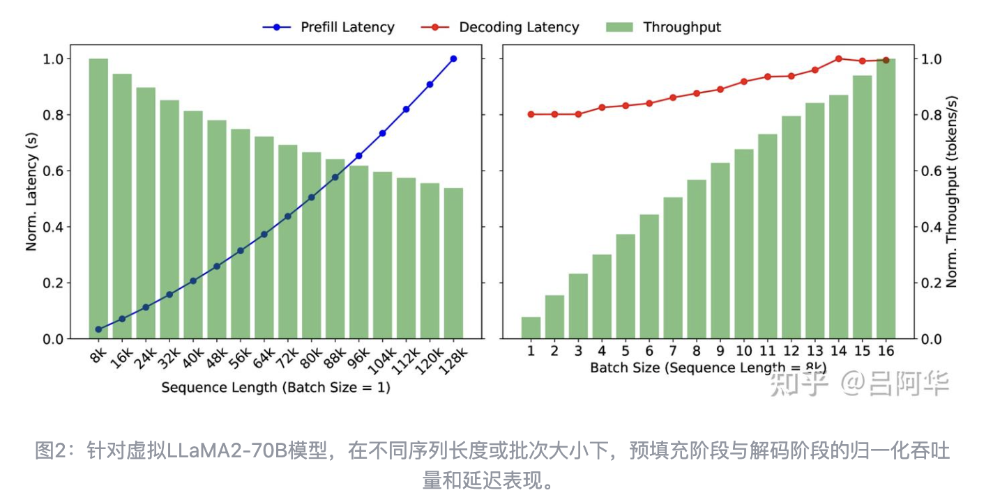

**解码阶段**：解码阶段则利用KVCache，通过自回归方式逐步生成新的token。每个批次在该阶段一次仅能处理一个token，受限于内存容量，计算时间随着批次大小的增加呈次线性增长（如图2右所示）。为提升解码效率，常用优化方法为连续批处理技术。具体来说，调度器在每次迭代前检查请求状态，将新到达的请求加入批次，同时移除已完成的请求。

**由于两阶段的特性不同，MaaS提供商为其定义了不同的服务水平目标（SLO）**。预填充阶段关注请求到达至生成TTFT，而解码阶段则关注同一请求中连续token生成的TBT。例如，若设置 TTFT(p90) = 4*，表示90%的请求其TTFT不超过无干扰条件下单次请求TTFT的四倍。本文的实验中设置了 TTFT(p90) = 10* 和 TBT(p90) = 5*。

在实际部署中，由于GPU供应紧张，动态扩展推理集群的能力有限，MaaS提供商通常需要通过拒绝部分请求来维持服务质量。**因此，核心挑战在于如何在满足SLO的同时，最大化有效吞吐量（goodput）**。与传统方法不同，Mooncake仅统计完成执行的请求为有效吞吐量，未完成的请求及其资源消耗将被视为浪费。因此，对于无法在SLO条件下完成的请求，应尽早拒绝。为实现这一目标，需要在优化预填充与解码架构的同时，具备短期负载预测能力，以更精准地进行调度与资源分配。

## Mooncake的分解式架构概述

Mooncake采用了分解式架构，通过将预填充节点与解码节点分离，同时整合GPU集群中的CPU、DRAM、SSD和RDMA资源，构建分解式KVCache。

这种设计充分利用未被完全利用的计算资源，为KVCache提供了充足的缓存容量和高效的传输带宽，从而实现了贴近GPU的高效前缀缓存，且无需增加额外成本。

如图3所示，KVCache以分页块形式存储在CPU内存中，可根据不同的请求模式选择合适的缓存管理策略，例如`最近最少使用（LRU）`、`最少使用频率（LFU）`或基于请求特性的自适应算法。KVCache块的传输由独立组件Messenger完成，该组件基于GPUDirect RDMA技术，实现了CPU与GPU之间的高速传输。此外，Mooncake还向外部用户提供上下文缓存API，进一步提升KVCache的重用效率。

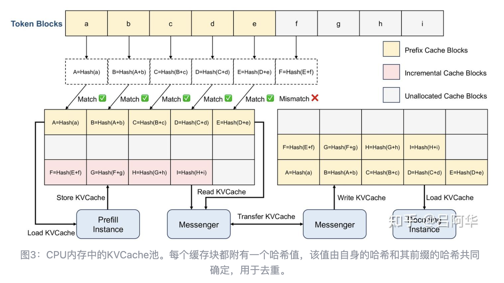

Mooncake的全局调度器Conductor负责管理KVCache的分布与工作负载的调度，并通过复制或交换缓存块优化未来推理性能。图4展示了一个典型请求的四步工作流：

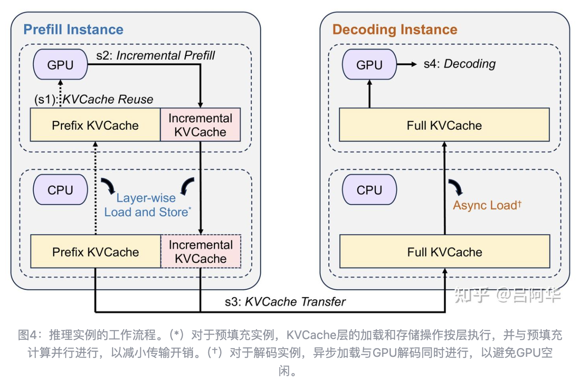

1. **KVCache重用**：在接收到请求后，预填充节点加载前缀缓存（若存在）至GPU内存，以初始化推理。这一过程需要在重用KVCache、均衡节点负载以及满足TTFT要求之间寻找平衡。
2. **增量预填充**：预填充节点使用前缀缓存完成当前阶段的计算，并将新增的KVCache存储回CPU内存。当未缓存的输入token数量超过一定阈值时，预填充阶段将分块执行，以流水线方式提高计算效率。
3. **KVCache传输**：Messenger服务异步管理KVCache的跨节点传输，结合增量预填充步骤，将每层生成的KVCache实时传输至解码节点的CPU内存，最大限度降低等待时间。
4. **解码**：当解码节点接收完整的KVCache后，请求被加入连续批处理队列。Conductor根据节点负载预选解码节点，并由本地调度器二次验证实际负载情况。如果负载超出SLO限制，该请求将被拒绝，先前的预填充计算资源也随之浪费。

## 采样的真实世界请求追踪数据

为了支持对LLM服务的深入研究，团队从一个小时的在线请求数据中抽取了一个子集，并制作了开源的请求追踪数据集。为保留请求之间的缓存关系，数据采样时优先选择了同一会话内的请求。最终，追踪数据集包含23,608条记录，字段包括时间戳、输入长度、输出长度和哈希ID。此外，我们引入了重新映射的块哈希信息，这在分析和实现KVCache重用策略时尤为关键。据他们了解，这是首个可用于真实场景中KVCache重用分析的开源数据集。

### 数据详情

```json
{

     "timestamp": 27482,
     "input_length": 6955,
     "output_length": 52,
     "hash_ids": [46, 47, 48, 49, 50, 51, 52, 53, 54, 55, 56, 57, 2353, 2354]
}
{
     "timestamp": 30535,
     "input_length": 6472,
     "output_length": 26,
     "hash_ids": [46, 47, 48, 49, 50, 51, 52, 53, 54, 55, 56, 57, 2366]
}
```

以上数据展示了追踪数据集中的两个样本，以下是数据集的字段说明及其作用：

- **时间戳**：timestamp字段表示请求的相对到达时间，单位为毫秒，范围从0到3,600,000。
- **输入与输出长度**：为保护隐私，追踪数据不包含实际文本或token，而是使用input_length和output_length字段，表示输入和输出token的数量，类似于Splitwise。
- **哈希ID**：hash_ids字段描述了前缀缓存关系。它通过对token块（块大小为512）进行哈希计算生成前缀哈希值，该值包含当前块及其所有前置块的哈希值（详见图3）。生成的哈希值被映射为全局唯一ID。相同的哈希ID表示某一块的token及其前置token是相同的，因此可以在对应的KVCache中共享。例如，在提供的样本中，前12个哈希ID是相同的，表示它们可以为前12*512=6,144个token共享前缀缓存。

在样本数据中，哈希ID的去重机制显著提高了KVCache的重用效率。这一特性使得研究人员能够更好地分析实际工作负载中的缓存利用模式，并为优化LLM服务的缓存策略提供可靠依据。同时，通过去除具体文本内容并仅保留抽象信息，数据集在保护用户隐私的同时，仍保留了极高的研究价值。

### 统计特征分析

图5展示了请求追踪数据中输入长度和输出长度的分布情况。平均输入长度为7,590个token，平均输出长度为182个token，输入与输出的平均比例高达720。这一分布特性反映了Kimi在处理和理解长上下文方面的强大能力，但这仅是具有代表性的一种模式，并非覆盖所有工作负载场景。

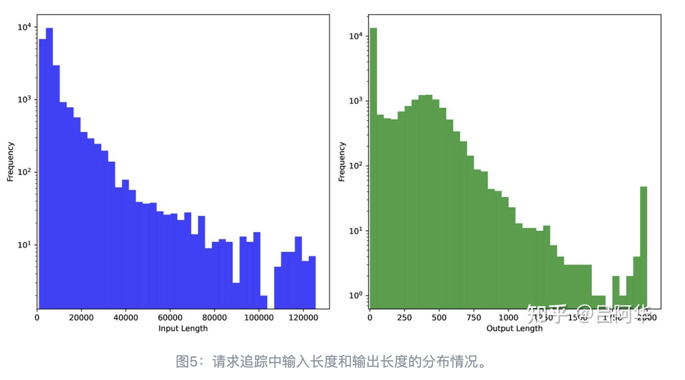

基于该追踪数据，团队假设一个全局缓存池，并对三种缓存策略的性能进行了分析：

- **LRU（最近最少使用）**：优先清除最近未被访问的缓存块。
- **LFU（最少使用频率）**：优先清除访问频率最低的缓存块。
- **LengthAwareCache**：类似于LFU，但优先清除出现在请求后段的缓存块。

表1展示了在不同缓存容量下的命中率对比。

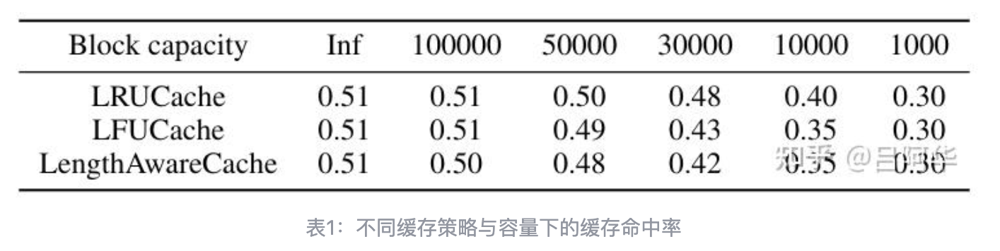

当缓存容量从1,000块增加到50,000块时，缓存命中率从30%提升至50%。进一步增加容量后，命中率的提升趋于平缓。然而，这并不意味着更大的缓存没有必要，因为追踪数据仅为真实工作负载的一部分。在实际场景中，所需的缓存容量通常需随着工作负载规模的增加而扩大。在该数据集中，LRU策略表现最佳，这可能与请求间存在较强的时间接近性有关。

图6进一步揭示了缓存块流行度的极端不均衡分布。超过50%的缓存块从未被访问，而某些热点块的访问次数却高达数万次。这种长尾分布特性表明，**针对热点块的复制策略对系统性能优化至关重要**。通过在不同节点间复制这些高频访问的缓存块，可以有效降低传输拥堵，提升系统整体效率。

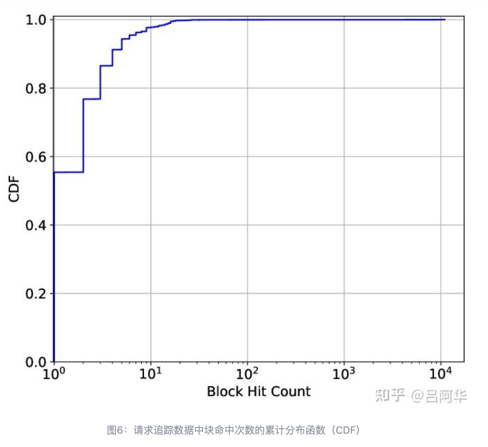

以上统计特征表明，**在设计和优化LLM服务的缓存管理时，需要综合考虑输入输出长度分布、缓存容量、以及缓存块流行度等多种因素。特别是对于具有高输入输出比例和显著热点特性的工作负载，合理设计缓存策略和分配资源尤为关键。**

## 预填充池的实现

与解码节点的固定设计不同，关于是否需要一个独立且弹性的预填充池，以及其最佳设计方案，目前尚存争议。例如，虽然许多研究支持分解式架构，但随着**分块预填充（chunked prefill）**的引入，这一设计是否仍然必要成为讨论的焦点。分块预填充通过将输入token拆分为小块并加入连续批次处理流程，带来了以下优势：

- 消除预填充与解码的分离，使所有节点功能一致，简化调度；
- 将分块预填充嵌入解码批处理后，可提升计算密度，优化模型浮点操作利用率（MFU）。

尽管如此，Mooncake仍坚持分解式架构。仅在满足以下条件时，才将预填充嵌入解码批次：

- 请求无需分块处理；
- 不会影响解码阶段的TBT SLO。

这一选择主要基于两点考虑：

- 预填充节点需要独特的跨节点并行配置，以支持长上下文处理；
- 分解式设计为显存的优化提供了额外的空间。

### 多节点预填充的设计

随着现代LLM上下文长度从8K扩展至128K甚至1M token，**长上下文请求中的输入token量通常是输出token量的10至100倍**。为了优化TTFT，利用多个`8x GPU节点`进行并行处理成为必要。然而，直接将**张量并行（TP）**扩展到多节点会导致显著的性能下降，因为每层需要两次全规约（all-reduce）操作，占用大量网络资源，降低MFU。

**序列并行（SP）**作为一种优化方法，将请求的输入序列分配到不同节点，减少每层通信次数，提高MFU。然而，SP的MFU仍不及单节点TP。此外，动态调整SP组的规模增加了系统复杂性，且频繁的跨节点通信会与KVCache传输争夺网络资源。

为解决上述问题，Mooncake设计了**分块流水线并行（CPP）**。通过将预填充集群划分为多个节点组，并将输入token划分为长度不超过prefill_chunk的小块，CPP实现了请求的分块并行处理。这种方法不仅减少了跨节点通信开销，还能在短上下文和长上下文预填充场景下提供一致的性能表现。与传统流水线并行类似，CPP将通信与计算重叠，大幅提升了MFU，并减少了网络资源争夺。

据团队所知，这是**首次将流水线并行应用于长上下文推理阶段，标志着推理加速技术的新突破**。

### 逐层预填充的设计与优化

在LLM推理中，VRAM不仅是计算能力的关键限制因素，更是宝贵的资源。为了减少状态（主要是KVCache）对VRAM的占用，Mooncake优化了预填充的内存管理与调度方式。理论上，KVCache的占用成本由其大小与处理时间的乘积决定，即S×TS \times TS×T。如果对请求进行分块处理，并将分块预填充与其他解码请求结合，处理时间TTT会增加，从而加大VRAM占用成本。

为降低这种成本，Mooncake利用了逐层预填充的特性，通过计算与KVCache的加载和存储重叠来减少内存占用。在这一设计中：

- 每层的KVCache在注意力计算前完成异步加载，并同时触发下一层的加载操作；
- 计算完成后，KVCache的异步存储立即启动；
- 在所有计算结束后，系统等待所有存储操作完成。

通过这种方法，KVCache传输时间与计算时间可以相互重叠，从而将预填充实例的执行时间缩短至KVCache加载时间或标准预填充时间的较小值。实验结果（图7）表明，逐层预填充在长上下文请求中的延迟优化效果显著。

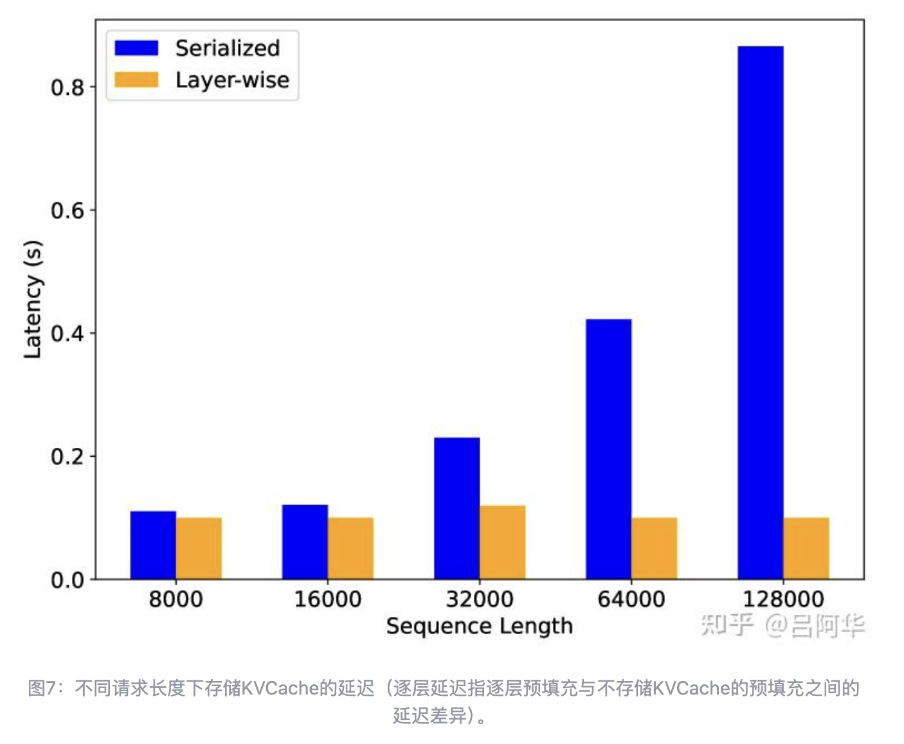

这一优化使得预填充调度无需考虑VRAM的整体可用容量，只需确保能够容纳单个请求的KVCache即可。这使得调度时更关注KVCache分布和可用的DRAM资源（如图1所示）。通过解放VRAM限制，系统调度更加灵活，为进一步提升资源利用率创造了条件。

逐层预填充的内存管理优化为其他应用场景的探索提供了可能。例如，OpenAI最近推出的批处理API允许用户以50%的成本提交异步请求组，适用于不需要即时响应的任务。这类批处理请求由于没有严格的TBT要求，可以充分利用空闲的VRAM资源。Mooncake可以将这些请求的解码阶段嵌套至预填充处理中，进一步提升计算密度和MFU。这种方法不仅降低了运行成本，还为LLM服务的多任务优化开辟了新的路径。

## 以KVCache为中心的调度

本章聚焦于Conductor在正常工作条件下的调度策略，主要探讨如何优化请求的分配及KVCache块的管理。针对过载场景的调度策略将在下一节详细讨论。

### 预填充全局调度的优化设计

传统的LLM服务多采用基于请求数量的负载均衡策略评估节点负载。然而，Mooncake的预填充调度策略更为复杂，不仅关注节点负载，还综合考虑了前缀缓存的命中长度以及可重用KVCache块的分布情况。通常而言，将请求路由到前缀缓存较长的节点可以降低计算成本，但为了实现整体负载平衡并满足TTFT SLO，有时需要将请求分配到其他节点。为此，Mooncake提出了一种**缓存感知的全局调度算法**，综合考虑了前缀缓存影响的预填充时间和队列排队时间。

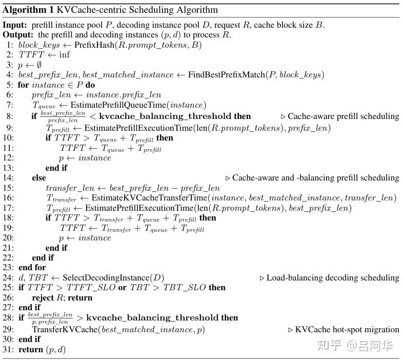

如算法1所示，该调度机制包含以下步骤：

**分块与哈希计算：**

- 每个新请求的输入token被分为若干块，对每块生成哈希键。
- 每个块的哈希键与前一个块的哈希键（若存在）进行拼接，以确保前缀缓存关系能够被准确捕捉。

**前缀匹配与时间估算：**

- 将请求的块哈希键逐一与预填充节点的缓存键比较，计算前缀匹配长度（prefix_len）。
- 基于请求长度和prefix_len，Conductor使用预测模型估算预填充时间，并叠加队列中的等待时间以计算TTFT。

**实例分配与反馈：**

- Conductor将请求分配给预计TTFT最短的实例，同时更新该实例的缓存状态和队列时间。
- 如果发现该请求无法满足SLO，直接向客户端返回HTTP 429状态码，表示当前负载过高。

尽管调度框架的核心逻辑看似简单，但其工程实现隐藏了诸多复杂性。例如，估算请求的预填充阶段计算时间需要使用基于离线测试数据的预测模型。该模型根据请求长度和前缀缓存命中长度估算预填充时长。由于Transformers具有规律的计算模式，这种预测在离线数据足够的情况下通常误差较小。此外，队列时间是通过聚合排队请求的预填充时间计算的。在实际实现中，TTFT的计算是并行进行的，因此计算时间对系统性能的影响较小。

相比之下，传输时间的预测更具挑战性。传输时间不仅受数据量影响，还依赖于当前的网络状态，尤其是发送节点是否存在拥堵。此外，为缓解拥堵问题，系统还需对热点KVCache块进行复制，这将在下一节中进一步讨论。

### 缓存负载均衡

在Mooncake集群中，每台预填充机器独立管理其本地前缀缓存。这些缓存的使用频率差异很大，例如，系统提示会被几乎所有请求访问，而某些本地长文档的内容可能仅由单个用户使用。如上一节所述，Conductor在实现缓存匹配效率与实例负载平衡方面至关重要。因此，从分布式缓存的视角来看，负载均衡同样重要。这不仅涉及如何在全局范围内优化缓存的分布，还包括如何通过备份策略实现更高的缓存命中率与更低的系统负载。

简单的解决方案可能包括：收集每个缓存块的全局使用频率，利用预测模型估算未来的使用情况，并基于预测结果进行调度。然而，与预填充时间的估算不同，工作负载的动态性非常高，特别是对于用户数量快速增长的MaaS提供商，精确预测未来的使用情况几乎不可行。因此，我们提出了一种基于启发式的自动热点迁移方案，来改进缓存负载均衡。

当实例负载较高时，请求可能无法被直接分配到具有最长前缀缓存的节点。在这种情况下，如果预估的额外预填充时间短于传输时间，Conductor会将缓存的位置和请求转发到备用实例。该实例主动检索KVCache并将其存储在本地。同时，当远程前缀匹配长度不超过本地可用前缀长度的特定倍数时，优先直接计算输入token。这两种策略一方面缩短了请求的预填充时间，另一方面也通过热点缓存的自动复制使其分布更广泛，从而提高系统整体性能。

为验证这一策略的效果，团队设计了调度实验，比较了以下几种调度算法的性能：

- **随机调度**：每个请求的预填充实例随机选择。
- **负载均衡调度**：选择当前负载最轻的实例。
- **缓存感知调度**（上一节提出）：基于缓存命中率优化的调度算法。
- **KVCache中心化调度**（本节提出）：在缓存感知调度基础上加入缓存负载均衡的考虑。

实验在一个包含8个预填充实例和8个解码实例的Mooncake集群中进行，使用夜间空闲的机器，重放了23,000个真实请求。实验结果通过平均TTFT和TTFT SLO达成率进行评估。如图8所示，缓存感知调度和缓存负载均衡策略均显著降低了TTFT，而KVCache中心化调度在TTFT和SLO达成率方面均优于随机调度和负载均衡调度。

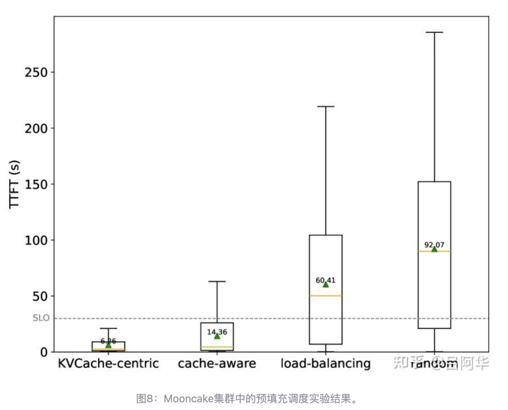

## 面向过载的调度

现有LLM服务研究通常假设系统能够处理所有传入请求，并以此优化吞吐量、TTFT或TBT。然而，在实际场景中，全面处理所有请求既不现实也不经济。特别是对于商业推理服务，用户请求量的增长速度远快于推理资源的扩展速度，因此过载问题在当前LLM服务中非常普遍，尤其是在高峰期表现尤为明显。

为了在成本和用户体验之间找到平衡，系统应尽可能多地处理请求，直到负载达到预设阈值。超出这一阈值的请求要么直接拒绝，要么推迟重试。作为一种分解式推理系统，Mooncake提供了更灵活的调度能力，但也因此面临独特的调度挑战。这些问题在传统的非分解式架构中并不常见，且以往研究中也未提及。

本节介绍了一种为分解式架构量身定制的提前拒绝策略，并讨论了因该策略可能导致的负载波动问题。此外，还探讨了如何通过预测生成长度来进一步优化调度效果。

### 过载场景下的调度

而在Mooncake的分解式架构中，预填充阶段和解码阶段被独立处理，使得系统可以更直观地使用SLO的满足情况来衡量负载。具体来说，系统定义了TTFT和TBT的SLO约束，分别记为 `lttft` 和 `ltbtt`。调度器通过比较实例上预测的最大TTFT和TBT与SLO约束值，评估各实例的负载情况。基于此，Mooncake的调度策略需要完成两个关键决策：

- 根据预填充实例的负载决定是否接受预填充阶段；
- 根据解码实例的负载决定是否继续处理解码阶段。

通过采用这种分解式的负载评估方法，Mooncake能够更灵活地调配资源，同时更精准地确保TTFT和TBT的SLO要求得以满足。

### 提前拒绝策略

在实践中，仅通过单独评估预填充或解码实例的负载，往往无法准确反映系统实际处理的请求数量。这主要因为请求从预填充到解码之间存在时间延迟。如果请求在完成预填充后，由于解码实例负载过高被拒绝，则预填充阶段所消耗的计算资源将被浪费。结果是，预填充阶段实际成功处理的请求数量通常低于负载指标所显示的值。

为解决这一问题，Mooncake引入了提前拒绝策略。通过将解码实例的负载评估提前到预填充阶段之前，Conductor在请求到达时即根据预填充池和解码池中较高的负载决定是否接受请求。提前拒绝策略不仅显著减少了因请求被拒绝导致的无效计算，同时有效改善了系统的负载分配。

### 提前拒绝引发的负载波动

尽管提前拒绝策略优化了资源使用效率，但也带来新的负载波动问题。图9展示了在应用提前拒绝策略后，Mooncake集群中20台机器在20分钟内的负载变化情况。

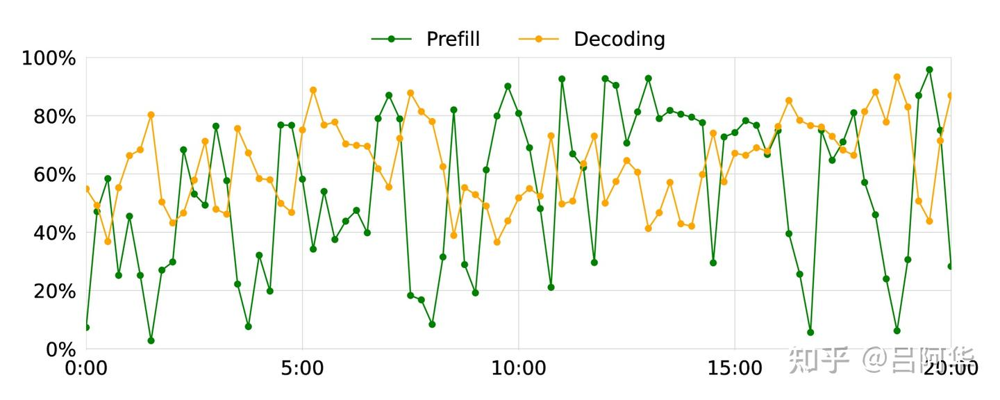

实验发现，预填充机器与解码机器之间的负载呈现显著的反向波动。这种现象在以下两种情况下尤为严重：

- 预填充机器数量较少；
- 预填充阶段的计算时间较长。

深入分析表明，这种波动的根源在于调度过程中的时间延迟。解码负载的预测与实际执行之间的滞后，使得预填充和解码阶段的负载产生错配。这种动态错配可通过图10(a)中的理论示例形象说明：

- 阶段1：由于预填充和解码实例的负载均较低，Conductor接受大量请求，直至预填充实例的负载接近上限。
- 阶段2：随着预填充实例完成任务，这些请求被调度到解码实例，导致解码实例负载激增。为避免解码阶段过载，Conductor拒绝新请求，导致预填充实例的负载下降。
- 阶段3：由于没有新的请求进入解码阶段，解码实例负载开始降低。此时，Conductor再次接受更多请求，直至预填充实例满载。
- 阶段4：解码实例负载再次上升，Conductor开始拒绝请求，导致预填充实例负载降低。

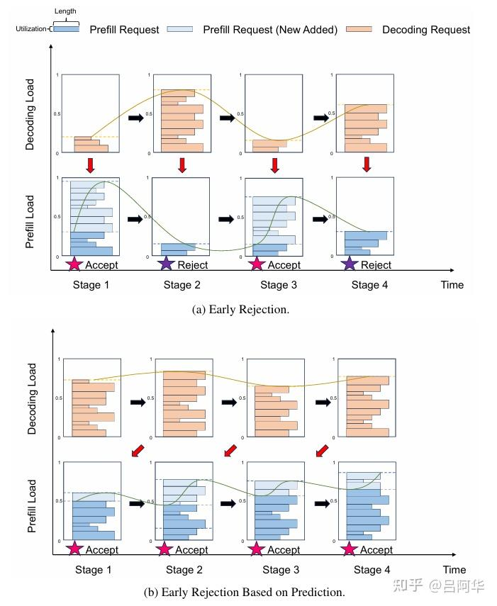

这种负载在预填充和解码阶段之间的剧烈波动显著降低了推理集群的资源利用效率。解决这一问题需要进一步优化调度策略，减少预测滞后的影响。

### 基于预测的提前拒绝

为了解决因提前拒绝策略引发的负载波动问题，我们提出了一种基于预测的提前拒绝框架，专注于解决分解式LLM服务系统（如Mooncake）在过载场景中的调度难题。该框架通过预测每个请求在完成预填充阶段后的解码负载，并以此作为决策依据，从而有效缓解负载波动问题。如图10(b)所示，提前预测解码负载可以帮助更均衡地分配资源，提高系统整体性能。关键在于如何准确预测未来的解码负载。为此，我们提出以下两种方法：

- **请求级预测**：请求级预测的目标是估算每个请求的输出长度，从而更精确地预测TTFT和TBT。这一方法有助于了解解码实例的负载水平，例如在指定时间后能够处理的请求数量。然而，准确预测每个请求的输出长度十分困难，尤其是在系统资源紧张的过载场景中。预测成本较高或准确率较低的问题使请求级预测目前难以实际应用。
- **系统级预测**：与逐一预测单个请求不同，系统级预测聚焦于估算整体负载情况。它通过预测一段时间内批处理数量或解码实例的TBT状态，提供对系统负载的宏观评估。这种方法无需高度精确，更适合应对过载条件下的动态调度需求。

在Mooncake当前的实现中，我们采用了系统级预测策略。假设每个请求的解码阶段耗时相同（记为 `td`），具体步骤如下：

- 在某一时刻 `t`，将预填充实例能够完成的请求加入解码实例的批处理队列；
- 从解码实例中移除那些在 `t` 之前完成的请求（即执行时间超过 `td` 的请求）；
- 计算所有解码实例的平均TBT与SLO目标 `ltbtt` 的比值，进而估算当前的解码负载。

这一方法有效降低了对单个请求预测精度的依赖，同时通过持续的系统级负载评估，为过载场景下的调度提供了可靠依据。未来，团队计划进一步探索请求级预测方法，以便在系统资源允许的条件下实现更精细的调度优化。

## 相关工作

在提升LLM服务系统效率方面，研究者已在调度优化、内存管理和资源分配等领域取得了显著进展。生产级系统如FasterTransformer、TensorRT-LLM和DeepSpeed Inference通过优化架构显著提高了推理吞吐量；Orca通过迭代级调度实现各阶段的并行处理，而vLLM则利用动态KVCache管理进一步优化内存效率。其他系统如FlexGen、SARATHI和FastServe采用创新的调度与交换策略，在硬件资源受限的环境下有效分配任务，形成了互为补充的优化方案。

Mooncake的设计在上述研究的基础上进一步发展，**特别受益于vLLM的开源贡献**。在此过程中，团队对vLLM社区深表感谢。

近期研究同样关注预填充与解码阶段的分离，通过分解式架构提升系统的整体吞吐量。例如，Splitwise的早期研究为Mooncake的开发提供了启发，而DistServe通过优化资源分配与并行策略进一步验证了分解式架构的效率。TetriInfer结合分块预填充和两阶段分解策略，同时提出预测性调度算法，在优化资源利用方面表现出色。

前缀缓存的应用在LLM推理中得到了广泛实践，用于在多请求之间复用KVCache，从而减少计算开销。例如，Prompt Cache通过预计算并存储常用KVCache显著降低了推理延迟；SGLang基于RadixAttention提出了一种利用基数树和LRU缓存结构实现高效共享的方案。

与这些方法类似，AttentionStore提出了一种分层KV缓存系统，通过低成本存储介质支持大规模KVCache存储。Mooncake在架构设计上与AttentionStore有一定相似性，但其专注于长上下文推理场景，KVCache的规模更大，需结合高容量存储与高效传输，同时采用以KVCache为中心的全局调度策略。此外，Mooncake并非单一的缓存服务，而是通过内存高效的缓存存储机制和缓存感知的调度策略实现了前缀缓存效率的提升。

近期研究还开始探讨以KVCache为中心的提示词调度问题。团队验证了这些研究中的许多成果，但也发现Mooncake在实际工作负载中的KVCache复用率远低于开源基准所示的结果。即使在理想条件下，Mooncake的复用率最高约为50%，而在特定场景（如“chat-to-paper”服务 https://papers.cool/）中，复用率可以高达90%。此外，我们进一步强调了面向SLO的过载调度策略的重要性，而不仅仅是单纯追求吞吐量的优化方法。

## 结论

本文提出了Mooncake，一种以KVCache为核心的分解式架构，专为高效服务LLM而设计，尤其在处理长上下文请求和应对过载场景时展现出卓越性能。

本文深入探讨了实现这一架构的必要性，分析了在最大化整体有效吞吐量的同时满足延迟相关SLO要求所面临的挑战，并详细阐述了Mooncake在设计和优化中的关键决策。这一研究为LLM服务系统的高效资源利用和灵活调度提供了新思路，为未来探索异构架构和动态调度策略奠定了坚实基础。


> https://zhuanlan.zhihu.com/p/9658186469
