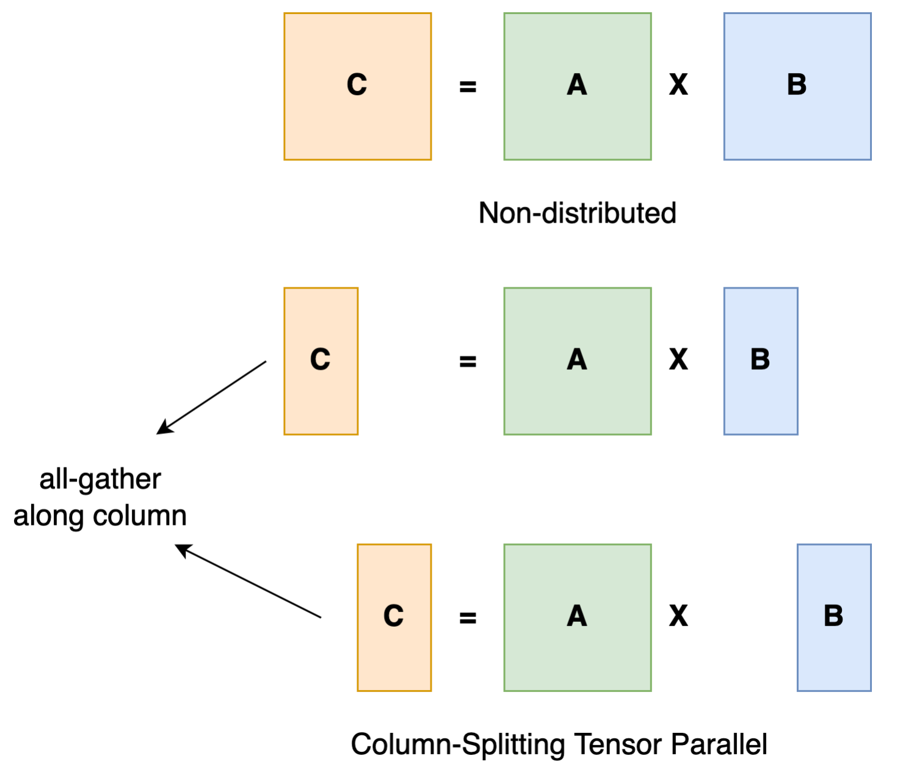
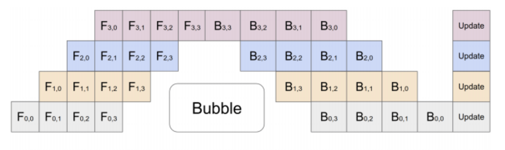
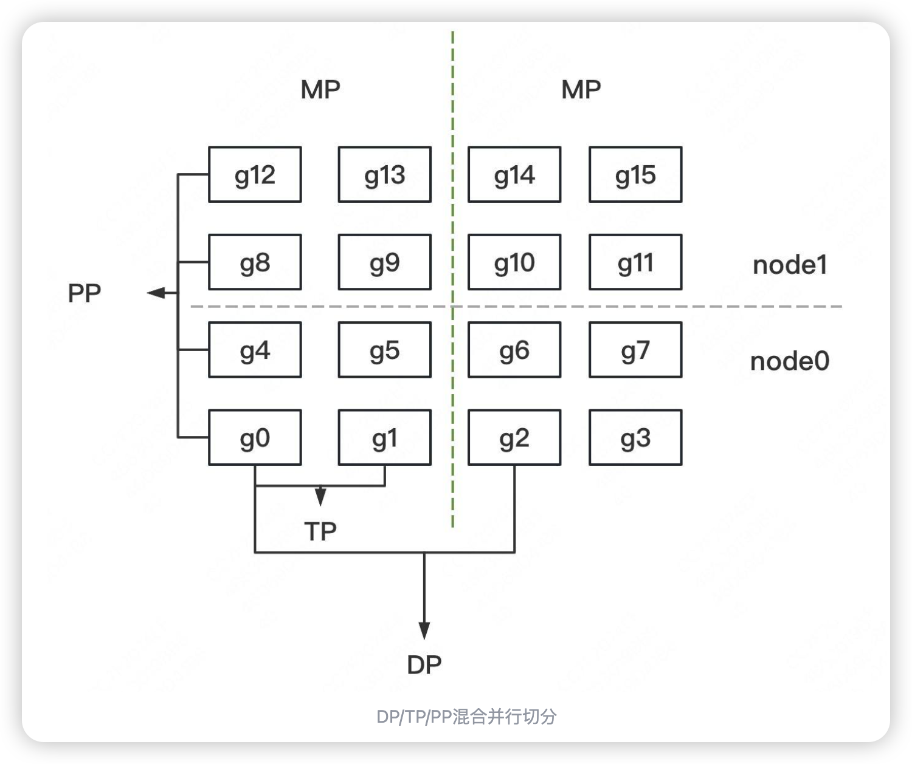

- [大模型并行计算介绍](#大模型并行计算介绍)
  - [几种并行方法](#几种并行方法)
  - [切分示例](#切分示例)
  - [分组设计问题](#分组设计问题)
    - [分组的原则是什么](#分组的原则是什么)
    - [分组的目的是什么](#分组的目的是什么)
  - [专家并行](#专家并行)
    - [专家并行介绍](#专家并行介绍)
    - [专家并行例子](#专家并行例子)
  - [sp 实践案例](#sp-实践案例)
- [references](#references)

# 大模型并行计算介绍

## 几种并行方法

- **数据并行（DP，Data Parallelism）**：解决计算墙的问题。每个设备上都会有一个模型的完整副本，每个设备独立地处理一部分数据集，然后将各自的梯度汇总起来（通常是通过AllReduce操作）。因此，DP的通信主要发生在训练的每个epoch结束时，各个设备之间需要交换梯度信息。这种通信通常量较大，因为它涉及到模型所有参数的同步。
  > Data parallel is the most common form of parallelism due to its simplicity. In data parallel training, the dataset is split into several shards, each shard is allocated to a device. This is equivalent to parallelize the training process along the batch dimension. Each device will hold a full copy of the model replica and trains on the dataset shard allocated. After back-propagation, the gradients of the model will be all-reduced so that the model parameters on different devices can stay synchronized.
- **模型并行（MP，Model Parallelism）**：模型并行有多种方式：张量并行、流水线并行、专家并行等。
  > In data parallel training, one prominent feature is that each GPU holds a copy of the whole model weights. This brings redundancy issue. Another paradigm of parallelism is model parallelism, where model is split and distributed over an array of devices. There are generally two types of parallelism: tensor parallelism and pipeline parallelism. Tensor parallelism is to parallelize computation within an operation such as matrix-matrix multiplication. Pipeline parallelism is to parallelize computation between layers. Thus, from another point of view, tensor parallelism can be seen as intra-layer parallelism and pipeline parallelism can be seen as inter-layer parallelism.
- **张量并行（TP，Tensor Parallelism）**：解决内存墙的问题。模型的权重矩阵被分割成多个部分，每个部分由不同的设备负责计算。TP的通信主要发生在前向和后向传播过程中，设备之间需要交换分割后的中间结果。由于需要在每次前向和后向传播时进行通信，TP的通信量也相当大。需要进行concat操作。
  > Tensor parallel training is to split a tensor into N chunks along a specific dimension and each device only holds 1/N of the whole tensor while not affecting the correctness of the computation graph. This requires additional communication to make sure that the result is correct.
  
- **流水线并行（PP，Pipeline Parallelism）**：解决内存墙的问题模型的不同层被分配到不同的设备上，设备之间按照顺序传递激活和梯度。PP的通信量相对较小，因为它只需要在相邻的设备之间传递数据（前一层的输出是后一层的输入），而不是在整个集群中广播。但是，PP引入了额外的复杂性，尤其是在处理依赖关系和同步方面。
  > The core idea of pipeline parallelism is that the model is split by layer into several chunks, each chunk is given to a device. During the forward pass, each device passes the intermediate activation to the next stage. During the backward pass, each device passes the gradient of the input tensor back to the previous pipeline stage. This allows devices to compute simultaneously, and increases the training throughput. One drawback of pipeline parallel training is that there will be some bubble time where some devices are engaged in computation, leading to waste of computational resources.
  
- **序列并行（SP，Sequence Parallelism）**：一种将输入序列维度进行切分的技术。序列并行技术主要用于训练超长文本（如64K、128K等长度的文本）。其核心思想是将超长文本序列分割成多个较短的子序列，并分布到不同的计算设备上并行处理。这种方式不仅能够有效降低单个设备的显存压力，还能通过并行计算提高整体效率。如何在真实业务场景环境中使用SP还有很多问题。序列并行是一种沿序列维度进行划分的并行策略，是训练长文本序列的有效方法。成熟的序列并行方法包括 Megatron 的序列并行、DeepSpeed-Ulysses 序列并行和 ring-attention 序列并行。
- **专家并行（EP，Expert Parallelism）**：在专家并行中，专家被放置在不同的GPU节点上，每个GPU节点处理不同批次的训练样本。从而减轻单个计算设备的显存压力。
  > The expert parallelism (EP) method routes requests to distinct experts in transformer blocks, reducing parameter interactions. Each request is routed to a small set of distinct experts. This greatly reduces the number of parameters that each request must interact with, as some experts are skipped. Requests must be reconstituted back to their original GPUs after expert processing generating high networking all-to-all communication over the GPU-to-GPU interconnect fabric. This method can be more efficient than TP because you don’t have to split operations into smaller chunks. 

**一般来说，通信量的大小排序大致如下：TP > DP > PP**。

这是因为TP需要频繁地在每次迭代中交换分割后的张量，而DP则是在每个epoch结束时进行一次较大的通信。PP的通信相对较少，但它需要更精细的调度和同步机制来保证正确的计算顺序。

在实际应用中，通常会混合使用这些并行策略来达到最优的性能。例如，可以在一个节点内部使用TP来分割模型，而在多个节点之间使用DP来加速训练。此外，还可以在TP的基础上加入PP来进一步分解模型的复杂度。选择哪种组合取决于具体的模型大小、硬件配置以及训练数据集等因素。

## 切分示例

假设我们有2台机器（node0和node1），每台机器上有8块GPU，GPU的编号为0~15。

我们使用这16块GPU，做**DP/TP/PP混合并行**，如下图：

- **MP：模型并行组（Model Parallism）**。假设一个完整的模型需要布在8块GPU上，则如图所示，我们共布了2个model replica（2个MP）。MP组为：[[g0, g1, g4, g5, g8, g9, g12, g13], [g2, g3, g6, g7, g10, g11, g14, g15]]。 MP包含TP和PP。
- **TP：张量并行组（Tensor Parallism）**。对于一个模型的每一层，我们将其参数纵向切开，分别置于不同的GPU上，则图中一共有8个TP组。TP组为：[[g0, g1], [g4, g5],[g8, g9], [g12, g13], [g2, g3], [g6, g7], [g10, g11], [g14, g15]]。
- **PP：流水线并行组（Pipeline Parallism）**。对于一个模型，我们将其每一层都放置于不同的GPU上，则图中一共有4个PP组。PP组为：[[g0, g4, g8, g12], [g1, g5, g9, g13], [g2, g6, g10, g14], [g3, g7, g11, g15]]
- **DP：数据并行组（Data Parallism）**。经过上述切割，对维护有相同模型部分的GPU，就可以做数据并行，则图中共有8个DP组。DP组为[[g0, g2], [g1, g3], [g4, g6], [g5, g7], [g8, g10], [g9, g11], [g12, g14], [g13, g15]]

明确了分组设计，我们再来看下面几个问题。

## 分组设计问题

### 分组的原则是什么

- **MP设定原则**：MP其实由TP+PP共同决定。在开始训练前，需要我们根据实际模型，预估训练时显存消耗（特别注意峰值显存），来为模型安排GPU资源。
- **TP、DP和PP设定原则**：在这三种并行模式的原理篇中，我们分析过三者的通讯量。一般而言，TP>DP>PP。通讯量大的尽量放入一台机器内，因为机器内带宽高。所以在图例中，**TP和DP不跨机，PP跨机。再提一点，在使用Megatron时，很多项目是不用PP，仅用TP+DP的，此时一般将TP放入一台机器内，令DP跨机**（比如codegeex）

### 分组的目的是什么

- 分配进程：
  - 确认分组方案后，在每块GPU上启动一个进程（process），每个进程**独立执行**自己所维护的那部分模型的计算，实现并行训练。
  - 进程0~15，为一个**进程大组（group）**，其下的每一个DP/MP/PP组，为一个**进程子组（subgroup）**
- **组间通讯**：确认好DP/TP/PP组，并分配好进程后，我们就能进一步设置不同进程间的通讯方案。例如属于一个DP组的g0和g2需要进行梯度通讯，属于一个PP组的g4和g8需要进行层间输出结果的通讯。

## 专家并行

### 专家并行介绍

在编译时，所有 tensor 的形状都是静态确定的。这意味着在编译阶段，模型的架构和数据布局已经被定义，包括模型的层数、每层的输入和输出维度等。

尽管 tensor 的形状是静态的，但在训练和推理过程中，模型的计算是动态的。这是因为模型中的路由器（门控网络）会根据输入数据动态地将 token 分配给不同的专家。这种动态性要求模型能够在运行时灵活地处理数据分布。

而这个**专家容量的作用就是将 batch 中的总 token 数平均分配给所有专家**。然后，**为了应对 token 分布不均的情况，会通过一个容量因子（capacity factor）来扩展每个专家的容量**。

容量因子越大，需要 Padding 的 Token 也就越多，无效计算越多；负载越不均衡，需要 Padding 的 Token 也就越多，无效计算越多。为了更好的负载均衡，作者同样添加了 Load Balancing Loss。

容量因子是一个大于 1.0 的数，它的作用是为每个专家提供额外的缓冲空间，以容纳可能超出平均分配的 token。这样，即使某些专家接收到的 token 数量超过了平均值，也能够处理这些额外的 token，而不会因为容量不足而导致计算跳过。**对于这些溢出的 token，模型会跳过计算，直接将 token 的表示通过残差连接传递到下一层**。

在专家并行模式下，专家层的前后会分别引入 All-to-All 通信操作。前一个 All-to-All 用于将每个 Worker 上的 Token 按照 Router 后对应的专家发送到专家所在的 GPU；而后一个 All-to-All 用于将专家计算后的 Token 重新按照原来的方式排列，回答原来的 GPU 上。

对于容量固定且输入 tokens 必须跟容量相同的方式，超过的 tokens 将被丢弃；对于容量固定输入 tokens 可变的方式（小于等于容量），一定程度上能避免 Padding 和多余计算。

### 专家并行例子

下图展示了一个有六个专家网络的模型被两路专家并行地训练。注意：专家1-3被放置在第一个计算单元上，而专家4-6被放置在第二个计算单元上。

1. `input x0` 经过 `top2 gate` 后，将 `input` 分别路由到 `Expert1` 和 `Expert 2`，其中 `Expert 2` 在另一个 GPU（`Worker1`） 上，所以这里需要涉及 GPU 间的通信。
2. `Expert1` 和 `Expert 2` 都计算完之后，`Expert 2` 的输出还得传输回输入所在的 GPU（`Worker1`） 上，这里也涉及 GPU 间的通信。
3. `Expert1` 和 `Expert 2` 在 `Worker1` 上做**加权和**输出 `Output y0`。

## sp 实践案例

以训练一个包含64层Transformer结构的大模型为例，假设我们需要处理长度为32K的文本序列。在单个GPU上，由于显存限制，可能无法一次性加载整个文本序列。通过序列并行技术，我们可以将文本分割成多个长度为4K的子序列，并分布到多个GPU上进行并行处理。

**步骤详解**

- 文本分割：将32K的文本序列分割成8个4K的子序列。
- 模型部署：将模型部署到多个GPU上，每个GPU负责处理一个或多个子序列。
- 前向传播：每个GPU独立进行前向传播计算，得到各自的输出。
- 梯度同步：在反向传播过程中，通过AllReduce等通信机制同步各GPU的梯度信息。
- 参数更新：根据同步后的梯度信息更新模型参数。

# references

- [https://zhuanlan.zhihu.com/p/718370713](https://zhuanlan.zhihu.com/p/718370713)
- [https://colossalai.org/docs/concepts/paradigms_of_parallelism/](https://colossalai.org/docs/concepts/paradigms_of_parallelism/)
