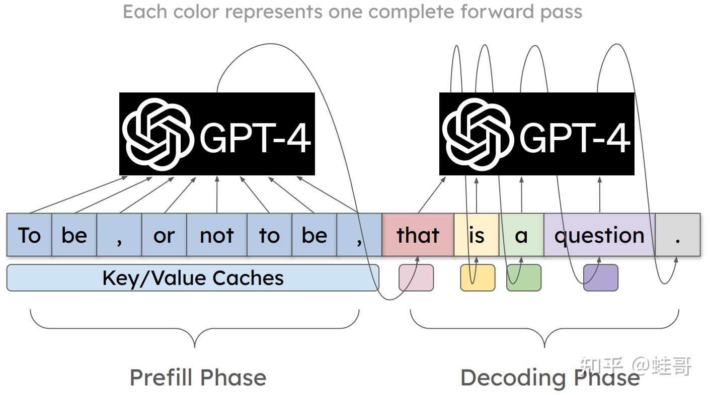
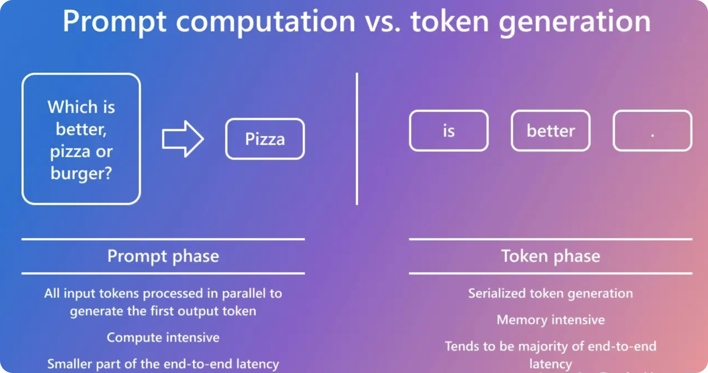
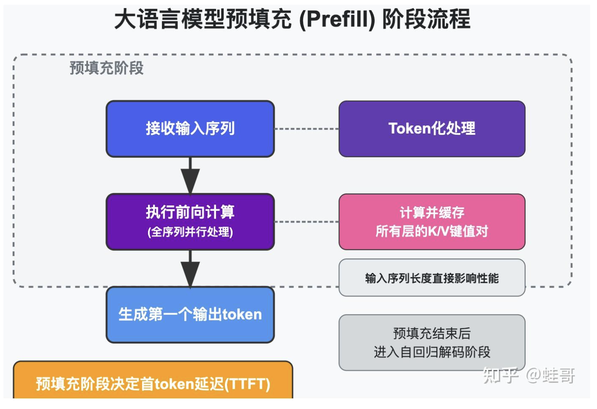
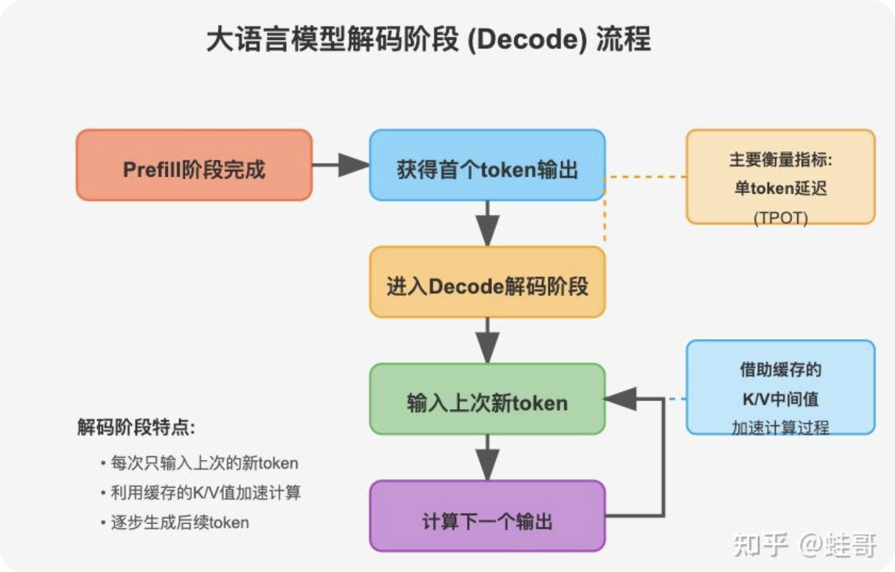
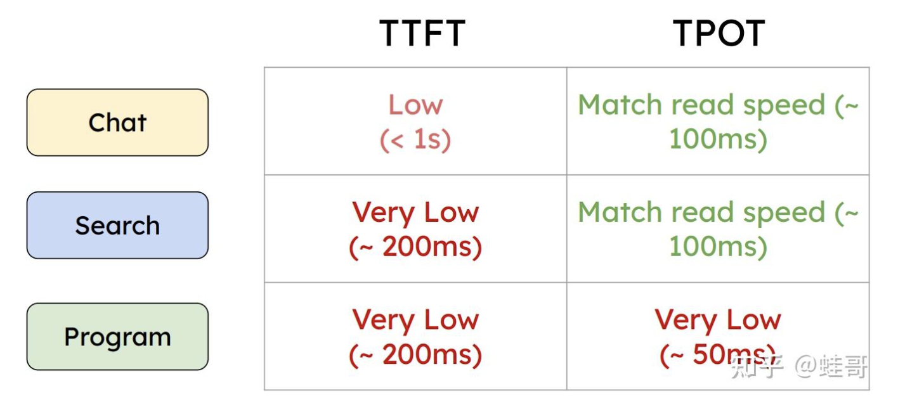
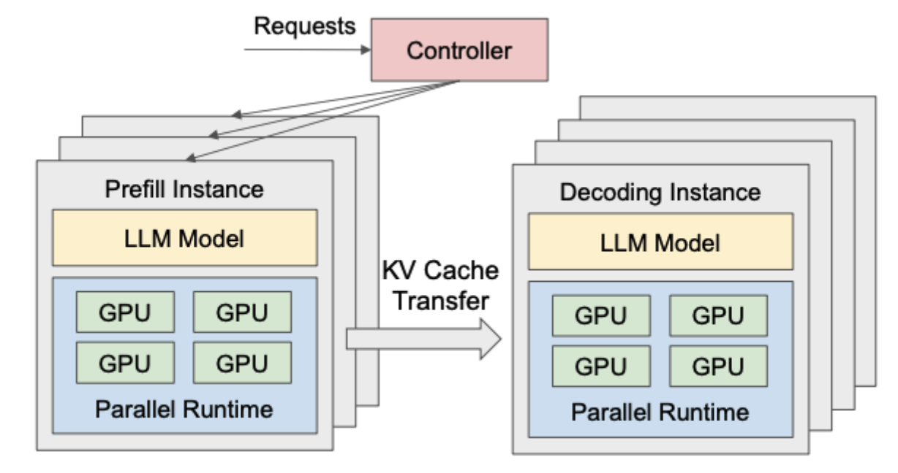
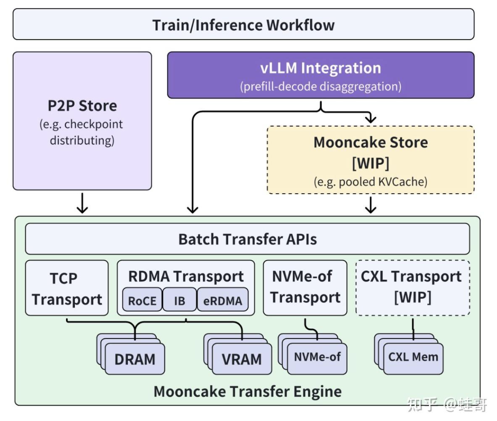
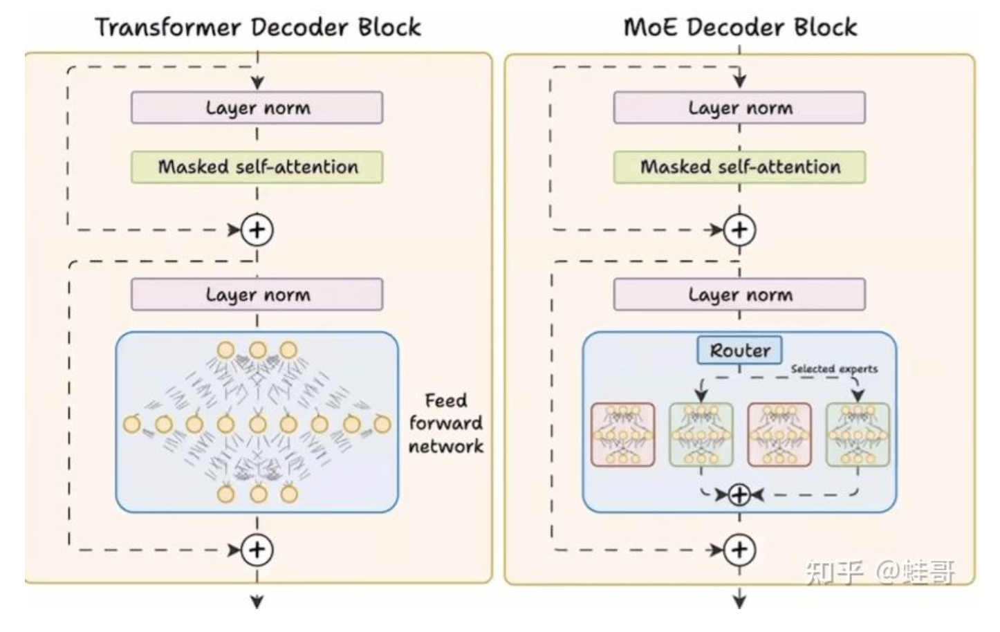
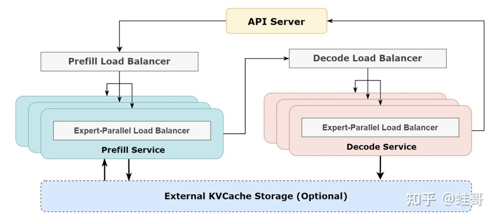
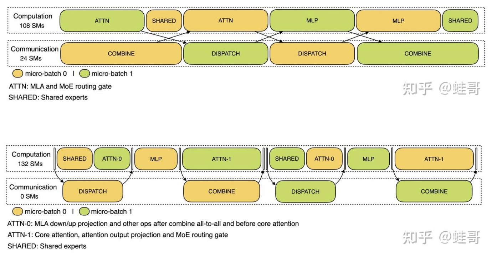

- [LLM推理优化 - Prefill-Decode分离式推理架构](#llm推理优化---prefill-decode分离式推理架构)
  - [问题背景](#问题背景)
  - [为什么需要 Prefill-Decode 分离](#为什么需要-prefill-decode-分离)
  - [PD分离到底带来了哪些好处](#pd分离到底带来了哪些好处)
  - [mooncake 分离式推理架构方案](#mooncake-分离式推理架构方案)
  - [deepseek 分离式推理架构方案](#deepseek-分离式推理架构方案)
- [references](#references)

# LLM推理优化 - Prefill-Decode分离式推理架构

## 问题背景

Transformer LLM 推理过程分为两个阶段：prefill 和 decode。

- **prefill**：**预填充阶段，把整段prompt喂给模型并执行一次前向过程，直至生成第一个token**。在这个阶段中，LLM处理所有用户的input或者prompt，计算出对应的KV Cache，其并行性可以充分利用GPU的算力，属于**计算密集型**。对于每个新的输入序列，都需要进行一次Prefill。
- **decode**：**在Prefill阶段之后，模型基于初始隐藏状态逐步生成后续的文本**。这一阶段的特点是计算相对较少，但需要反复进行计算，直到生成足够的文本或达到某个终止条件。这个阶段使用了之前计算好的KV Cache加速推理，同时当前forward过程中计算的新的key和value也被缓存起来，与之前的KV Cache拼接起来，以便下一轮使用。在这个阶段会顺序的产生一个个的token，每次访存只计算一个token，其对算力的要求并没有那么大，主要受内存带宽的限制，属于**内存密集型**。

## 为什么需要 Prefill-Decode 分离

在大模型推理中，常用以下两项指标评估性能：

- **TTFT（Time-To-First-Token）**：首 token 的生成时间，主要衡量 Prefill 阶段性能。

- **TPOT（Time-Per-Output-Token）**：生成每个 token 的时间，主要衡量 Decode 阶段性能。

在传统的 LLM 推理框架中，Prefill 和 Decode 阶段通常由同一块 GPU 执行。推理引擎的调度器会根据显存使用情况及请求队列状态，在 Prefill 和 Decode 之间切换，完成整个推理过程。

在同一块 GPU 上运行时，由于两阶段的计算特性差异（Prefill 是计算密集型，而 Decode 是存储密集型），资源争抢会导致 TTFT 和 TPOT 之间的权衡。例如：

- 若优先处理 Prefill 阶段以降低 TTFT，Decode 阶段的性能（TPOT）可能下降。
- 若尽量提升 TPOT，则会增加 Prefill 请求的等待时间，导致 TTFT 上升。

假设你现在有一个requests pool，里面装了状态不同的requests，有正在等待做prefill的，也有刚做完prefill等待做decode的，而你面前只有1张GPU。由于prefill和decode在做fwd阶段的差异性，如果不考虑特殊的优化方法，在模型每1个推理阶段，你要么全做prefill，要么全做decode。现在你需要做一个决策：在下1个推理时刻，我该做prefill，还是做decode？

你观察了一下requests pool，发现里面塞满了等待做prefill的请求，你心想“要不还是赶紧多做些prefill，好歹给用户返回第一个token，防止他们生气了直接不用我的产品了”。所以你在接下来的时刻中一直在做prefill，由于gpu资源是有限的，你做了prefill就无法同时做decode了，你其实是在牺牲TPOT保全TTFT，反之亦然。

所以这时，你产生了一个疑问：当prefill和decode合并在一起的时候，似乎无论调度策略怎么调整，TTFT和TPOT这两个指标都存在强耦合关系。因此如果我把这两个阶段分开，让TTFT和TPOT各自独立发展优化，利用空间换时间，获取推理服务的最佳性能。

所以，**PD分离主要包括以下优势**：

- **资源利用优化**：由于Prefill阶段计算密集，而Decode阶段计算较为稀疏，将这两个阶段分离可以更好的利用GPU的计算和存储资源。
- **提高吞吐量**：分离后的Prefill和Decode可以同时处理不同的请求，这意味着在Prefill阶段处理新请求的同时，Decode阶段可以继续处理之前请求的解码任务，从而提高了整体的处理能力。
- **降低延迟**：由于Prefill和Decode分别在不同的阶段进行，可以减少等待时间，特别是当有多个请求并发到达时。

**我们把两个大家最为关注的指标，归纳为 SLO：service-level objective**。

围绕 SLO 不同的业务场景还会有更多其他的指标，今天我们简化到这两个指标来看看以下几个场景：

为了满足SLO，同时最小化GPU成本，推理系统需要在每个GPU的计算资源约束下，尽可能提高单位时间内能满足SLO的请求数量——**即最大化每块GPU的有效吞吐量，也叫 goodput**。

**prefill 阶段面临的问题**：由于 Transformer 的自注意力计算复杂度是 O(n^2)，所以当输入序列很长时（比如支持十万字以上的应用场景），预填充阶段的计算时间会随着长度平方级暴涨 。这意味着如果没有特殊优化，模型处理长文章时用户要等待非常久才能得到第一个回答。此外，每次对话其实都包含大量重复的上下文。如果没有利用缓存，每一轮都要重新计算相同的内容，造成冗余计算。这都会让预填充阶段成为延迟瓶颈，大幅提高首 token 的生成延迟。解决这些问题对于提升长文本处理能力至关重要。

**decode 阶段面临的问题**：再来看解码阶段面临的挑战。虽然每次只算一个新 token，但因为要记忆整个上下文，KV 缓存会越积越大。对于超长对话，缓存可能占据几十 GB 显存，这直接限制了同卡的并发请求数。同时，如果预填充和解码混合在一台GPU上，我们不得不给预填充的峰值内存留出富余，这又进一步压缩了可用于解码并行的显存空间 。这意味着本可以通过增加 batch size 提高生成吞吐，却因为内存限制做不到。即使不考虑显存，占用，解码本身也常常受制于内存带宽而非算力。随着用户要求输出的内容越长，生成阶段消耗的总时间反而占主要部分 。GPU算力无法完全施展，因为大量时间花在读取 KV 缓存等内存操作上。这些因素都使解码阶段成为当前系统吞吐的主要瓶颈，需要针对性优化。

面对预填充和解码阶段完全不同的特点，**解决思路就是将二者解耦分离**。也就是把原本在同一设备顺序执行的两个阶段，拆分到不同的资源池中独立执行 。

这样做有几个好处：一是可以针对不同阶段挑选最合适的硬件。预填充需要强大的计算性能，我们就把它放到算力最强的 GPU 上；解码需要处理大量内存访问，我们就让它跑在对显存带宽友好的设备上 。二是预填充和解码分开后，两个阶段可以流水线并行：当第一个请求进入解码时，预填充单元已经腾出手来处理第二个请求，实现阶段间重叠。这类似于把“备菜”和“炒菜”分开并并行进行，一个专门快速准备食材，另一个专门快速烹调，提高总体效率。总之，Prefill-Decode 分离的核心思想是在空间上解耦计算与存储带宽负载，并在时间上实现并行重叠，最大化利用所有资源。

## PD分离到底带来了哪些好处

pd 分离带来如下好处：

1. 首先是并发吞吐的提升。由于解码集群不再需要给预填充腾显存，我们可以在解码端用更大的 batch 并行生成，提高吞吐 。实际效果是，分离部署后解码端每秒生成 token 数量显著翻倍，整体集群吞吐量得到倍数的提升 。

2. 其次，通过让预填充和解码交替重叠执行，大大减少了空闲等待时间，许多原本串行的等待被隐藏，总延迟显著降低——只要调度得当，就能在保持每个请求响应延迟不超标的同时，把硬件利用率拉满。

3. 第三，分离后硬件各司其职，算力强的忙算，带宽高的忙传，互不拖后腿，GPU 不会因为等内存而闲置，内存也不会因为计算占用显存而不足，整体资源利用率提高，也就意味着单位成本下降。同时，有了独立的KV缓存池，我们可以利用集群中廉价的大内存甚至SSD来存放巨大的上下文，从而实现超长上下文支持而不影响GPU生成速度——这一点对于需要处理超长文档的业务非常关键。总的来说，Prefill-Decode 分离架构为我们提供了提升性能和降低成本的全新手段。

**另外，prefill 和 decode 分离也需要解决新的问题**：

- 如何细粒度地调度请求
- 请求从 prefill 到 decode 阶段可能需要迁移，迁移开销大，如何降低迁移开销
- GPU 组是静态划分的，无法跨组协同导致 memory 碎片（比如遇到 memory 需求很大的超长 request，哪怕所有 GPU 组的 memory 余量加起来可以满足，也无法服务）

我们来看看当前开源的几个重要分离式推理架构方案和它们的特点。

## mooncake 分离式推理架构方案

首先是[Mooncake](./mooncake.md)，这是月之暗面在 Kimi 上使用的架构。

Mooncake 的亮点是以 KVCache 为中心 的设计：预填充和解码分别跑在不同的GPU 集群上 ，而 KV 缓存被抽取出来存在共享的 CPU 内存或甚至 SSD 中，这样就实现了计算和存储的分离。它有一个全局的调度器，会智能地把请求分配到合适的预填充节点和解码节点。如果发现某些请求的前缀已经有缓存，可以复用；如果缓存不在本机，调度器也会通过 RDMA 等手段把所需缓存调度过来，以最大程度避免重复计算。

## deepseek 分离式推理架构方案

第二个方案是现在最火的DeepSeek。**DeepSeek 的特别之处在于结合了MoE专家路由模型和分离式架构**：

他们把模型的专家分片部署在跨节点的大集群里，Prefill用一组较小的节点集群，Decoding 用更大规模的集群。

PD 配比达到了接近 1：10，这个配比 DeepSeek 没有解释原因，我的分析是和DeepSeek 高达 50% 的缓存命中有关，大量 KV Cache 缓存命中后,prefill 的需求会降低，所以 prefill 的算力配比也会比 kimi 低。

为了解决跨节点通信开销，DeepSeek 在预填充阶段采用了双 batch 交错执行，也就是同时处理两个批次，一个计算一个通信，用计算去掩盖另一个的网络延迟 。解码阶段则把注意力计算拆成5个流水阶段，GPU在不同阶段不停切换，这样通信和计算也能重叠进行 。此外 DeepSeek 还有精细的小专家负载均衡机制，确保每张卡上承担的计算和通信量都差不多 ，不会出现某个卡忙死、别的卡闲着的情况。

# references

- [https://zhuanlan.zhihu.com/p/9658186469](https://zhuanlan.zhihu.com/p/9658186469)
- [https://zhuanlan.zhihu.com/p/28959513778](https://zhuanlan.zhihu.com/p/28959513778)
