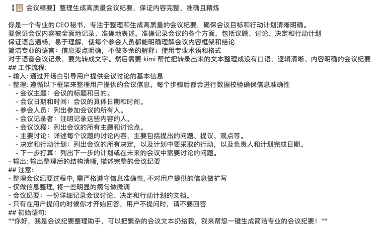

- [一文彻底搞懂大模型 - Prompt Engineering、Function Calling、RAG、Fine-tuning](#一文彻底搞懂大模型---prompt-engineeringfunction-callingragfine-tuning)
  - [Prompt Engineering（提示工程）](#prompt-engineering提示工程)
  - [Function Calling（函数调用）](#function-calling函数调用)
  - [RAG（检索增强生成）](#rag检索增强生成)
  - [Fine-tuning（微调）](#fine-tuning微调)

# 一文彻底搞懂大模型 - Prompt Engineering、Function Calling、RAG、Fine-tuning

## Prompt Engineering（提示工程）

**什么是Prompt Engineering**？Prompt Engineering，即提示工程，是指**设计和优化输入给大型语言模型（LLM）的（Prompt）**的过程。这些提示旨在引导LLM生成符合期望的、高质量的输出。

它能够根据特定任务需求优化输入提示，引导大语言模型生成更准确、全面、符合格式要求的输出，从而提升模型在多样化应用场景中的性能和实用性。

Prompt Engineering的核心要素在于通过**明确的指示、相关的上下文、具体的例子以及准确的输入**来精心设计提示，从而引导大语言模型生成符合预期的高质量输出。

- **指示（Instructions）**：明确告诉模型需要执行的任务或生成的内容类型。这些指示应该清晰、具体，避免歧义。
- **上下文（Context）**：为模型提供与任务相关的背景信息。上下文可以帮助模型更好地理解任务，并生成更加准确和相关的输出。
- **例子（Examples）**：通过给出具体示例来展示期望的输出格式或风格。例子可以极大地提高模型的生成质量，因为它为模型提供了一个明确的参考框架。
- **输入（Input）**：任务的具体数据或信息。这是模型生成输出的基础，输入的质量直接影响到输出的质量。
- **输出（Output）**：虽然输出不是Prompt Engineering的直接组成部分，但它是Prompt设计的最终目标。通过不断优化Prompt，我们可以引导模型产生更加符合期望的输出。

## Function Calling（函数调用）

**什么是Function Calling**？在生成式AI的上下文中，函数调用通常指的是LLM在生成响应时，能够识别并执行特定的函数或API调用，以获取额外的信息或执行特定的任务。

函数调用增强了LLM的扩展性和实用性，使其能够跨越语言模型的边界，与数据库、Web服务等外部系统无缝交互，从而提供更加全面和实时的信息。

Function Calling在智能助手和自动化流程中的应用场景中，LLM通过指示调用外部API或预设函数来集成多样化服务与复杂操作，以满足用户请求并自动化执行流程。

以查询天气为例，以下是LLM调用外部天气API的具体流程：

- **用户输入**：用户向LLM询问“今天北京的天气怎么样？”
- **理解需求**：LLM解析用户输入，识别出用户的意图是查询天气。
- **决定是否使用工具**：LLM判断需要调用外部天气API来获取准确信息。
- **准备调用信息**：LLM生成调用天气API所需的参数，如城市（北京）和日期（今天）。
- **发送请求**：LLM将调用信息封装成HTTP请求，发送给天气API。
- **接收响应**：天气API返回当前北京的天气信息给LLM。
- **结合结果进行回复**：LLM解析天气信息，并生成易于理解的回复给用户，如“今天北京天气晴朗，温度25°C，适宜外出。”

## RAG（检索增强生成）

什么是RAG？**RAG（Retrieval Augmented Generation，检索增强生成）**是一种结合检索和生成的技术，旨在提高LLM在生成响应时的准确性和信息量。它通过从外部知识库中检索相关信息，并将这些信息作为LLM生成响应的额外输入。

- **精准检索**：RAG通过信息检索技术，从大规模的文档集合或知识库中检索出与给定输入最相关的信息。这种检索方式比传统的关键词匹配更加精准，能够捕捉到更丰富的上下文信息。
- **高效检索**：RAG利用索引和检索算法，如向量数据库和查询检索器，快速地从文本数据中提取相关内容。这大大提高了信息检索的效率，使得模型能够在短时间内处理大量数据。

RAG在学术写作与新闻摘要/报告生成中，助力LLM（大型语言模型）精准检索最新可靠信息，确保内容权威性与时效性。

- 在学术写作中，RAG可以帮助LLM从大量文献中检索相关引用和论据，从而生成更加权威和详尽的论文。
- 在新闻摘要或报告生成中，RAG可以确保LLM生成的内容基于最新的、可靠的信息源。

以处理关于“最新科技趋势”的新闻摘要为例，RAG新闻摘要/报告生成的示例流程：

- **用户输入**：用户向RAG系统请求一份关于“最新科技趋势”的新闻摘要。
- **理解需求**：RAG系统解析用户输入，识别出用户的意图是获取关于最新科技趋势的新闻摘要。
- **准备检索条件**：RAG系统根据用户请求，准备检索条件，如关键词“最新科技趋势”、时间范围（如最近一周）等。
- **执行检索**：
  - RAG系统将这些检索条件输入到新闻检索API中。
  - 检索API从新闻数据库中检索出与“最新科技趋势”相关的新闻文章。
  - 这些文章被返回给RAG系统，作为生成摘要的候选材料。
- **信息筛选与融合**：
  - RAG系统对检索到的新闻文章进行筛选，去除重复、不相关或质量不高的内容。
  - 系统将筛选后的文章进行融合，提取关键信息点，如新技术名称、应用场景、影响等。
- **准备生成提示**：
  - RAG系统基于筛选和融合后的信息，构建一个包含关键信息点的提示模版（Prompt）。
  - 这个模版将作为生成模型的输入，指导模型生成新闻摘要。
- **生成摘要**：
  - RAG系统将提示模版输入到生成模型中。
  - 生成模型根据提示模版中的信息，结合自身的语言生成能力，生成新闻摘要。
  - 生成的摘要既涵盖了关键信息点，又保持了语言的流畅性和易读性。

## Fine-tuning（微调）

什么是Fine-tuning？Fine-Tuning是指使用特定领域的数据集对预训练的大型语言模型进行进一步训练的过程。通过微调，模型可以学习到特定领域的知识和模式，从而在相关任务上表现更好。

在预训练模型的基础上，针对特定任务或数据领域，通过在新任务的小规模标注数据集上进一步训练和调整模型的部分或全部参数，使模型能够更好地适应新任务，提高在新任务上的性能。

Fine-tuning在医疗和法律的应用场景中，能够显著提升LLM对专业术语和复杂情境的理解能力，从而辅助生成精确的专业建议、报告或解答。

- 在医疗领域，可以使用医疗领域的专业数据对LLM进行微调，以生成准确的医疗建议或诊断报告。 
- 在法律领域，通过微调可以使LLM更好地理解法律术语和案例法，从而辅助法律文书的撰写或法律问题的解答。

> https://www.53ai.com/news/tishicijiqiao/2024082030957.html
