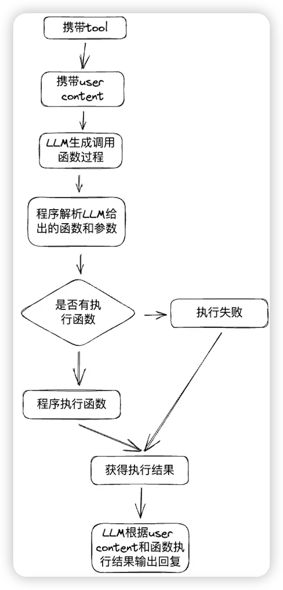
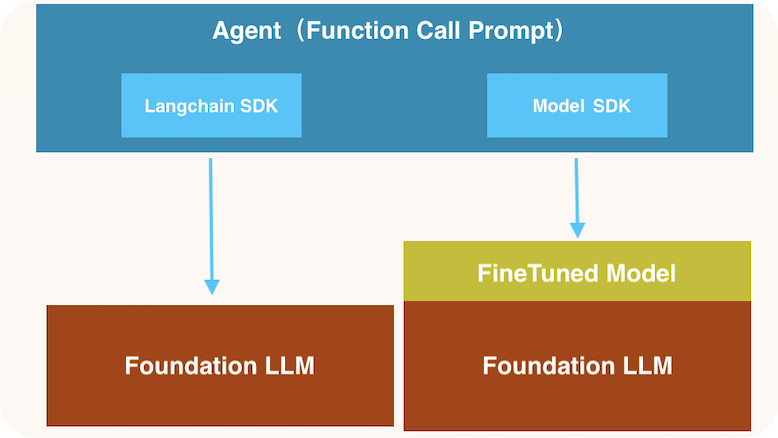

- [react vs function call](#react-vs-function-call)
  - [function call 定义](#function-call-定义)
  - [prompt 方式实现 function call](#prompt-方式实现-function-call)
  - [大模型 function call 微调](#大模型-function-call-微调)
    - [准备数据](#准备数据)
    - [微调](#微调)
    - [评估](#评估)
  - [react 定义](#react-定义)
  - [react 方式](#react-方式)
    - [prompt 模版](#prompt-模版)
    - [langchain](#langchain)
    - [使用 llm function call 的 react](#使用-llm-function-call-的-react)
  - [总结](#总结)
- [references](#references)


# react vs function call

OpenAI function calling，作为智能代理与外部工具交互的基本方式，对于每位从业者来说都是必备技能。随着技术的发展，我们期望的不只是能与我们对话的LLM，而是能够辅助我们使用各种工具、做出决策的智能伙伴。

不过需要特别指出的是，最近OpenAI在Chat Completions API中已经废弃了“函数（function）”的使用，转而采用“工具（tool）”。这一变更旨在拓宽LLM集成的功能范围，为更复杂的交互模式铺平道路，如构建能够相互作用的多代理系统。


## function call 定义

function call 功能能够更加结构化的方式指导LLM输出，为在执行具体函数提供了参数，铺平了道路。当然并非所有的 LLM 都支持 function call 功能。

通过 function call 功能，LLM 可根据对话内容灵活选用工具。当然，模型只是选择需要执行的工具，以及生成此次调用工具的参数，真正执行工具的决定权在用户手上（或者在 Agent 工程）。工具可以是开发者开发的函数，外部服务的 api，或者任何 LLM 可以互动的资源。

比如，Tool Node 是 LangGraph 中的关键组件，它的作用就是实际执行工具。

function call 的 agent 流程如下：


function call 具体的调用流程可以总结为：


可以看到function calling跟大预言模型至少有两次交互的的过程。

简而言之：

- LLM起到决策的作用，告知业务系统应该调用什么函数，以及入参是什么。
- 业务系统负责实现对应的函数（比如本地实现，或者调用其他系统提供的服务），并且将函数的响应结果再次抛给LLM。
- LLM根据响应结果，组织自然语言，继续与业务系统进行交互。



在这里，有很多小伙伴会有一个误区：误以为函数调用是有LLM本身执行的。其实，LLM仅仅做决策，而实际的调用是由业务系统完成的。

**现阶段，function-calling能力的实现分两层：**

- **利用Prompt模板引导**
- **LLM 针对 function call 做微调**



**所以，不管大模型是否具备 function call 能力，通过 Prompt 方式都可以引导大模型进行 function call；但是对于 function call llm，由于经过了微调，因此能更准确的识别特定的函数或API调用。**

## prompt 方式实现 function call

比如：

```yaml
You have access to the following tools:
{json.dumps(tools)}
You can select one of the above tools or just response user's content and respond with only a JSON object matching the following schema:
{{
  "tool": <name of the selected tool>,
  "tool_input": <parameters for the selected tool, matching the tool'
s JSON schema>,
  "message": <direct response users content>}
  ...
}
```

该Prompt告知了LLM：如果需要使用function-calling能力，那么就从tools（tools是预定义的functions）中选取一个最匹配的函数；如果不需要，就用自然语言与用户交互，此时与正常的对话流程无异。输出的格式固定为json，方便解析。

由此，我们受到启发：只要LLM基座够强（能够严格遵循Prompt响应诉求），即使LLM本身不支持function-calling，我们也可以自己实现function-calling，脱离对特定LLM的依赖！

拿到function-calling的结果后，若要用自然语言的形式输出结果，还要再调用一次LLM，对结果进行整合。此时可以使用另一个Prompt：

```yaml
Please generate a natural language description based on the following question and answer.
Question: [Content of the question]
Answer: [Content of the answer]
Generated Description: The result of [key phrase from the question] is [answer].
If necessary, you can polish the description.Only output the Description, with Chinese language.
```

该Prompt的作用就是告诉LLM，你要根据我的问题和答案，用自然语言重新描述一遍。这里指定了中文输出，可根据实际需要进行调整。

## 大模型 function call 微调

大模型的 function call 微调，目的是让大模型能更准确的识别特定的函数或API调用。

### 准备数据

首先定义一些函数：

```python
function_list = [
    {
        "type": "function",
        "function": {
            "name": "takeoff_drone",
            "description": "Initiate the drone's takeoff sequence.",
            "parameters": {
                "type": "object",
                "properties": {
                    "altitude": {
                        "type": "integer",
                        "description": "Specifies the altitude in meters to which the drone should ascend.",
                    }
                },
                "required": ["altitude"],
            },
        },
    },
    ...
]
```

其次定义一些 `[prompt，期望调用的函数】` 对：

```python
Let's get the drone in the air, how high should it go?
{'name': 'takeoff_drone', 'arguments': '{"altitude": 100}'}
Ready for takeoff, how high should the drone fly?
{'name': 'takeoff_drone', 'arguments': '{"altitude": 100}'}
Can you bring the drone down to where we are?
{'name': 'land_drone', 'arguments': '{"location": "current"}'}
Let's get the drone to land right here
{'name': 'land_drone', 'arguments': '{"location": "current"}'}
Bring the drone back to base for landing
{'name': 'land_drone', 'arguments': '{"location": "home_base"}'}
Can you safely land the drone at home base
{'name': 'land_drone', 'arguments': '{"location": "home_base"}'}
Can you make the drone move to the left by 10 units?
{'name': 'control_drone_movement', 'arguments': '{"direction": "left", "distance": 10}'}
I need the drone to go left, could you move it 10 steps that way?
{'name': 'control_drone_movement', 'arguments': '{"direction": "left", "distance": 10}'}
```

当然这些训练数据也可以通过大模型产生，比如：

```python
COMMAND_GENERATION_PROMPT = """
You are to output 2 commands, questions or statements that would generate the inputted function and parameters.
Please make the commands or questions natural, as a person would ask, and the command or questions should be varied and not repetitive.
It should not always mirror the exact technical terminology used in the function and parameters, rather reflect a conversational and intuitive request.
For instance, the prompt should not be 'turn on the dome light', as that is too technical, but rather 'turn on the inside lights'.
Another example, is the prompt should not be 'turn on the HVAC', but rather 'turn on the air conditioning'. Use language a normal driver would use, even if
it is technically incorrect but colloquially used.

RULES: ALWAYS put a backwards slash before an apostrophe or single quote '. For example, do not say don't but say don\'t.
Prompts MUST be in double quotes as well.

Example

Input: {{'name': 'calibrate_sensors','arguments': {{}}'' }}
Prompt: ["The sensors are out of whack, can you reset them", "The calibration of the drone is off, fix it please!"]

Input: {{'name': 'set_autopilot','arguments': {{'status': 'off'}}}}
Prompt: ["OK, I want to take back pilot control now","Turn off the automatic pilot I'm ready control it"]

Input: {invocation}
Prompt:
"""
```

### 微调

```python
# Upload the training file
file = client.files.create(
    file=open("data/drone_training.jsonl", "rb"),
    purpose="fine-tune",
)
file_id = file.id
print(f"FileID: {file_id}")

# Create a fine-tuning job

ft = client.fine_tuning.jobs.create(
    model="gpt-3.5-turbo",
    training_file=file_id,
    suffix="drone",
)

print(f"Fine-tuning job created: {ft}")
```

### 评估

再对微调后的模型进行 function call 的准确度评估。

## react 定义

ReAct的概念来自论文《ReAct: Synergizing Reasoning and Acting in Language Models》，这篇论文提出了一种新的方法，通过结合语言模型中的推理（reasoning）和行动（acting）来解决多样化的语言推理和决策任务。ReAct 提供了一种更易于人类理解、诊断和控制的决策和推理过程。

它的典型流程如下图所示，可以用一个有趣的循环来描述：思考（Thought）→ 行动（Action）→ 观察（Observation），简称TAO循环。

ReACT 让大模型先进行思考，思考完再进行行动，然后根据行动的结果再进行观察，再进行思考，这样一步一步循环下去。这种行为模式基本上就是人类这样的智能体主要模式。

ReAct 在传统的“行动-观察”（action-observation）循环中加入了“思考”步骤，使得模型在每一步行动后能够对观察结果进行总结和思考，从而调整后续的行动计划。这种方法通过显式地注入与任务解决相关的常识性知识，提高了模型的决策准确率。

## react 方式

ReAct 是 `Reasoning` 和 `Acting` 的缩写，是一种 `prompting` 技术，通过将**思路链推理**与**行动执行**相结合来增强 AI 代理的能力。这种方法允许代理反复推理问题并执行行动，通过动态和交互过程完善其响应。

在实践中，ReAct 代理通常遵循以下算法逻辑：

- **Initial prompt**：代理收到初始提示或问题
- **Loop**：
  - **Reasoning**：根据目前的信息，确定下一步应该做什么，比如执行工具
  - **Action Execution**：执行动作，通常是调用工具
  - **Observation**：观察执行动作的结果
- **Final Output**：当代理推断收集到的信息足够时，它会提供最终的、完善的响应或解决方案。

这种方法可以实现更可靠、更复杂的响应，因为代理可以根据实时反馈和新信息调整其方法，模仿人类解决问题的策略。所有这些都使 ReAct 代理成为广泛应用的绝佳解决方案。

### prompt 模版

```python
TOOL_DESC = """{name_for_model}: Call this tool to interact with the {name_for_human} API. What is the {name_for_human} API useful for? {description_for_model} Parameters: {parameters} Format the arguments as a JSON object."""

REACT_PROMPT = """Answer the following questions as best you can. You have access to the following tools:

{tool_descs}

Use the following format:

Question: the input question you must answer
Thought: you should always think about what to do
Action: the action to take, should be one of [{tool_names}]
Action Input: the input to the action
Observation: the result of the action
... (this Thought/Action/Action Input/Observation can be repeated zero or more times)
Thought: I now know the final answer
Final Answer: the final answer to the original input question

Begin!

Question: {query}

{agent_scratchpad}"""
```

### langchain

> https://github.com/langchain-ai/langchain/blob/master/libs/langchain/langchain/agents/structured_chat/base.py

在LangChain中`create_structured_chat_agent`使用的是ReACT方法，即Thought，Action，Observation三个步骤。不需要模型专门用Function Call微调过。使用prompt来使模型生成tool所需要的参数，返回的json参数格式可以自己定义，然后在Action中解析模型生成的tool中的参数，传入tool中执行，拿到最后的Observation结果。

```python
def create_structured_chat_agent(
    llm: BaseLanguageModel,
    tools: Sequence[BaseTool],
    prompt: ChatPromptTemplate,
    tools_renderer: ToolsRenderer = render_text_description_and_args,
    *,
    stop_sequence: Union[bool, List[str]] = True,
) -> Runnable:
    """Create an agent aimed at supporting tools with multiple inputs.

    Args:
        llm: LLM to use as the agent.
        tools: Tools this agent has access to.
        prompt: The prompt to use. See Prompt section below for more.
        stop_sequence: bool or list of str.
            If True, adds a stop token of "Observation:" to avoid hallucinates.
            If False, does not add a stop token.
            If a list of str, uses the provided list as the stop tokens.

            Default is True. You may to set this to False if the LLM you are using
            does not support stop sequences.
        tools_renderer: This controls how the tools are converted into a string and
            then passed into the LLM. Default is `render_text_description`.

    Returns:
        A Runnable sequence representing an agent. It takes as input all the same input
        variables as the prompt passed in does. It returns as output either an
        AgentAction or AgentFinish.

    Examples:

        .. code-block:: python

            from langchain import hub
            from langchain_community.chat_models import ChatOpenAI
            from langchain.agents import AgentExecutor, create_structured_chat_agent

            prompt = hub.pull("hwchase17/structured-chat-agent")
            model = ChatOpenAI()
            tools = ...

            agent = create_structured_chat_agent(model, tools, prompt)
            agent_executor = AgentExecutor(agent=agent, tools=tools)

            agent_executor.invoke({"input": "hi"})

            # Using with chat history
            from langchain_core.messages import AIMessage, HumanMessage
            agent_executor.invoke(
                {
                    "input": "what's my name?",
                    "chat_history": [
                        HumanMessage(content="hi! my name is bob"),
                        AIMessage(content="Hello Bob! How can I assist you today?"),
                    ],
                }
            )

    Prompt:

        The prompt must have input keys:
            * `tools`: contains descriptions and arguments for each tool.
            * `tool_names`: contains all tool names.
            * `agent_scratchpad`: contains previous agent actions and tool outputs as a string.

        Here's an example:

        .. code-block:: python

            from langchain_core.prompts import ChatPromptTemplate, MessagesPlaceholder

            system = '''Respond to the human as helpfully and accurately as possible. You have access to the following tools:

            {tools}

            Use a json blob to specify a tool by providing an action key (tool name) and an action_input key (tool input).

            Valid "action" values: "Final Answer" or {tool_names}

            Provide only ONE action per $JSON_BLOB, as shown:

            ```
            {{
              "action": $TOOL_NAME,
              "action_input": $INPUT
            }}
            ```

            Follow this format:

            Question: input question to answer
            Thought: consider previous and subsequent steps
            Action:
            ```
            $JSON_BLOB
            ```
            Observation: action result
            ... (repeat Thought/Action/Observation N times)
            Thought: I know what to respond
            Action:
            ```
            {{
              "action": "Final Answer",
              "action_input": "Final response to human"
            }}

            Begin! Reminder to ALWAYS respond with a valid json blob of a single action. Use tools if necessary. Respond directly if appropriate. Format is Action:```$JSON_BLOB```then Observation'''

            human = '''{input}

            {agent_scratchpad}

            (reminder to respond in a JSON blob no matter what)'''

            prompt = ChatPromptTemplate.from_messages(
                [
                    ("system", system),
                    MessagesPlaceholder("chat_history", optional=True),
                    ("human", human),
                ]
            )
    """  # noqa: E501
    missing_vars = {"tools", "tool_names", "agent_scratchpad"}.difference(
        prompt.input_variables + list(prompt.partial_variables)
    )
    if missing_vars:
        raise ValueError(f"Prompt missing required variables: {missing_vars}")

    prompt = prompt.partial(
        tools=tools_renderer(list(tools)),
        tool_names=", ".join([t.name for t in tools]),
    )
    if stop_sequence:
        stop = ["\nObservation"] if stop_sequence is True else stop_sequence
        llm_with_stop = llm.bind(stop=stop)
    else:
        llm_with_stop = llm

    # 这里就没有像 create_tool_calling_agent 函数那样去调用 llm.bindtools(tools) 将工具的定义附加到模型的调用过程中
    agent = (
        RunnablePassthrough.assign(
            agent_scratchpad=lambda x: format_log_to_str(x["intermediate_steps"]),
        )
        | prompt
        | llm_with_stop
        | JSONAgentOutputParser()
    )
    return agent
```

另外，`create_react_agent` 函数是这么写的：

> https://github.com/langchain-ai/langchain/blob/master/libs/langchain/langchain/agents/react/agent.py

```python
def create_react_agent(
    llm: BaseLanguageModel,
    tools: Sequence[BaseTool],
    prompt: BasePromptTemplate,
    output_parser: Optional[AgentOutputParser] = None,
    tools_renderer: ToolsRenderer = render_text_description,
    *,
    stop_sequence: Union[bool, List[str]] = True,
) -> Runnable:
    """Create an agent that uses ReAct prompting.

    Based on paper "ReAct: Synergizing Reasoning and Acting in Language Models"
    (https://arxiv.org/abs/2210.03629)

    .. warning::
       This implementation is based on the foundational ReAct paper but is older and not well-suited for production applications.
       For a more robust and feature-rich implementation, we recommend using the `create_react_agent` function from the LangGraph library.
       See the [reference doc](https://langchain-ai.github.io/langgraph/reference/prebuilt/#langgraph.prebuilt.chat_agent_executor.create_react_agent)
       for more information.

    Args:
        llm: LLM to use as the agent.
        tools: Tools this agent has access to.
        prompt: The prompt to use. See Prompt section below for more.
        output_parser: AgentOutputParser for parse the LLM output.
        tools_renderer: This controls how the tools are converted into a string and
            then passed into the LLM. Default is `render_text_description`.
        stop_sequence: bool or list of str.
            If True, adds a stop token of "Observation:" to avoid hallucinates.
            If False, does not add a stop token.
            If a list of str, uses the provided list as the stop tokens.

            Default is True. You may to set this to False if the LLM you are using
            does not support stop sequences.

    Returns:
        A Runnable sequence representing an agent. It takes as input all the same input
        variables as the prompt passed in does. It returns as output either an
        AgentAction or AgentFinish.

    Examples:

        .. code-block:: python

            from langchain import hub
            from langchain_community.llms import OpenAI
            from langchain.agents import AgentExecutor, create_react_agent

            prompt = hub.pull("hwchase17/react")
            model = OpenAI()
            tools = ...

            agent = create_react_agent(model, tools, prompt)
            agent_executor = AgentExecutor(agent=agent, tools=tools)

            agent_executor.invoke({"input": "hi"})

            # Use with chat history
            from langchain_core.messages import AIMessage, HumanMessage
            agent_executor.invoke(
                {
                    "input": "what's my name?",
                    # Notice that chat_history is a string
                    # since this prompt is aimed at LLMs, not chat models
                    "chat_history": "Human: My name is Bob\\nAI: Hello Bob!",
                }
            )

    Prompt:

        The prompt must have input keys:
            * `tools`: contains descriptions and arguments for each tool.
            * `tool_names`: contains all tool names.
            * `agent_scratchpad`: contains previous agent actions and tool outputs as a string.

        Here's an example:

        .. code-block:: python

            from langchain_core.prompts import PromptTemplate

            template = '''Answer the following questions as best you can. You have access to the following tools:

            {tools}

            Use the following format:

            Question: the input question you must answer
            Thought: you should always think about what to do
            Action: the action to take, should be one of [{tool_names}]
            Action Input: the input to the action
            Observation: the result of the action
            ... (this Thought/Action/Action Input/Observation can repeat N times)
            Thought: I now know the final answer
            Final Answer: the final answer to the original input question

            Begin!

            Question: {input}
            Thought:{agent_scratchpad}'''

            prompt = PromptTemplate.from_template(template)
    """  # noqa: E501
    missing_vars = {"tools", "tool_names", "agent_scratchpad"}.difference(
        prompt.input_variables + list(prompt.partial_variables)
    )
    if missing_vars:
        raise ValueError(f"Prompt missing required variables: {missing_vars}")

    prompt = prompt.partial(
        tools=tools_renderer(list(tools)),
        tool_names=", ".join([t.name for t in tools]),
    )
    if stop_sequence:
        stop = ["\nObservation"] if stop_sequence is True else stop_sequence
        llm_with_stop = llm.bind(stop=stop)
    else:
        llm_with_stop = llm
    output_parser = output_parser or ReActSingleInputOutputParser()
    agent = (
        RunnablePassthrough.assign(
            agent_scratchpad=lambda x: format_log_to_str(x["intermediate_steps"]),
        )
        | prompt
        | llm_with_stop
        | output_parser
    )
    return agent
```

### 使用 llm function call 的 react

因为现在有许多的 llm 经过微调之后已经具备 function call 能力，并且对工具选择和工具参数生成方面更加准确，所以充分使用 llm 能力，对 react 会更理想。

当前 [langchain](https://python.langchain.com/v0.1/docs/modules/agents/agent_types/react/) 和 [LlamaIndex](https://docs.llamaindex.ai/en/stable/examples/agent/react_agent/) 都内置了 react agent，但是他们的实现（参考：[langchain 的 create_structured_chat_agent 函数](#langchain)）不支持工具带有多个参数，也不支持 llm 的 function call 能力，而只是希望大模型能够生成`带有 tool input 参数的 json string`，甚至是`a single input string`。

我们来看看 motleycrew 的实现：

> https://github.com/ShoggothAI/motleycrew/blob/main/motleycrew/agents/langchain/tool_calling_react_prompts.py

```python
class ToolCallingReActPrompts:
    main_instruction: str
    output_instruction_with_output_handler: str
    output_instruction_without_output_handler: str
    example_messages: list[BaseMessage]
    reminder_message_with_output_handler: BaseMessage
    reminder_message_without_output_handler: BaseMessage

    def __init__(self):
        self.prompt_template = ChatPromptTemplate.from_messages(
            # However, sometimes, especially when solving advanced tasks, the LLM still skipped the 
            # reasoning step. It could be because the initial prompt and the examples became diluted by the 
            # message history in the context. So we thought, why don’t we append a reminder to the context 
            # every time, which will tell the model what it should do right now?
            [
                MessagesPlaceholder(variable_name="chat_history", optional=True),
                ("system", self.main_instruction),
                MessagesPlaceholder(variable_name="example_messages", optional=True),
                MessagesPlaceholder(variable_name="input"),
                MessagesPlaceholder(variable_name="agent_scratchpad"),
                MessagesPlaceholder(variable_name="additional_notes", optional=True),
            ]
        )
        self.prompt_template = self.prompt_template.partial(example_messages=self.example_messages)
        self.prompt_template_with_output_handler = self.prompt_template.partial(
            output_instruction=self.output_instruction_with_output_handler,
        )
        self.prompt_template_with_output_handler.append(self.reminder_message_with_output_handler)

        self.prompt_template_without_output_handler = self.prompt_template.partial(
            output_instruction=self.output_instruction_without_output_handler,
        )
        self.prompt_template_without_output_handler.append(
            self.reminder_message_without_output_handler
        )


class ToolCallingReActPromptsForOpenAI(ToolCallingReActPrompts):
    main_instruction = """Answer the following questions as best you can.
Think carefully, one step at a time, and outline the next step towards answering the question.

You have access to the following tools:
{tools}

To use tools, you must first describe what you think the next step should be, and then call the tool or tools to get more information.
In this case, your reply must begin with "Thought:" and describe what the next step should be, given the information so far.
The reply must contain the tool call or calls that you described in the thought.
You may include multiple tool calls in a single reply, if necessary.

If the information so far is not sufficient to answer the question precisely and completely (rather than sloppily and approximately), don't hesitate to use tools again, until sufficient information is gathered.
Don't stop this until you are certain that you have enough information to answer the question.
{output_instruction}
{output_handlers}

Begin!
"""
...
```

> https://github.com/ShoggothAI/motleycrew/blob/main/motleycrew/agents/langchain/tool_calling_react.py

```python
# 构建 prompt 模版
def get_relevant_default_prompt(
    llm: BaseChatModel, force_output_handler: bool
) -> ChatPromptTemplate:
    if ChatAnthropic is not None and isinstance(llm, ChatAnthropic):
        prompts = ToolCallingReActPromptsForAnthropic()
    else:
        # Anthropic prompts are more specific, so we use the OpenAI prompts as the default
        prompts = ToolCallingReActPromptsForOpenAI()

    if force_output_handler:
        return prompts.prompt_template_with_output_handler
    return prompts.prompt_template_without_output_handler

# 创建带 function call 的 react agent
def create_tool_calling_react_agent(
    llm: BaseChatModel,
    tools: Sequence[BaseTool],
    prompt: ChatPromptTemplate,
    output_handlers: Sequence[BaseTool],
    force_output_handler: bool,
    intermediate_steps_processor: Callable | None = None,
) -> Runnable:
    prompt = prompt.partial(
        tools=render_text_description(list(tools)),
        output_handlers=render_text_description(output_handlers) if force_output_handler else "",
    )
    check_variables(prompt)

    # bind_tools 将工具的定义附加到模型的调用过程中
    tools_for_llm = list(tools)
    llm_with_tools = llm.bind_tools(tools=tools_for_llm)

    if not intermediate_steps_processor:
        intermediate_steps_processor = lambda x: x

    agent = (
        RunnablePassthrough.assign(
            agent_scratchpad=lambda x: format_to_tool_messages(
                intermediate_steps_processor(x["intermediate_steps"])
            ),
            additional_notes=lambda x: x.get("additional_notes") or [],
        )
        | prompt
        | RunnableLambda(print_passthrough)
        | llm_with_tools
        | ToolsAgentOutputParser()
    )
    return agent


def print_passthrough(x):
    """A helper function useful for debugging LCEL chains. It just returns the input value.

    You can put a breakpoint in this function to debug a chain.
    """
    return x


class ReActToolCallingMotleyAgent(LangchainMotleyAgent):
    """Universal ReAct-style agent that supports tool calling.

    This agent only works with newer models that support tool calling.
    If you are using an older model, you should use
    :class:`motleycrew.agents.langchain.LegacyReActMotleyAgent` instead.
    """

    def __init__(
        self,
        tools: Sequence[MotleySupportedTool],
        description: str | None = None,
        name: str | None = None,
        prompt_prefix: str | ChatPromptTemplate | None = None,
        prompt: ChatPromptTemplate | None = None,
        chat_history: bool | GetSessionHistoryCallable = True,
        force_output_handler: bool = False,
        handle_parsing_errors: bool = True,
        handle_tool_errors: bool = True,
        llm: BaseChatModel | None = None,
        max_iterations: int | None = Defaults.DEFAULT_REACT_AGENT_MAX_ITERATIONS,
        intermediate_steps_processor: Callable | None = None,
        runnable_config: RunnableConfig | None = None,
        verbose: bool = False,
    ):
        """
        Args:
            tools: Tools to add to the agent.
            description: Description of the agent.
            name: Name of the agent.
            prompt_prefix: Prefix to the agent's prompt.
            prompt: The prompt to use.
                See Prompt section below for more on the expected input variables.
            chat_history: Whether to use chat history or not.
                If `True`, uses `InMemoryChatMessageHistory`.
                If a callable is passed, it is used to get the chat history by session_id.
                See :class:`langchain_core.runnables.history.RunnableWithMessageHistory`
                for more details.
            force_output_handler: Whether to force the agent to return through an output handler.
                If True, at least one tool must have return_direct set to True.
            handle_parsing_errors: Whether to handle parsing errors.
            handle_tool_errors: Whether to handle tool errors.
                If True, `handle_tool_error` and `handle_validation_error` in all tools
                are set to True.
            llm: Language model to use.
            max_iterations: The maximum number of agent iterations.
            intermediate_steps_processor: Function that modifies the intermediate steps array
                in some way before each agent iteration.
            runnable_config: Default Langchain config to use when invoking the agent.
                It can be used to add callbacks, metadata, etc.
            verbose: Whether to log verbose output.

        Prompt:
            The prompt must have `agent_scratchpad`, `chat_history`, and `additional_notes`
            ``MessagesPlaceholder``s.
            If a prompt is not passed in, the default one is used.

            The default prompt slightly varies depending on the language model used.
            See :mod:`motleycrew.agents.langchain.tool_calling_react_prompts` for more details.
        """
        if llm is None:
            llm = init_llm(llm_framework=LLMFramework.LANGCHAIN)

        if not tools:
            raise ValueError("You must provide at least one tool to the ReActToolCallingAgent")

        if prompt is None:
            prompt = get_relevant_default_prompt(llm=llm, force_output_handler=force_output_handler)

        def agent_factory(tools: dict[str, MotleyTool]) -> AgentExecutor:
            ...

            agent = create_tool_calling_react_agent(
                llm=llm,
                tools=tools_for_langchain,
                prompt=prompt,
                output_handlers=output_handlers_for_langchain,
                force_output_handler=force_output_handler,
                intermediate_steps_processor=intermediate_steps_processor,
            )

            ...
            return agent_executor

        super().__init__(
            prompt_prefix=prompt_prefix,
            description=description,
            name=name,
            agent_factory=agent_factory,
            tools=tools,
            force_output_handler=force_output_handler,
            chat_history=chat_history,
            input_as_messages=True,
            runnable_config=runnable_config,
            verbose=verbose,
        )
```

## 总结

- function call（或者叫工具调用），其实有两种方式：
  - 一种是 llm 支持 function call
  - 一种是纯 prompt 引导大模型进行 function call（不管 llm 是否支持 function call，都可以纯 prompt 方式引导）
- 不管使用哪种方式，都需要在 prompt 中进行描述
  - 因为与大模型的交互是基于 prompt，tools 都需要在 prompt 中描述清楚
  - 对于 function call llm，需要通过 sdk 调用 llm.bind_tools() 将工具的定义附加到模型的调用过程中，可以实现工具添加到 function call prompt 模版中
- ReACT 跟 function call 压根不是一个层面的东西
  - ReACT 在工具调用的实现方式，可以使用 llm function call 能力
  - 也可以使用纯 prompt 引导方式

# references

- [https://zhuanlan.zhihu.com/p/695038609](https://zhuanlan.zhihu.com/p/695038609)
- [https://ithelp.ithome.com.tw/m/articles/10347297](https://ithelp.ithome.com.tw/m/articles/10347297)
- [https://www.cnblogs.com/xiaoxi666/p/18594503](https://www.cnblogs.com/xiaoxi666/p/18594503)
- [https://www.leewayhertz.com/react-agents-vs-function-calling-agents/#Benefits-of-the-function-calling-agents](https://www.leewayhertz.com/react-agents-vs-function-calling-agents/#Benefits-of-the-function-calling-agents)
- [https://www.cnblogs.com/frankcui/p/18681161](https://www.cnblogs.com/frankcui/p/18681161)
- [https://medium.com/motleycrew-ai/reliable-ai-at-your-fingertips-how-we-built-universal-react-agents-that-just-work-1876a9a674a8](https://medium.com/motleycrew-ai/reliable-ai-at-your-fingertips-how-we-built-universal-react-agents-that-just-work-1876a9a674a8)
- [https://www.yangyanxing.com/llmdev/langgraph/2.5_langGraph%20ReAct%20%E4%BD%BF%E7%94%A8.html](https://www.yangyanxing.com/llmdev/langgraph/2.5_langGraph%20ReAct%20%E4%BD%BF%E7%94%A8.html)
- [https://github.com/samwit/langchain-tutorials/blob/main/agents/YT_Exploring_ReAct_on_Langchain.ipynb](https://github.com/samwit/langchain-tutorials/blob/main/agents/YT_Exploring_ReAct_on_Langchain.ipynb)
